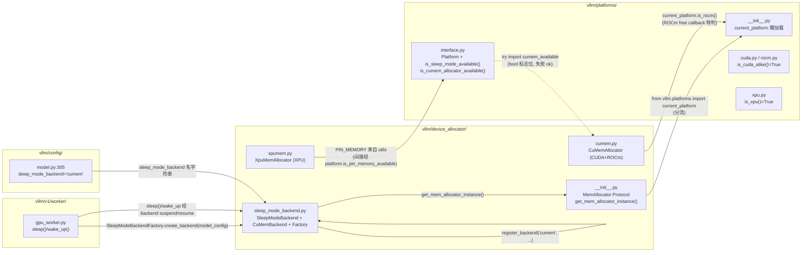
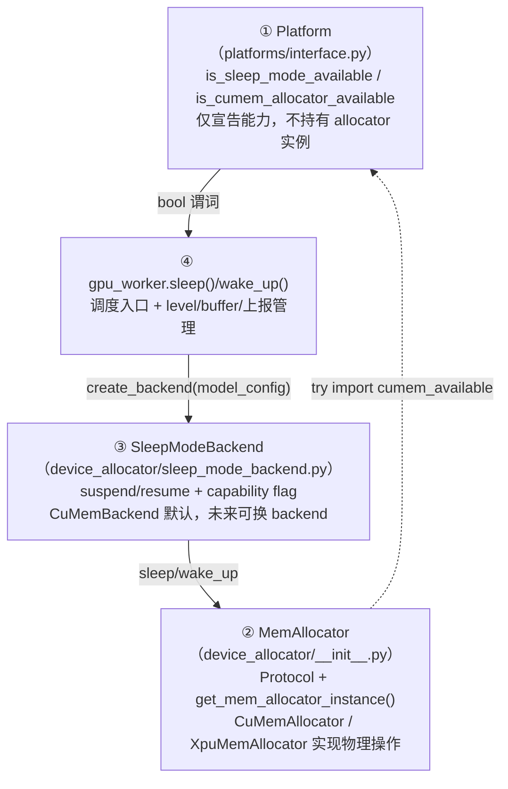

# Platform vs device_allocator：边界与互引

[← Wiki 首页](../README.md) > [硬件平台](README.md) > 边界与互引

源码对照：`vllm/platforms/`（约 4195 行）vs `vllm/device_allocator/`（约 918 行）

## 是什么

本页专门梳理 `vllm/platforms/` 与 `vllm/device_allocator/` 两棵子树的**职责边界**、**互引方向**与**协作模式**。前者是 vLLM 的硬件平台抽象（"我是谁、能做什么"），后者是 sleep/wake-up 用到的设备内存分配器（"如何在显存里腾挪"）。它们一起实现了 vLLM 在 CUDA/ROCm/XPU 上的 sleep mode，但代码必须分两棵子树因为：

- `platforms/` 在 vLLM import 阶段就被解析（`current_platform` 懒加载但极早触发），承担"识别 + 注入点"角色；
- `device_allocator/` 只在 sleep/wake-up 真正调用时才被 import，承担"显存操作"实现角色。

边界清晰后，新增一个 sleep mechanism（如 CUDA process checkpoint）只需在 `device_allocator/` 加一个 backend，无需触碰 `platforms/`；新增一个硬件平台（如 NPU）只需在 `platforms/` 加一个 `Platform` 子类与一个探针函数，无需触碰 `device_allocator/`。

核心规则：

- **`platforms/` 不直接 import `device_allocator/` 的具体类**，仅通过 `is_cumem_allocator_available()` try import `cumem_available` 标志位（`interface.py:231`），用 `is_cuda_alike()` / `is_xpu()` / `is_sleep_mode_available()` bool 谓词对外宣告能力。
- **`device_allocator/` 反向 import `platforms.current_platform`**（`__init__.py:10`、`cumem.py:22`、`xpumem.py` 隐式经 `PIN_MEMORY`），用其做平台分流（`is_cuda_alike` → `CuMemAllocator`、`is_xpu` → `XpuMemAllocator`）与 ROCm 特判（`is_rocm()` 在 `cumem.py:207` 改 free callback 行为）。
- **`SleepModeBackend` 把互引收敛**：`sleep_mode_backend.py` 用 `get_mem_allocator_instance()` 间接调 `device_allocator/`，`gpu_worker` 用 `SleepModeBackendFactory.create_backend()` 间接调 `device_allocator/`，二者都不直接依赖 `platforms/`。
- **`device_config.sleep_mode_backend` 字段**（`vllm/config/model.py:305`，默认 `"cumem"`）是 allocator ↔ config 的唯一字符串契约，工厂据此 lazy import 具体 backend。

## 为什么

### 为什么不合并到一棵子树？

- **import 时序**：`platforms/` 必须早（在 `VllmConfig` 初始化前就要 `pre_register_and_update`），`device_allocator/` 必须晚（直到 Worker 调 `sleep()` 才需要）。合并会让 `import vllm.platforms` 间接 import `vllm.cumem_allocator` C 扩展，破坏"无 CUDA context 也能 import vllm"的不变量（CPU-only 探测失败时 cumem C 扩展可能不存在）。
- **可选依赖**：`vllm.cumem_allocator`（C 扩展）、`vllm_xpu_kernels.xpumem_allocator`（外部包）都不是必装项，缺失即 `cumem_available=False` / `xpumem_available=False`。把这些 try import 集中在 `device_allocator/` 让 `platforms/` 保持无外部 C 扩展强依赖。
- **可替换性**：`SleepModeBackend` 抽象（RFC #34303）让"机制"可被替换（cumem / CUDA checkpoint / CRIU / durable snapshot），而"平台"不可被替换（一个进程只能激活一个 `Platform`）。把两者放一棵子树会让"机制可换"的设计意图模糊。
- **测试隔离**：`device_allocator/` 的测试要 mock `cumem_available` 与 `vllm.cumem_allocator` C 扩展；`platforms/` 的测试要 mock `pynvml`/`amdsmi` 等。分开后两套 mock 互不干扰。

### 为什么 `device_allocator/` 反向 import `platforms.current_platform`？

- `get_mem_allocator_instance()`（`__init__.py:35`）需要分流：`is_cuda_alike()` → `CuMemAllocator`、`is_xpu()` → `XpuMemAllocator`、其它 raise。这是**单一导入点**，避免 `device_allocator/` 内部用 `if` 判厂商 ID。
- `CuMemAllocator._python_free_callback`（`cumem.py:207`）在 ROCm 上返回空 chunk list 避免 double-free——这种 ROCm-specific 行为只能通过 `current_platform.is_rocm()` 动态判定（cumem 单例跨 CUDA/ROCm 共用）。
- `PIN_MEMORY`（`cumem.py:24` 从 `vllm.utils.torch_utils` 引入，但实际再向上追溯到 platform 的 `is_pin_memory_available`）决定 `cpu_backup_tensor` 是否 pin。该决策跨平台差异显著（WSL 默认 False、XPU True、CPU False），由平台统一决定。

### 为什么 `platforms/` 用 bool 谓词而非直接 return `CuMemAllocator` 实例？

- **避免循环 import**：`platforms/interface.py` 被 `device_allocator/__init__.py` import（`from vllm.platforms import current_platform`）。若 `interface.py` 反向 import `vllm.device_allocator.cumem.CuMemAllocator`，就形成 `interface → cumem → interface` 闭环。
- **capability flag 优于类型耦合**：`is_sleep_mode_available()` / `is_cumem_allocator_available()` 返回 bool，让上层（Worker、API endpoint）在调用 sleep 前做闸门检查，而不需要在 `platforms/` 里持有 allocator 类引用。这也是 `SleepModeBackend.is_supported()` 静态方法的模式。

## 怎么做

### 互引方向图

实线：importtime/runtime 直接调用。虚线：可选 try import（缺失即降级）。

### 责任分配表

| 关注点 | 归属 | 入口 API |
|---|---|---|
| 判断"是谁"（CUDA/ROCm/TPU/XPU/CPU/Zen/OOT/Unspecified） | `platforms/` | `current_platform._enum` / `is_*()` |
| 列出"能做什么"（capability、dtype、attention、comm、compile） | `platforms/` | `Platform.*` `@classmethod` |
| 判断"是否有 sleep 能力" | `platforms/` | `is_sleep_mode_available()` / `is_cumem_allocator_available()` |
| 判断"是否为 sleep 走 cumem allocator" | `platforms/` + `device_allocator/` | platform try import → `cumem_available` bool |
| 实际分配、释放、sleep、wake_up 物理/virtual 内存 | `device_allocator/` | `MemAllocator.use_memory_pool/sleep/wake_up` |
| 单例 allocator 实例获取 | `device_allocator/` | `get_mem_allocator_instance()` |
| sleep level 1/2 语义（offload weights vs discard all） | `device_allocator/`（`SleepModeBackend.suspend(level)`） | `CuMemBackend.suspend(level)` 转 `offload_tags` |
| 选 sleep 机制（cumem / 未来 CUDA ckpt / CRIU / durable） | `device_allocator/` + `Config` | `SleepModeBackendFactory.create_backend(model_config)` |
| capability flag（是否保 communicators/编译产物/graph） | `device_allocator/` | `SleepModeBackend.*` `@classmethod` |
| sleep level 2 buffer 备份 | `vllm/v1/worker/gpu_worker.py` | `sleep_saved_buffers = {n: b.cpu().clone() ...}` |
| profile / metric 上报"释放了多少 GiB" | `vllm/v1/worker/gpu_worker.py` | `freed_bytes = after_free - before_free` |
| 配置字段 `sleep_mode_backend` 默认值 | `vllm/config/model.py:305` | `"cumem"` |

### 三层抽象的清晰边界

### `is_sleep_mode_available` 与 `SleepModeBackend.is_supported` 的区别

| 谓词 | 判定 | 调用方 | 用途 |
|---|---|---|---|
| `Platform.is_sleep_mode_available()` | 静态平台能力（CUDA/ROCm/XPU True；CPU/TPU False） | API endpoint、health check | 用户"/sleep"前 quick 闸门 |
| `SleepModeBackend.is_supported()` | 当前 platform/driver 是否支持**该 backend** | `SleepModeBackendFactory.create_backend` | 实例化前的细粒度检查 |
| `Platform.is_cumem_allocator_available()` | try import `vllm.cumem_allocator` C 扩展 | `Platform.is_sleep_mode_available` 同等待核实 | 决定 cumem backend 是否能选 |

三者逻辑上是"全平台 → 该平台是否可 cumem → 该 backend 是否当前可运行"的逐步细化。

## 与其它模块/系统配合

- **`vllm/v1/worker/gpu_worker.py`**：sleep/wake 调用方；不直接 import `CuMemAllocator`，而经 `SleepModeBackendFactory` + `SleepModeBackend`；`level==2` 的 `_sleep_saved_buffers` 在 worker 层而非 allocator 层完成（buffer 生命周期跨 wake_up）。
- **`vllm/config/model.py`**：`sleep_mode_backend: str = "cumem"` 字段是 `device_allocator/` 唯一从 config 读的入口；`platform/` 不读该字段。
- **`vllm/plugins/__init__.py`**：`vllm.general_plugins` entry point 让第三方 `SleepModeBackend` 通过 import-time `register_backend` 静态调用挂入；与 `vllm.platform_plugins`（platform OOT 插件）是平行两个 entry point 组。
- **`vllm/utils/torch_utils.PIN_MEMORY`**：受 `platform.is_pin_memory_available()` 影响的单值常量，被 `device_allocator/cumem.py` 与 `xpumem.py` 复用作 `cpu_backup_tensor` 的 pin_memory 参数。
- **NCCL buffer**：位于 `CuMemAllocator` pool 之外，sleep 时不被 unmap，`CuMemBackend.preserves_communicators()=True` 让 worker 无需 reinit NCCL。这是 platform vs allocator 边界最重要的一致性保证——allocator 只管 pool 内分配，communicator 资源形态由 `device_communicators/` 维护。
- **`vllm.cumem_allocator` C 扩展**：独立 wheel，提供 `init_module` / `python_create_and_map` / `python_unmap_and_release` 三个 C 函数；缺失时 `cumem_available=False`，sleep path 在 `get_mem_allocator_instance()` 处 raise（与 `is_cumem_allocator_available()` 返回 `False` 一致）。
- **`vllm_xpu_kernels.xpumem_allocator`**：外部 wheel，提供对称的 XPU C 扩展与 `torch.ops._C.xpu_memcpy_sync`。

## 历史版本演进

- **v0.5**：sleep mode 不存在；`device_allocator/` 子树不存在；平台与内存分配全在 `platforms/` 与 PyTorch caching allocator 内（待核实）。
- **v0.6（cumem 落地，#11743）**：`[Core] Support fully transparent sleep mode` 引入 `vllm/device_allocator/cumem.py` 与 `__init__.py`；`Platform.is_sleep_mode_available()` 与 `is_cumem_allocator_available()` 同步加入；互引方向确立（cumem → current_platform，platforms → cumem 仅 try import bool）。此时 `device_allocator/` 只服务 CUDA。
- **v0.7–v0.9**：sleep mode 改进（expandable_segments 兼容、PyTorch 2.6 MemPool 兼容、ROCm 迁移 #12695、在线量化 #24731、stream-aware free #43020）全部在 `device_allocator/` 内演进；`platforms/` 端的 `is_*` 谓词保持稳定；边界清晰使得 ROCm 迁移无需改 `RocmPlatform`。
- **v0.10（XPU 接入，#37149）**：`[XPU][Feature] transparent sleep mode support for XPU platform` 引入 `xpumem.py` 与 `XpuMemAllocator`；`get_mem_allocator_instance()` 加 `is_xpu()` 分支；`Platform.is_sleep_mode_available()` 在基类把 XPU 加入 True 列表（`interface.py:229`）。边界再次验证：仅 `device_allocator/` 与 `platform/interface.py` 一行改动，`xpu.py` 本身不动。
- **v0.11 / v0.12 / main（SleepModeBackend 抽象，#44074/#47243）**：`[Core] Pluggable sleep-mode backend abstraction (RFC #34303)` 引入 `sleep_mode_backend.py`，把"机制"从"内存操作"中再拆一层；`CuMemBackend` 默认包装 cumem 行为；`SleepModeBackendFactory` 通过 `vllm.general_plugins` entry point 支持第三方 backend。该抽象让 platform vs allocator 边界进化为"platform vs MemAllocator vs SleepModeBackend"三层，未来新增机制（如 CUDA process checkpoint）将完全不触碰 `platforms/`。`#47243 [Core] Make sleep-mode backend capability flags communicator-agnostic` 进一步把 capability 与具体资源解耦，让 backend 可独立描述能力。具体版本归属（部分待核实）。

[← 返回硬件平台首页](README.md)

## 参见

- [interface.md](interface.md) — `is_sleep_mode_available` / `is_cumem_allocator_available` 谓词定义。
- [device-allocator.md](device-allocator.md) — `MemAllocator` / `CuMemAllocator` / `XpuMemAllocator` / `SleepModeBackend` 全貌。
- [cuda.md](cuda.md) / [rocm.md](rocm.md) / [xpu.md](xpu.md) — 各平台如何 enable allocator（`is_cuda_alike` / `is_xpu`）。
- [plugin-resolver.md](plugin-resolver.md) — `vllm.platform_plugins` 与 `vllm.general_plugins` 两个 entry point 组的对照。
- [../15-kv-cache-offload/README.md](../15-kv-cache-offload/README.md) — sleep engine 上层调度。
- [../02-execution/worker/gpu-worker.md](../02-execution/worker/gpu-worker.md) — `sleep()/wake_up()` 在 worker 层的 buffer 与上报管理。
- [../07-distributed/device-communicators/README.md](../07-distributed/device-communicators/README.md) — NCCL buffer 不在 allocator pool 的边界保证。
