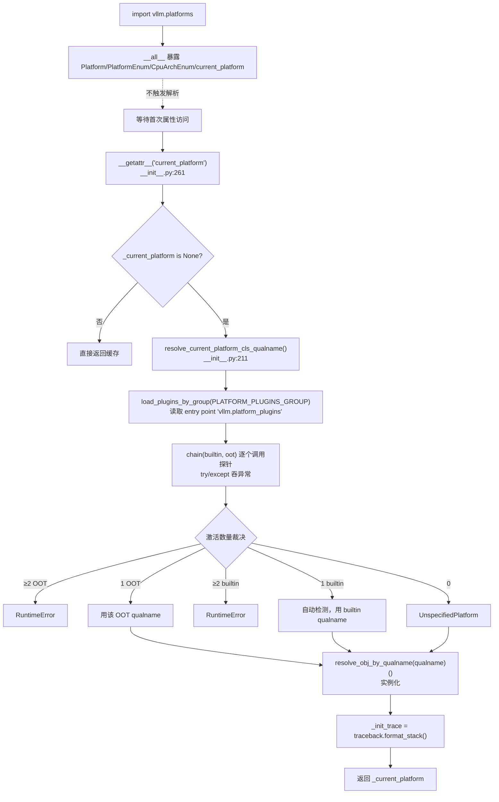

# 平台插件解析与 `current_platform` 懒加载

[← Wiki 首页](../README.md) > [硬件平台](README.md) > 插件解析器

源码：`vllm/platforms/__init__.py`（约 304 行）

## 是什么

`__init__.py` 是平台子系统的**入口与解析器**。它对外暴露全局单例 `current_platform`（一个 `Platform` 子类实例），并按"内置探针 → entry-point 插件 → 唯一性裁决 → 懒加载"的流水线决定到底实例化哪一个平台类。该模块刻意不在 import 期做任何厂商检测，把 `current_platform` 推迟到**首次属性访问**时才解析，以兼容 out-of-tree（OOT）平台的注册时序。

核心成员：

- `builtin_platform_plugins: dict[str, Callable]`（`__init__.py:202`）：5 个内置探针 `tpu / cuda / rocm / xpu / cpu`，每个都是返回 `"module.qualname"` 字符串或 `None` 的零参函数。
- `vllm_version_matches_substr(substr)`（`__init__.py:18`）：通过 `importlib.metadata.version("vllm")` 判断 vLLM 包版本子串（用于区分 cpu build）。
- 各 `xxx_platform_plugin()` 探针函数（`__init__.py:35`-199）：尝试导入对应厂商库（`libtpu` / `pynvml` / `amdsmi` / `torch.xpu`），命中则返回 qualname。
- `resolve_current_platform_cls_qualname()`（`__init__.py:211`）：裁决函数。把内置插件与通过 `vllm.platform_plugins` entry point 注册的 OOT 插件合并，逐个调用，按"OOT 优先 / 内置次之 / 都没有则 UnspecifiedPlatform"输出 qualname。
- `__getattr__("current_platform")`（`__init__.py:261`）：模块级 PEP 562 懒加载。首次访问 `vllm.platforms.current_platform` 时触发 `_current_platform` 解析，并把 `traceback.format_stack()` 存进 `_init_trace` 供调试。
- `__setattr__`（`__init__.py:287`）：允许测试与初始化代码覆盖 `current_platform`。
- `_is_amd_zen_cpu()`（`__init__.py:153`）：读 `/proc/cpuinfo` 判断 `AuthenticAMD + avx512`，给 `cpu_platform_plugin` 决定走 `ZenCpuPlatform` 还是 `CpuPlatform`。

## 为什么

- **OOT 平台的导入时序**：OOT 平台（如 Neuron、HPU、私有 NPU）通常以独立 pip 包形式存在，其 entry point 注册的插件模块需要 `from vllm.platforms import Platform` 来继承 `Platform`。如果 `current_platform` 在 `import vllm.platforms` 时就解析，就会触发"先有鸡还是先有蛋"——OOT 模块还没机会注册，`Platform` 类本身就被实例化了。懒加载（`__getattr__`）把解析推迟到真正首次访问，确保 `PLATFORM_PLUGINS_GROUP` 注册的插件先被 `load_plugins_by_group` 装载完毕。该模块注释明确写道："we have tests for this, if any developer violate this, they will see the test failures"（`__init__.py:272`）。
- **唯一性裁决**：单进程只能激活一个平台。`resolve_current_platform_cls_qualname` 接受的合法状态是：0 个激活 → `UnspecifiedPlatform`；恰好 1 个 OOT 激活 → 用该 OOT；恰好 1 个 builtin 激活 → 自动检测；其它（≥2 个同类激活）→ `RuntimeError`。这套规则把"装了 CUDA 又想用 CPU build"这种边界情况显式 raise 出来。
- **Stateless 探针**：每个内置探针都用 try/except 包住厂商库导入与初始化（`pynvml.nvmlInit()`/`nvmlShutdown()`、`amdsmi_init()`/`amdsmi_shut_down()`），且**失败仅 `logger.debug`**，不抛出。这确保解析过程对单进程副作用最小，可被 Ray 多 worker 共享。
- **CPU build 防误激活**：`cuda_platform_plugin` 不仅要看 `pynvml.nvmlDeviceGetCount() > 0`，还要 `not vllm_version_matches_substr("cpu")`——避免 cpu build 装在 GPU 机器上时被错误激活成 CUDA（`__init__.py:73`）。同样 Jetson 走 NVML 不可用的兜底路径（`cuda_is_jetson()`）。
- **`_init_trace` 调试**：懒加载让"谁第一次访问 `current_platform`"成为关键诊断信息。`_init_trace` 把首次访问的完整 Python 栈存起来，便于排查"导入期意外触发解析"的违规调用。

## 怎么做

### 探针流水线



### 内置探针的实现要点

| 探针 | 检测路径 | 返回 qualname | 关键副作用 |
|---|---|---|---|
| `tpu_platform_plugin` | `envs.VLLM_TPU_USING_PATHWAYS` → Pathways 代理；否则 `import libtpu` | Pathways: `tpu_inference.platforms.tpu_platform.TpuPlatform`；普通: `vllm.platforms.tpu.TpuPlatform` | 无 |
| `cuda_platform_plugin` | `import_pynvml()` → `nvmlInit()` → `nvmlDeviceGetCount()>0` 且非 cpu build；Jetson 兜底 `/etc/nv_tegra_release` | `vllm.platforms.cuda.CudaPlatform` | 模块内 `nvmlInit/nvmlShutdown` |
| `rocm_platform_plugin` | `import amdsmi` → `amdsmi_init()` → 处理器数 > 0 | `vllm.platforms.rocm.RocmPlatform` | `amdsmi_init/shut_down` |
| `xpu_platform_plugin` | `torch.distributed.is_xccl_available()` 设置 `dist_backend="xccl"`；`torch.xpu.is_available()` | `vllm.platforms.xpu.XPUPlatform` | 修改 `XPUPlatform.dist_backend` 类属性 |
| `cpu_platform_plugin` | `vllm_version_matches_substr("cpu")` 或 macOS；`_is_amd_zen_cpu()` 且 `import zentorch` 成功则走 Zen | `vllm.platforms.cpu.CpuPlatform` / `vllm.platforms.zen_cpu.ZenCpuPlatform` | 无 |

### 唯一性裁决的源码骨架

```python
# __init__.py:211-251 简化
def resolve_current_platform_cls_qualname() -> str:
    platform_plugins = load_plugins_by_group(PLATFORM_PLUGINS_GROUP)
    activated = []
    for name, func in chain(builtin_platform_plugins.items(),
                            platform_plugins.items()):
        try:
            q = func()
            if q is not None:
                activated.append(name)
        except Exception:
            pass                                  # 探针失败视为未激活

    activated_builtin = set(activated) & set(builtin_platform_plugins)
    activated_oot = set(activated) - set(builtin_platform_plugins)

    if len(activated_oot) >= 2:
        raise RuntimeError(...)
    elif activated_oot:
        return platform_plugins[next(iter(activated_oot))]()   # OOT 优先
    elif len(activated_builtin) >= 2:
        raise RuntimeError(...)
    elif activated_builtin:
        return builtin_platform_plugins[next(iter(activated_builtin))]()
    else:
        return "vllm.platforms.interface.UnspecifiedPlatform"
```

### OOT 插件注册

第三方平台通过 entry point 注册：

```toml
# pyproject.toml 示例
[project.entry-points."vllm.platform_plugins"]
my_npu = "my_npu_pkg.platform:NpuPlatformPlugin"
```

`my_npu_pkg.platform:NpuPlatformPlugin` 必须是一个零参可调用，返回 `"my_npu_pkg.platform.MyNpuPlatform"` 字符串（即 `Platform` 子类的 qualname）。`load_plugins_by_group` 在解析时把它们与 builtin 合并，OOT 命中优先级最高（即便机器上同时有 CUDA 也会用 OOT）。`PLATFORM_PLUGINS_GROUP = "vllm.platform_plugins"`（`vllm/plugins/__init__.py:19`）。

### 覆盖 `current_platform`（测试场景）

```python
# __init__.py:287
def __setattr__(name, value):
    if name == "current_platform":
        global _current_platform
        _current_platform = value
    ...
```

这让单测能 `vllm.platforms.current_platform = MyFakePlatform()` 直接注入 mock 平台，无需 monkeypatch。但生产代码不应使用——解析器逻辑会因此被绕过。

### `_init_trace` 诊断

首次懒加载触发后 `_init_trace` 保存完整栈。如果怀疑某次 import 意外触发了平台解析（例如某个 `vllm/__init__.py` 子模块在导入期就 `current_platform.is_cuda()`），可在调试器或日志里打印 `vllm.platforms._init_trace` 查看是谁触发的。该字段被列入 `__all__` 便于导出。

## 与其它模块/系统配合

- **[interface.md](interface.md)**：`Platform` / `PlatformEnum` / `CpuArchEnum` 都从 `interface` re-export 给外部（`__init__.py:13`）。
- **`vllm/plugins/__init__.py`**：`PLATFORM_PLUGINS_GROUP` 与 `load_plugins_by_group` 是 vLLM 通用插件系统的平台组入口，与 `vllm.general_plugins`（用于 [`device-allocator.md`](device-allocator.md) 中的 `SleepModeBackendFactory`）是平行的两个 entry point 组。
- **`vllm/utils/import_utils.py:resolve_obj_by_qualname`**：把 qualname 字符串反射成类对象，是"返回字符串避免循环导入"模式（见 [`interface.md`](interface.md) 的子系统注入点）的落点。
- **Ray**：`ray_device_key` / `device_control_env_var` / `ray_noset_device_env_vars` 让 Ray 在 worker 启动时正确设置可见设备。懒加载确保 Ray fork 时不会意外初始化 CUDA context。
- **`vllm/envs.py`**：`VLLM_TPU_USING_PATHWAYS`（`envs.py:180`）等多种 env 被探针读取；新增 env 须同步登记。
- **`vllm/config/__init__.py`**：`VllmConfig` 初始化时调用 `current_platform.pre_register_and_update` / `apply_config_platform_defaults` / `check_and_update_config` / `update_block_size_for_backend`（见 [`interface.md`](interface.md) 的"配置生命周期 hook"）。懒加载保证这些调用要么命中已解析实例，要么触发首次解析。

## 历史版本演进

- **v0.5–v0.6**：`current_platform` 在 `vllm/platforms/__init__.py` 导入期即解析（eager），导致 OOT 平台插件无法以"先 import Platform 再被检测"的方式工作；社区出现多起循环 import 与"Platform 还没被覆盖就实例化了"的报告（待核实）。
- **v0.7（懒加载落地，#19410 前后）**：引入 PEP 562 `__getattr__` 把 `current_platform` 推迟到首次访问解析；entry point 组改名 `vllm.platform_plugins`（与 `vllm.general_plugins` 区分）；`UnspecifiedPlatform` 作为兜底。注释明确加入"we have tests for this"以约束后续 PR。
- **v0.8（xccl + XPU 抽象，#19410）**：`stateless_init_device_torch_dist_pg` 抽象与 `get_device_communicator_cls` 都以 qualname 形式注入；`xpu_platform_plugin` 检测 `is_xccl_available` 并就地修改 `XPUPlatform.dist_backend = "xccl"`。
- **v0.9（Neuron/HPU V0 deprecation，#21131/#21159）**：删除 V0 Neuron/HPU builtin 探针；OOT 化持续推进。
- **v0.10（TPU 重命名 + Pathways，#21417/#26279/#28452）**：`tpu_commons` → `tpu_inference`，探针支持 `VLLM_TPU_USING_PATHWAYS` 走 `tpu_inference.platforms.tpu_platform.TpuPlatform`。
- **v0.11 / v0.12 / main**：`_is_amd_zen_cpu` 探针合并（#35970 In-Tree AMD Zen CPU Backend），把 `zentorch` 检测前移到平台解析期；`577a73458a` 把 `PLATFORM_PLUGINS_GROUP` 字符串字面量收敛为常量；`ebfbcfe46`（#45026）"Stop setting CUDA_VISIBLE_DEVICES internally"重塑了 logical→physical 映射与 `set_assigned_physical_gpu_ids` 的协作。具体版本归属（部分待核实）。

[← 返回硬件平台首页](README.md)

## 参见

- [interface.md](interface.md) — `Platform` 抽象基类与所有 `@classmethod` hook。
- [cuda.md](cuda.md) / [rocm.md](rocm.md) / [cpu.md](cpu.md) — 内置探针触发的具体平台。
- [tpu.md](tpu.md) — Pathways 代理下走外部 `tpu_inference` 包；non-Pathways 走 `vllm/platforms/tpu.py`。
- [device-allocator.md](device-allocator.md) — 平行的 `vllm.general_plugins` entry point 用于 `SleepModeBackend` 扩展。
- [../17-utils-cross-cutting/plugins.md](../17-utils-cross-cutting/plugins.md) — vLLM 通用插件系统（待补充）。
