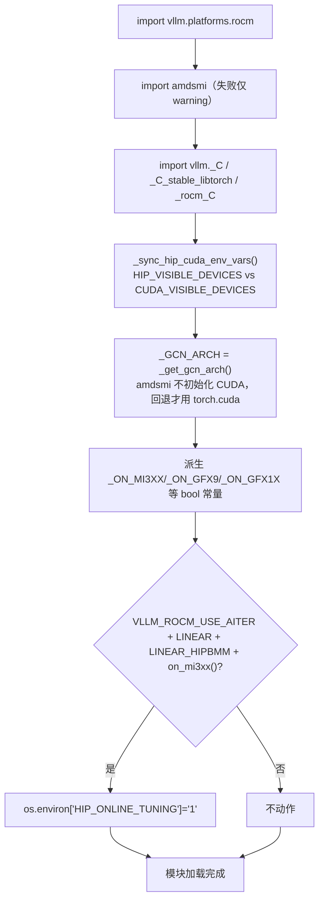

# RocmPlatform · amdsmi · AITER

[← Wiki 首页](../README.md) > [硬件平台](README.md) > ROCm

源码：`vllm/platforms/rocm.py`（约 1052 行）

## 是什么

`rocm.py` 是 vLLM 在 AMD Instinct / Radeon GPU 上的平台实现。它通过 `amdsmi`（AMD System Management Interface）做**无 HIP context 初始化**的设备探测，并在模块导入期通过 `_query_gcn_arch_from_amdsmi()` 解析 GCN 架构字符串（`gfx942` / `gfx1100` / `gfx1201` 等）构造成一组 `_ON_GFX*` 布尔常量，用来 gating FP8 表示（FNUZ vs OCP）、custom allreduce、MLA backend、AITER hipBLASLt 在线调优等差异化行为。`RocmPlatform` 与 `CudaPlatform` 同属 `is_cuda_alike()`（共享 `device_type="cuda"`、`dist_backend="nccl"`、`CuMemAllocator`）。

核心成员：

- `RocmPlatform`（`rocm.py:444`）：单实现类。`device_type="cuda"`（HIP 兼容 CUDA dispatch）、`dispatch_key="CUDA"`、`device_control_env_var="CUDA_VISIBLE_DEVICES"`（与 CUDA 共享，但 HIP_VISIBLE_DEVICES 优先，见下文 env 同步）、`ray_noset_device_env_vars` 含 `HIP/CUDA/ROCR` 三个变体。`supported_quantization` 白名单 22 种 quant 方案。
- 模块级常量：`_GCN_ARCH = _get_gcn_arch()`（`rocm.py:209`），在导入期通过 amdsmi 解析（失败回退到 `torch.cuda.get_device_properties("cuda").gcnArchName`，会初始化 CUDA）。派生 `_ON_MI3XX` / `_ON_GFX9` / `_ON_GFX90A` / `_ON_GFX942` / `_ON_GFX950` / `_ON_GFX1X` / `_ON_GFX11` / `_ON_GFX1100` / `_ON_GFX1151` / `_ON_GFX12X` 等纯 Python bool——刻意做成"torch.compile/Dynamo safe"，避免 guard 触发重编译。
- `_capability_from_gcn_arch(gcn)`（`rocm.py:223`）：把 GCN 字符串映射为 `(major, minor)`，镜像 HIP `hipDeviceProp_t.major/minor` 派生规则：`gfx9xx` → `(9, x)`、`gfx1xxx` → `(1x, x)`、`gfx12xx` → `(12, x)`。
- `_sync_hip_cuda_env_vars()`（`rocm.py:116`）：在**模块导入期**同步 `HIP_VISIBLE_DEVICES` 与 `CUDA_VISIBLE_DEVICES`，冲突 raise，单边设置则镜像。注释警告"Using CUDA_VISIBLE_DEVICES on ROCm is deprecated and support will be removed in vLLM v0.26.0"。
- `_get_backend_priorities(use_mla, use_sparse, use_kv_connector)`（`rocm.py:407`）：attention backend 优先级表。MLA 走 `ROCM_AITER_MLA` / `TRITON_MLA` / `ROCM_AITER_TRITON_MLA`；非 MLA 时 `ROCM_ATTN` 头号候选（但 KV connector 时让位，因其用 `(2, num_blocks, ...)` 布局不兼容 blocks-first）。
- `use_rocm_custom_paged_attention(...)`（`rocm.py:346`）：`@cache` 决策函数，对 gfx9/graph11/12 不同 ISA 给出 paged attention kernel 启用条件（head_size、block_size、gqa_ratio、sliding_window 等）。
- `_ROCM_DEVICE_ID_NAME_MAP`（`rocm.py:65`）：device_id 字符串 → 友好名映射表，覆盖 MI300A/X、MI308X、MI325X、MI300X_HF、Radeon RX7900XTX、RDNA 3.5 APU（gfx1150/1151）、RDNA 4（gfx1201）。
- 模块级副作用：`import vllm._C` / `vllm._C_stable_libtorch` / `vllm._rocm_C`（各 import 失败被 warning 吞）；`_sync_hip_cuda_env_vars()` 自动在 import 时执行；若 `VLLM_ROCM_USE_AITER` + `VLLM_ROCM_USE_AITER_LINEAR` + `VLLM_ROCM_USE_AITER_LINEAR_HIPBMM` + `on_mi3xx()` 同时成立，设 `HIP_ONLINE_TUNING=1`（`rocm.py:336`）。

## 为什么

- **amdsmi 优先 = 保持 fork**：`amdsi_init()` 不创建 HIP context，与 CUDA 的 NVML 同理；这让 Ray executor 的 `fork` 路径在 ROCm 上也能工作。`get_device_total_memory`（`rocm.py:745`）专门用 `_query_total_memory_from_amdsmi`，失败再回退到 `torch.cuda.get_device_properties`，注释写明 "preserves `fork` where it is otherwise valid"。`get_device_capability` 直接用 `_capability_from_gcn_arch(_GCN_ARCH)`（`rocm.py:685`），完全不碰 CUDA。
- **GCN 字符串 vs DeviceCapability**：HIP 用 `gcnArchName` 表达代际（gfx942/gfx950/gfx1100…），而 `Platform` 抽象的 `DeviceCapability(major, minor)` 需要 int 对。`_capability_from_gcn_arch` 在模块导入期把字符串解析为 `(major, minor)`，让上层（attention/quant）能统一走 `has_device_capability` API。MMms 4 位布局与 1-digit major（gfx9 系列）/ 2-digit major（gfx10/11/12 系列）的歧义在函数内置校验，无法识别时 raise `ValueError` 提示报 issue。
- **FNUZ vs OCP FP8**：AMD MI300/MI325 原生硬件支持 FNUZ FP8（`float8_e4m3fnuz`），其余硬件走 OCP FP8（`float8_e4m3fn`）。`is_fp8_fnuz()`（`rocm.py:874`）通过 `"gfx94" in _GCN_ARCH` 判定，`fp8_dtype()`（`rocm.py:879`）按此分流。这避免 quant 层散落 `if` 判 AMD。
- **AITER 集成**：AITER（AMD Instinct Tuning Engineering Runtime）是 ROCm 的优化 kernel 包。`apply_config_platform_defaults`（`rocm.py:764`）根据 `rocm_aiter_ops.is_*_enabled()` 注入 `+quant_fp8` / `+grouped_topk` / `+sparse_attn_indexer` 等 custom_ops，是 AITER 在编译期生效的统一入口。`get_default_ir_op_priority`（`rocm.py:999`）在 cudagraph on + `VLLM_ROCM_USE_AITER` + `VLLM_ROCM_USE_AITER_RMSNORM` 时把 `aiter` 加到 rms_norm IR provider 优先级最前。
- **XGMI 全互联检测**：`is_fully_connected(device_ids)`（`rocm.py:700`）通过 `amdsmi_topo_get_link_type` 检查 `hops==1 && type==2`（type 2 = XGMI），等价于 CUDA 的 NVLink 检测，给 custom allreduce 与 TP 拓扑规划用。`use_custom_allreduce` 仅对 `gfx94`/`gfx95` 返回 `True`。
- **env 变量镜像**：ROCm 工具链历史上 `HIP_VISIBLE_DEVICES` 与 `CUDA_VISIBLE_DEVICES` 都生效，但混用易导致 fork 后子进程看不到正确设备。`_sync_hip_cuda_env_vars` 在 import 时统一二者，冲突 raise，单边设置就镜像，从 v0.11 起进入"CUDA_VISIBLE_DEVICES 弃用窗口"。

## 怎么做

### 模块导入期副作用顺序



### GCN → capability 映射规则

```
格式：gfx<digits><stepping>
digits 长度 2-3 (gfx9 系列):  major=digits[0], minor=digits[1]
                    e.g. gfx90a → (9,0), gfx942 → (9,4), gfx950 → (9,5)
digits 长度 4 (gfx1xxx 系列): major=digits[:2], minor=digits[2]
                    e.g. gfx1100 → (11,0), gfx1201 → (12,0)
major < 9 或 > 12 时 raise ValueError(请提 vLLM issue)
```

`get_device_capability`（`rocm.py:685`）先尝试 `_capability_from_gcn_arch(_GCN_ARCH)`，若返回 `None`（字符串不是 `gfx*` 前缀）才回退到 `torch.cuda.get_device_capability` 并 warning。

### attention backend 选择

```python
# rocm.py:407 简化
def _get_backend_priorities(use_mla, use_sparse, use_kv_connector=False):
    if use_sparse:
        return [ROCM_AITER_MLA_SPARSE]
    if use_mla:
        if rocm_aiter_ops.is_mla_enabled():
            return [ROCM_AITER_MLA, TRITON_MLA, ROCM_AITER_TRITON_MLA]
        return [TRITON_MLA]
    backends = []
    if not use_kv_connector:                      # ROCM_ATTN 用 (2,num_blocks,...) 布局
        backends.append(ROCM_ATTN)
    if rocm_aiter_ops.is_mha_enabled():
        backends.append(ROCM_AITER_FA)
    if is_aiter_found_and_supported():
        backends.append(ROCM_AITER_UNIFIED_ATTN)
    backends += [TRITON_ATTN, TURBOQUANT]
    return backends
```

`get_attn_backend_cls`（`rocm.py:531`）逻辑跟 CUDA 类似：先校验 `selected_backend`，再枚举候选做 `validate_configuration`，选 priority 最小者；多 backend 被排除时写 info 日志。

### `apply_config_platform_defaults` 注入 custom_ops

```python
# rocm.py:764 简化
def apply_config_platform_defaults(cls, vllm_config):
    cc = vllm_config.compilation_config
    if rocm_aiter_ops.is_linear_fp8_enabled() and "+quant_fp8" not in cc.custom_ops:
        cc.custom_ops.append("+quant_fp8")
    if rocm_aiter_ops.is_fusion_moe_shared_experts_enabled() and "-grouped_topk" in cc.custom_ops:
        cc.custom_ops.remove("-grouped_topk")       # 强制开启
    if rocm_aiter_ops.is_fused_moe_enabled() and "+grouped_topk" not in cc.custom_ops and "-grouped_topk" not in cc.custom_ops:
        cc.custom_ops.append("+grouped_topk")
    cc.custom_ops.append("+sparse_attn_indexer")    # ROCm 默认走 sparse_attn_indexer
```

### `check_and_update_config` 对 DCP/PCP 的 cudagraph 降级

`rocm.py:795`：若 `cudagraph_mode.has_full_cudagraphs()` 且 `decode_context_parallel_size>1` 或 `prefill_context_parallel_size>1`，则强制改为 `CUDAGraphMode.PIECEWISE`（DCP/PCP 不支持 full cudagraph）；`worker_cls: "auto"` → `gpu_worker.Worker`。

### 关键环境变量

| env | 作用 | 默认 |
|---|---|---|
| `HIP_VISIBLE_DEVICES` | 设备可见性（推荐） | — |
| `CUDA_VISIBLE_DEVICES` | 同上（弃用窗口，v0.26 移除） | — |
| `ROCR_VISIBLE_DEVICES` | 同上（ray noset 列表也含此项） | — |
| `VLLM_ROCM_USE_AITER` | AITER 总开关 | `False` |
| `VLLM_ROCM_USE_AITER_LINEAR` / `_LINEAR_HIPBMM` / `_RMSNORM` / `_MLA` / `_MHA` / `_MOE` / `_UNIFIED_ATTENTION` / `_FUSION_SHARED_EXPERTS` / `_FP8BMM` / `_FP4BMM` / `_FP4_ASM_GEMM` / `_TRITON_ROPE` / `_TRITON_GEMM` / `_CUSTOM_AR` / `_PAGED_ATTN` | AITER 子功能开关 | — |
| `HIP_ONLINE_TUNING` | 由 platform 在 AITER+hipBLASLt+MI3XX 时自动设 | `0` |
| `VLLM_USE_TRITON_AWQ` | AWQ on ROCm 强制启用 Triton（`verify_quantization` 自动设 1） | — |
| `FLASH_ATTENTION_TRITON_AMD_ENABLE` | RDNA 启用 Flash Attention Triton backend | `FALSE` |

完整 env 语义见 `vllm/envs.py:121-137` 与 `vllm/_aiter_ops.py:1480-1491`。

## 与其它模块/系统配合

- **[plugin-resolver](plugin-resolver.md)**：`rocm_platform_plugin()` 在 `amdsmi_init()` + 处理器数 > 0 时返回 `"vllm.platforms.rocm.RocmPlatform"`。
- **[interface.md](interface.md)**：`RocmPlatform` 实现 `Platform` 全部 hook，`is_cuda_alike()` 返回 `True`（与 CUDA 共走 `CuMemAllocator` + `CudaCommunicator`）。
- **[cuda.md](cuda.md)**：大量共用语义（`dist_backend="nccl"`、`get_punica_wrapper=PunicaWrapperGPU`、`get_device_communicator_cls=CudaCommunicator`、`get_static_graph_wrapper_cls=CUDAGraphWrapper`），但 env vars、gcN 字符串、AITER 集成差异明显。
- **[device-allocator](device-allocator.md)**：`is_cumem_allocator_available()` 同走 `vllm.device_allocator.cumem.cumem_available`；`CuMemAllocator._python_free_callback` 对 ROCm 特判（asleep 时返回空 chunk list 避免 double-free，见 [`device-allocator.md`](device-allocator.md)）。
- **`vllm/_aiter_ops.py`**：AITER 启用判定与子功能开关的实际实现，`rocm_aiter_ops.is_*_enabled()` 是 platform 决策的唯一入口。
- **[编译](../09-compilation-ir/README.md)**：`apply_config_platform_defaults` 在编译初始化前注入 custom_ops；`get_default_ir_op_priority` 让 `aiter` 进入 IR provider 优先级（cudagraph on 时）。
- **[执行层](../02-execution/README.md)**：`worker_cls` 解析为 `gpu_worker.Worker`；DCP/PCP + full cudagraph 自动降级 PIECEWISE；sleep mode 在 ROCm 上有 5 秒 memory 释放宽限期（见 [`../02-execution/worker/gpu-worker.md`](../02-execution/worker/gpu-worker.md) 的 `sleep()` 实现）。
- **[模型执行-内核](../03-model-execution/kernels.md)**：`import_kernels` 在父类基础上追加 `vllm._rocm_C`；`use_rocm_custom_paged_attention` 决定 paged attention kernel 选型。
- **[注意力](../05-attention/README.md)**：`_get_backend_priorities` 候选名单被 attention selector 消费；`opaque_attention_op()` 返回 `True`；`get_supported_vit_attn_backends` 含 `ROCM_AITER_FA`。

## 历史版本演进

- **v0.5–v0.6**：ROCm 平台与 CUDA 共用一份 `cuda.py`，靠 `is_rocm()` 分支判定，环境变量 `ROCM` 等 hardcoded；sleep mode 仅 CUDA 可用（待核实）。
- **v0.7（独立 rocm.py）**：`RocmPlatform` 从 CUDA 分出，引入 `amdsmi` 探测；`_ROCM_DEVICE_ID_NAME_MAP` 覆盖 MI300 系列；`use_rocm_custom_paged_attention` 决策函数成型。`supports_fp8`/`is_fp8_fnuz`/`fp8_dtype` 三个 FP8 表示差异化方法加入。
- **v0.8（sleep mode 迁移 ROCm，#12695）**：`[Core][AMD] Migrate fully transparent sleep mode to ROCm platform` 让 `is_sleep_mode_available()` 对 ROCm 返回 `True`；`CuMemAllocator` 的 ROCm 特判（`is_asleep` + 空 chunk list）落地以避免 double-free。
- **v0.9（AITER 抽象 + hipBLASLt 在线调优）**：`vllm/_aiter_ops.py` 收敛 AITER 子功能开关；`apply_config_platform_defaults` 注入 `+quant_fp8`/`+grouped_topk`/`+sparse_attn_indexer`；`HIP_ONLINE_TUNING` 自动设置（#40426）；MLA backend 候选表加入 `ROCM_AITER_MLA`/`ROCM_AITER_TRITON_MLA`/`ROCM_AITER_MLA_SPARSE`。
- **v0.10（GCN capability 抽象 + KV layout 标准化）**：`_capability_from_gcn_arch` 把 GCN 字符串映射为 `(major, minor)`，让上层 attention selector 走 `DeviceCapability` API；`[Attention][AMD] Standardize kv layout to blocks first for AMD`（#43660）让 `ROCM_ATTN` 与 KV connector 兼容性问题暴露，`_get_backend_priorities` 新增 `use_kv_connector` 参数绕让 `ROCM_ATTN`。
- **v0.11 / v0.12 / main**：`[ROCm][CI] Query total device memory via amdsmi to avoid HIP init`（#46141）让 `get_device_total_memory` 完全 context-free；`[ROCm] Begin Deprecation Window for CUDA_VISIBLE_DEVICES on ROCm`（#46636）开始走弃用流程；`[ROCm] Remove erroneous inclusion of gptq_marlin`（#46655）清理 quant 白名单；gfx1151（Strix Halo）、gfx1201（RDNA 4）等新型号加入 device id 映射。具体版本归属（部分待核实）。

[← 返回硬件平台首页](README.md)

## 参见

- [interface.md](interface.md) — `Platform` 抽象基类。
- [cuda.md](cuda.md) — 同为 `is_cuda_alike()`，NVML/ amdsmi 对照。
- [device-allocator.md](device-allocator.md) — ROCm sleep mode 与 `CuMemAllocator` 的 free callback 特判。
- [../05-attention/README.md](../05-attention/README.md) — AITER backend 候选名单。
- [../02-execution/worker/gpu-worker.md](../02-execution/worker/gpu-worker.md) — ROCm sleep 5 秒宽限期来源。
