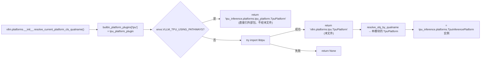

# TpuPlatform · libtpu / Pathways

[← Wiki 首页](../README.md) > [硬件平台](README.md) > TPU

源码：`vllm/platforms/tpu.py`（约 20 行，wrapper 形式）

## 是什么

`tpu.py` 是 vLLM 在 Google TPU 上的平台实现的**轻量包装层**。由于 TPU 的绝大部分平台逻辑都由外部包 `tpu_inference`（旧名 `tpu_commons`）提供，vLLM 本仓库内 `vllm/platforms/tpu.py` 只做一件事：**把 `tpu_inference.platforms.TpuPlatform` 重导出为当前模块的 `TpuPlatform`**，并 set `USE_TPU_INFERENCE` 标志位。当 `import tpu_inference` 失败时打印 error 但仍允许模块继续导入（具体调用再 raise）。

核心成员：

- `TpuPlatform = TpuInferencePlatform`（`tpu.py:14`）：`tpu_inference.platforms.TpuPlatform` 类的别名。真实的 `Platform` 子类实现位于 `tpu_inference` 包内（不在 vLLM 主仓库）。
- `USE_TPU_INFERENCE = True`（`tpu.py:15`）：导入成功的标志位，给其它模块做"是否在 TPU 平台上"的软检测。
- 模块导入失败分支：`logger.error("tpu_inference not found, please install tpu_inference to run vllm on TPU")`（`tpu.py:18`），不抛异常，方便 import 期容错。

## 为什么

- **平台实现外置**：TPU 的设备探测（`libtpu` 初始化、Pathways 代理握手）、attention backend、weight loader、编译策略都和 TPU 硬件/软件栈强耦合，维护成本高且不能在 NVIDIA/AMD 机器上验证。把 `TpuPlatform` 实现放进独立 pip 包 `tpu_inference`，让 Google 团队可以独立发布补丁而不需要等 vLLM 主仓库发版。
- **两套后端共存**：在 [plugin-resolver.md](plugin-resolver.md) 中可以看到 `tpu_platform_plugin()` 返回的 qualname 因 `VLLM_TPU_USING_PATHWAYS` 而异：Pathways 模式返回 `"tpu_inference.platforms.tpu_platform.TpuPlatform"`，普通模式返回 `"vllm.platforms.tpu.TpuPlatform"`。本文件就是后者——再次 re-export 给 plugin-resolver 一个稳定的 vLLM 内部入口，避免 resolver 直接依赖 `tpu_inference`。
- **`USE_TPU_INFERENCE` 标志位**：vLLM 内部某些代码（如编译/分布式选型）需要快速判"是否 TPU"，而不付出完整 `current_platform` 解析代价。该 bool 让它们 try import 拿到答复（待核实具体调用点）。
- **import 失败容错**：在非 TPU 机器（如 CI 跑 NVIDIA 测试）上 `import vllm.platforms.tpu` 不应抛错——本文件的 `try/except ImportError + logger.error` 模式正是为此。实例化发生在 `current_platform` 解析期，那时若 `tpu_inference` 缺失也已经由 plugin-resolver 的探针函数过滤掉，不会真的进入本模块失败分支。

## 怎么做

### 完整源码（仅 20 行）

```python
# vllm/platforms/tpu.py 简化
from vllm.logger import init_logger
logger = init_logger(__name__)

try:
    from tpu_inference.platforms import (
        TpuPlatform as TpuInferencePlatform,
    )
    TpuPlatform = TpuInferencePlatform
    USE_TPU_INFERENCE = True
except ImportError:
    logger.error(
        "tpu_inference not found, please install tpu_inference "
        "to run vllm on TPU"
    )
    # 注意：不显式 raise，让 import 继续；
    # 真正的失败由 plugin-resolver 的探针函数（import libtpu）拦截
```

### 平台解析路径



注意 Pathways 与 non-Pathways 返回的 qualname 不同——前者直接走 `tpu_inference.platforms.tpu_platform` 不经过本文件；后者经过本文件的 `TpuPlatform = TpuInferencePlatform` 别名。

### TPU 特性 hook（落在 `tpu_inference` 内）

由于实际 `Platform` 子类在外部包，下列 hook 的覆盖细节需查阅 `tpu_inference` 包文档（待补充）：

- `uses_host_device_handling()` 在 `Platform` 基类默认对 `is_tpu()` 返回 `True`（见 [`interface.md`](interface.md)），即 `DeviceConfig.device` 在 TPU 上保持 unset，由 `tpu_inference` 在初始化期决定。
- `inference_mode()` 在 `Platform` 基类文档明确"TPU 不支持 `torch.inference_mode`，需 override 为 `torch.no_grad`"——这是 `tpu_inference.TpuPlatform` 必做的覆盖。
- `dist_backend` 在 Pathways 下走代理通信，non-Pathways 走 libtpu 自带 collectives。

## 与其它模块/系统配合

- **[plugin-resolver](plugin-resolver.md)**：`tpu_platform_plugin()` 是本文件的唯一调用方。
- **[interface.md](interface.md)**：`tpu_inference.platforms.TpuPlatform` 必须继承 `vllm.platforms.interface.Platform`，因此 OOT 插件加载顺序必须先于 `current_platform` 解析——这正是懒加载设计的目的（见 [`plugin-resolver.md`](plugin-resolver.md)）。
- **`vllm/envs.py`**：`VLLM_TPU_USING_PATHWAYS`（`envs.py:180`）是平台分流的唯一 env 开关。
- **[编译](../09-compilation-ir/README.md)**：TPU 不走 `torch.compile` + inductor，由 `tpu_inference` 提供独立编译策略；`get_compile_backend()` / `get_pass_manager_cls()` 等注入点的 TPU 覆盖实现都在外部包（待核实）。
- **[执行层](../02-execution/README.md)**：`uses_host_device_handling()` 让 `DeviceConfig.device` 不被主仓库设置；Worker 实现也在外部包。
- **Pathways**：Google 内部 TPU 编排系统，通过 `VLLM_TPU_USING_PATHWAYS=1` 启用代理，vLLM 主仓库仅负责 hand-off，真实执行在远端。

## 历史版本演进

- **v0.5–v0.6**：TPU 平台实现位于 `vllm/platforms/tpu.py` 内联，与 CUDA/ROCm 并列；`Platform` 子类较薄，多数 hook 走基类默认（待核实）。
- **v0.7（Neuron/HPU V0 deprecation，#21131/#21159）**：V0 Neuron/HPU builtin 探针被删除，TPU 保留但开始重构为外置包模型（待核实）。
- **v0.8（tpu_commons 引入，#21417 前后）**：`[TPU] Support Pathways in vLLM`（#21417）落地，`VLLM_TPU_USING_PATHWAYS` 开关出现；`tpu_platform_plugin()` 改为返回两个不同 qualname 的分支。
- **v0.9（重命名 tpu_commons → tpu_inference，#26279/#28452）**：`[TPU] Rename tpu_commons to tpu_inference`（#26279）和 `[TPU] Rename path to tpu platform`（#28452）让外部包改名，本文件 import 路径同步更新。
- **v0.10 / v0.11 / v0.12 / main**：本文件保持 20 行稳定，所有新功能（如 PDL、IR provider 优先级、Spark 之类新硬件）都由 `tpu_inference` 包内独立演进；vLLM 主仓库通过更新 import 路径或新增 env 开关适配。具体版本归属（部分待核实）。

[← 返回硬件平台首页](README.md)

## 参见

- [interface.md](interface.md) — `Platform` 抽象基类，TPU 实现须继承。
- [plugin-resolver.md](plugin-resolver.md) — `tpu_platform_plugin()` 是本文件入口。
- [cuda.md](cuda.md) / [rocm.md](rocm.md) — 对照"实现内置"vs"实现外置"两种范式。
- [../02-execution/README.md](../02-execution/README.md) — `uses_host_device_handling()` 让 DeviceConfig 在 TPU 上特殊处理。
