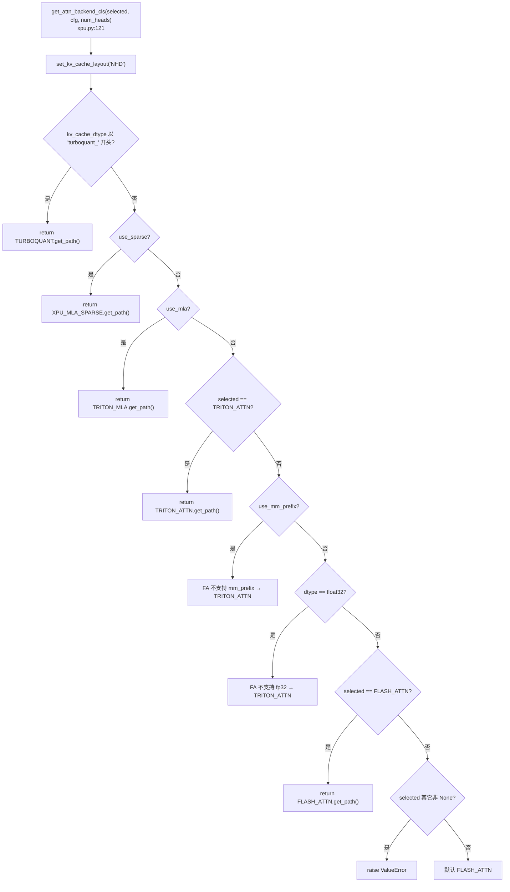
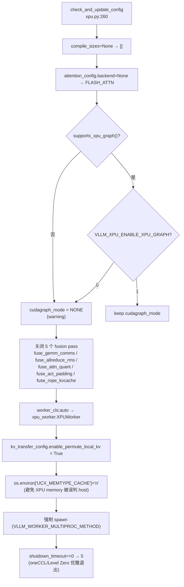

# XPUPlatform · xccl · vllm-xpu-kernels

[← Wiki 首页](../README.md) > [硬件平台](README.md) > XPU

源码：`vllm/platforms/xpu.py`（约 496 行）

## 是什么

`xpu.py` 是 vLLM 在 Intel XPU（Intel Arc/Data Center GPU）上的平台实现。它通过 `vllm_xpu_kernels` 包加载 C++ kernel 扩展（`_C`/`_moe_C`/`_xpu_C`），并把 attention backend 选择、cudagraph 兼容探测、fusion pass 关闭、TurboQuant KV cache 路由、GDN block size 对齐等 Intel GPU 特有逻辑集中实现。`dist_backend="xccl"` 在 plugin-resolver 探针命中 `torch.distributed.is_xccl_available()` 时设置（PyTorch ≥ 2.8.0.dev）。

核心成员：

- `XPUPlatform`（`xpu.py:103`）：单实现类。`device_type="xpu"`、`dispatch_key="XPU"`、`ray_device_key="GPU"`（Intel GPU 在 Ray 里也叫 GPU）、`dist_backend="xccl"`、`device_control_env_var="ZE_AFFINITY_MASK"`（Level Zero 的亲和性掩码，与 CUDA 的 `CUDA_VISIBLE_DEVICES` 不同范式）。
- `get_mem_info_wrapper(device)`（`xpu.py:31`）：把 `int/str/torch.device/None` 归一为 device index，bounds check 后调用 `torch.ops._C_cache_ops.getMemoryInfo(device)` 返回 `(free, total)`。模块顶层 `torch.accelerator.get_memory_info = get_mem_info_wrapper`（`xpu.py:100`）做全局 monkey-patch。
- `get_attn_backend_cls(...)`（`xpu.py:121`）：先 `set_kv_cache_layout("NHD")`（XPU 仅支持 NHD），再按 TurboQuant/sparse/MLA/FP32/mm_prefix 分支选 backend。
- `check_and_update_config(vllm_config)`（`xpu.py:260`）：设置默认 backend、`compile_sizes`、cudagraph_mode（按 `supports_xpu_graph()` 与 `VLLM_XPU_ENABLE_XPU_GRAPH` 决定）、关闭 XPU 不支持的 fusion pass、解析 `worker_cls`、强制 `UCX_MEMTYPE_CACHE=n`、强制 `spawn`、设默认 `shutdown_timeout=5`。
- `update_block_size_for_backend`（`xpu.py:338`）：调用父类后，若发现 `GDN_ATTN` backend，把 `block_size` 向上对齐到 64（kernel 限制），同时联动调整 `mamba_block_size` / `mamba_page_size_padded`。
- 模块级副作用：导入期 `import vllm_xpu_kernels._C` / `_moe_C` / `_xpu_C`（无 try/except，缺失直接 `ImportError`）；monkey-patch `torch.accelerator.get_memory_info`。

## 为什么

- **Level Zero 范式**：Intel XPU 用 Level Zero 而非 CUDA driver，可见设备 env 是 `ZE_AFFINITY_MASK`（如 `0.1` 表示 tile 0 + tile 1），与 `CUDA_VISIBLE_DEVICES` 的"逗号分隔整数列表"不同范式。vLLM `Platform` 抽象的 `device_control_id_to_physical_device_id` 默认 `int(device_id)`，对 Level Zero 的复合格式可能需要 OOT 扩展覆写（当前 `XPUPlatform` 未覆写， utilizar 时假定整数 ID）。
- **torch.accelerator monkey-patch**：PyTorch 的 `torch.accelerator.get_memory_info` 是新的统一 memory info API，但 Intel XPU 实现路径在 `vllm_xpu_kernels` 的 `torch.ops._C_cache_ops.getMemoryInfo`。XPU 平台在导入期把它垫成全局函数，让上层（如 GPU Worker sleep / wake_up）通过统一 API 拿到 free/total，而不必到处 if platform。
- **KV layout 锁定 NHD**：XPU 的 attention kernel 内部布局假设固定 `NHD`（num_heads, head_size, ...），与 vLLM 默认的 HND 不同。`get_attn_backend_cls` 入口处直接 `set_kv_cache_layout("NHD")` 并 `logger.info_once` 提示，避免每个 backend 再做一次。
- **cudagraph 兼容性硬探针**：XPU Graph 是较新特性，`supports_xpu_graph()`（从 `vllm.utils.torch_utils`）检测当前 PyTorch 是否支持。即使支持，默认 `VLLM_XPU_ENABLE_XPU_GRAPH=0` 仍 disabled——必须显式 opt-in。两条任一不满足则 `cudagraph_mode = CUDAGraphMode.NONE`。
- **fusion pass 禁用清单**：XPU 的 inductor 后端尚未支持若干 fusion pass（async TP、allreduce+rms、attn+quant、act+padding、rope+kvcache）。`check_and_update_config` 显式列了 5 个 pass 并逐个 `setattr(pass_config, flag, False)` 加 warning，避免运行期 inductor 报错。
- **GDN block size 64 对齐**：GDN（Gated DeltaNet）attention kernel 在 XPU 上要求 `block_size` 是 64 的倍数，与 vLLM 默认 16 不兼容。`update_block_size_for_backend` 在父类对齐后再补一道 GDN 专用对齐，并把 hybrid model 的 `mamba_page_size_padded` 联动调整以保持 page 一致。
- **TurboQuant KV cache 直通**：`attn_selector_config.kv_cache_dtype.startswith("turboquant_")` 时直接路由到 `TURBOQUANT` backend，绕过常规 MLA/MLA-sparse/FlashAttn 决策分支。

## 怎么做

### attention backend 选择流程



### `check_and_update_config` 全流程



### IR op 优先级

```python
# xpu.py:432 简化
def get_default_ir_op_priority(cls, vllm_config):
    cc = vllm_config.compilation_config
    using_inductor = cc.backend == "inductor" and cc.mode != CompilationMode.NONE
    default = ["native"] if using_inductor else ["xpu_kernels", "native"]
    return IrOpPriorityConfig.with_default(default)
```

非编译期把 `xpu_kernels` 加到 provider 优先级最前，让 IR op（如 `rms_norm`）优先用 `vllm_xpu_kernels` 提供的实现。

### `get_mem_info_wrapper` 归一化

```python
# xpu.py:31 简化
def get_mem_info_wrapper(device=None):
    if device is None:
        device = torch.xpu.current_device()
    elif isinstance(device, torch.device):
        if device.type != "xpu": raise RuntimeError(...)
        device = device.index if device.index is not None else torch.xpu.current_device()
    elif isinstance(device, str):
        # "xpu" → current; "xpu:N" → int(N)
        ...
    # bounds check
    if not (0 <= device < torch.xpu.device_count()): raise ValueError(...)
    free, total = torch.ops._C_cache_ops.getMemoryInfo(device)
    return free, total

torch.accelerator.get_memory_info = get_mem_info_wrapper
```

注意 `torch.ops._C` 在 XPU 平台是 `vllm_xpu_kernels._C` 的别名（通过 `import vllm_xpu_kernels._C` 注册）。

### 关键环境变量

| env | 作用 | 默认 |
|---|---|---|
| `ZE_AFFINITY_MASK` | Level Zero 设备亲和性（platform `device_control_env_var`） | — |
| `VLLM_XPU_ENABLE_XPU_GRAPH` | 显式启用 XPU Graph（cudagraph_mode） | `0` |
| `XPU_USE_TRITON_KERNEL` | 用 Triton kernel LoRA wrapper 取代 PunicaWrapperXPU | `0` |
| `UCX_MEMTYPE_CACHE` | 由 platform 强制 `n`，避免 XPU memory 被误判为 host | — |
| `VLLM_WORKER_MULTIPROC_METHOD` | 由 platform 强制 `spawn`（XPU 不支持 fork） | — |

## 与其它模块/系统配合

- **[plugin-resolver](plugin-resolver.md)**：`xpu_platform_plugin()` 在 `torch.xpu.is_available()` 时返回 `"vllm.platforms.xpu.XPUPlatform"`，并在 `is_xccl_available()` 时就地修改 `XPUPlatform.dist_backend="xccl"`。
- **[interface.md](interface.md)**：`XPUPlatform` 实现 `Platform`；`is_sleep_mode_available()` 在基类对 XPU 返回 `True`，sleep 经过 `XpuMemAllocator`（见下）。
- **`vllm_xpu_kernels`**：外部 pip 包，提供 C++ kernel 与 `xpumem_allocator` 扩展。`import vllm_xpu_kernels._C/_moe_C/_xpu_C` 是 XPU 平台强依赖。
- **[device-allocator](device-allocator.md)**：`is_xpu()` 在 `get_mem_allocator_instance()` 走 `XpuMemAllocator`，与 CUDA 的 `CuMemAllocator` 平行；sleep/wake 机制对称。
- **[编译](../09-compilation-ir/README.md)**：`check_and_update_config` 关闭 5 个 fusion pass；`get_static_graph_wrapper_cls()` 返回 `CUDAGraphWrapper`（与 CUDA 共享类名，但内部走 XPU Graph API）；`get_default_ir_op_priority` 让 `xpu_kernels` 优先。
- **[执行层](../02-execution/README.md)**：`worker_cls` 解析为 `xpu_worker.XPUWorker`；`update_block_size_for_backend` 处理 GDN 64 对齐；`get_punica_wrapper()` 默认 `PunicaWrapperXPU`，`XPU_USE_TRITON_KERNEL=1` 时切到 `PunicaWrapperGPU`。
- **[分布式-通信](../07-distributed/device-communicators/README.md)**：`get_device_communicator_cls()` 返回 `XpuCommunicator`；`is_xccl_available()` 缺失时 warning 但仍返回该类（运行期可能 raise）。
- **[KV 卸载-sleep](../15-kv-cache-offload/README.md)**：`is_sleep_mode_available()` 让 `[XPU][Feature] transparent sleep mode support for XPU platform`（#37149）走 `XpuMemAllocator.sleep/wake_up`。
- **[配置-device](../10-config/device-config.md)**：`device_control_env_var="ZE_AFFINITY_MASK"` 改变 `DeviceConfig` 读可见设备的来源。

## 历史版本演进

- **v0.5–v0.6**：Intel XPU 平台依赖 ipex（Intel Extension for PyTorch），attention/comm/attention backend 散落 costum ops；`XPUPlatform` 通过 `ipex` import 触发功能性（待核实）。
- **v0.7（ipex 弃用，#33379）**：`[XPU][1/N] Deprecate ipex and switch to vllm-xpu-kernels for xpu platform` 把 kernel 扩展迁移到独立的 `vllm_xpu_kernels` 包；`import vllm_xpu_kernels._C/_moe_C/_xpu_C` 成为模块顶层强依赖。
- **v0.8（xccl 抽象，#19410）**：`[Refactor]Abstract Platform Interface for Distributed Backend and Add xccl Support for Intel XPU`（#19410）让 `dist_backend="xccl"` 进入 `XPUPlatform`，由 `xpu_platform_plugin` 探针在 `is_xccl_available()` 时设置；`get_device_communicator_cls` 返回 `XpuCommunicator`。
- **v0.9（XPU Graph + fusion pass 关闭）**：`supports_xpu_graph()` 检测 + `VLLM_XPU_ENABLE_XPU_GRAPH` opt-in；`check_and_update_config` 显式列 5 个 fusion pass 关闭清单；`update_block_size_for_backend` 处理 GDN 64 对齐。
- **v0.10（TurboQuant + sleep mode）**：`get_attn_backend_cls` 增加 TurboQuant 直通分支；`#37149 [XPU][Feature] transparent sleep mode support for XPU platform` 让 `XpuMemAllocator` 落地，sleep mode 在 XPU 可用。
- **v0.11 / v0.12 / main**：`[XPU] Route mm_prefix models to Triton attention backend`（#47688）让 mm_prefix 走 Triton 而非 FlashAttn；`[XPU] [Fusion passes] Disable fuse_rope_kvcache_cat_mla & qk_norm_rope_fusion on XPU`（#47962）继续扩展禁用 pass 清单；`[XPU] C++ implementation for get_memory_info`（#47134）让 `get_mem_info_wrapper` 调 C++ 实现而非 Python 包装；`[XPU] Optimize XPU worker shutdown logic to prevent resource leak`（#46433）让 `shutdown_timeout=5` 默认值落地。具体版本归属（部分待核实）。

[← 返回硬件平台首页](README.md)

## 参见

- [interface.md](interface.md) — `Platform` 抽象基类。
- [cuda.md](cuda.md) — 对照 NVML vs torch.xpu 直接探测。
- [device-allocator.md](device-allocator.md) — `XpuMemAllocator` 与 `CuMemAllocator` 平行实现。
- [../07-distributed/device-communicators/README.md](../07-distributed/device-communicators/README.md) — `XpuCommunicator` + xccl。
- [../02-execution/worker/xpu-worker.md](../02-execution/worker/xpu-worker.md) — XPU Worker shutdown 与 `oneCCL` 资源回收。
