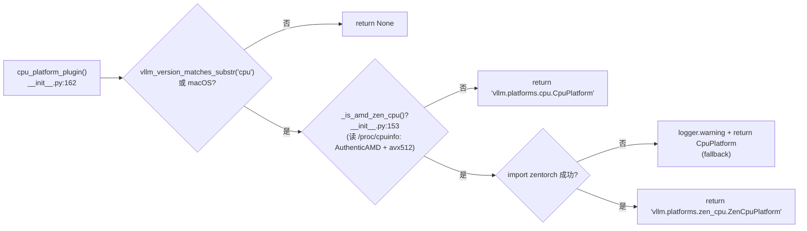
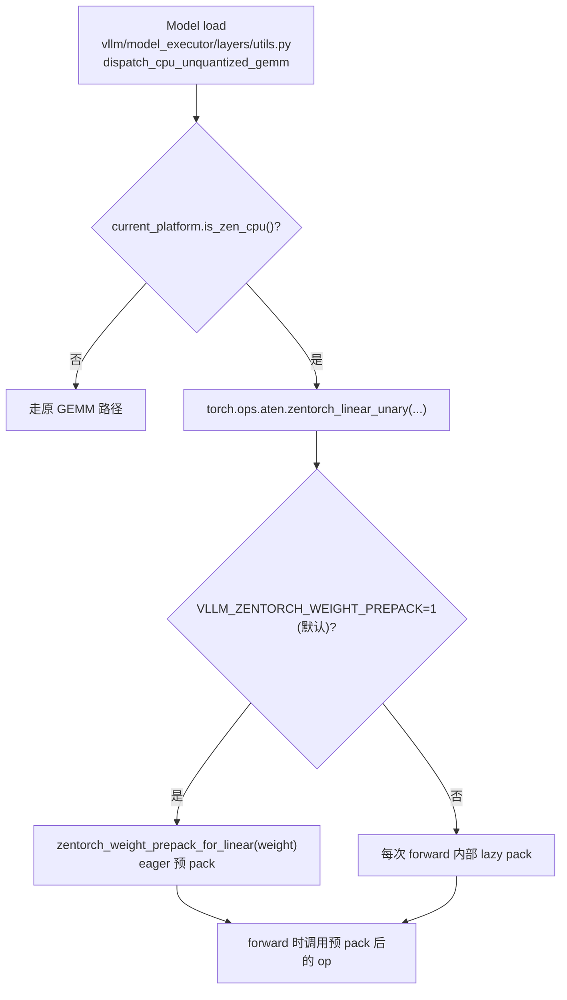

# ZenCpuPlatform · AVX-512 / zentorch

[← Wiki 首页](../README.md) > [硬件平台](README.md) > AMD Zen CPU

源码：`vllm/platforms/zen_cpu.py`（约 32 行）

## 是什么

`zen_cpu.py` 是 vLLM 在 AMD Zen 系列 CPU（ZenDNN/zentorch 优化）上的平台实现，作为 `CpuPlatform` 的**薄子类**。它本身不重写设备探测、worker 选择、编译模式等逻辑——那些全部继承自 [`CpuPlatform`](cpu.md)——只覆盖两个 AMD 特有的差异点：`is_zen_cpu()` 谓词与 `supported_dtypes` 列表。模型加载期的 zentorch 路由（`zentorch_linear_unary`、`zentorch_weight_prepack_for_linear`）由 `vllm/model_executor/layers/utils.py` 的 `dispatch_cpu_unquantized_gemm` 完成，由类 docstring 显式记录但不通过平台类自身实现。

核心成员：

- `ZenCpuPlatform(CpuPlatform)`（`zen_cpu.py:12`）：单实现类。`device_name="cpu"`、`device_type="cpu"`（沿用 CPU 命名空间）。
- `is_zen_cpu(self) -> bool`（`zen_cpu.py:24`）：覆写基类（返回 `False`）成 `True`。docstring 强调 `is_cpu()` 在本平台仍返回 `True`（继承自 `CpuPlatform`），即 Zen CPU 同时满足 `is_cpu()` 与 `is_zen_cpu()`，便于上层做"通用 CPU 路径 + Zen 优化路径"双层判断。
- `supported_dtypes` 属性（`zen_cpu.py:30`）：返回 `[torch.bfloat16, torch.float32]`——**剔除 `torch.float16`**。docstring 明确 "AMD CPUs do not support float16 compute"。
- 类 docstring（`zen_cpu.py:13-19`）：记录"model-load time 在 `layers/utils.py:dispatch_cpu_unquantized_gemm` 中把 linear ops 路由到 `zentorch_linear_unary`，并在 `VLLM_ZENTORCH_WEIGHT_PREPACK=1`（默认开启）时通过 `zentorch_weight_prepack_for_linear` eagerly 预 pack 权重"——这些行为**不在本类内实现**，只是把 contract 文档化，便于维护者检索。

## 为什么

- **共用 99% 行为，仅 1% 差异**：Zen CPU 在 NUMA 拓扑、`libgomp`/`libtcmalloc` LD_PRELOAD、`async_scheduling=False`、`block_size=128`、`CPU_ATTN` backend、`gloo` 通信、`spawn` 多进程等维度与通用 CPU 完全一致。让 `ZenCpuPlatform(CpuPlatform)` 继承而非重复实现，避免维护两份大文件，也让 `cpu.md` 描述的逻辑自动适用于 Zen。
- **float16 不支持**：AMD Zen CPU 微架构不支持 FP16 计算指令（与 Intel Xeon 不同），运行 FP16 模型会 fall back 到软件模拟，性能与精度都受损。`supported_dtypes` 显式排除 `torch.float16`，让 `--dtype=auto` 走 BF16 而非 FP16，避免静默性能退化。
- **`is_zen_cpu()` 谓词的语义**：上层（如 `dispatch_cpu_unquantized_gemm`）通过 `current_platform.is_cpu()` 判断进入 CPU 路径，再通过 `is_zen_cpu()` 二次判断是否走 zentorch 路由。这种"嵌套 if"让通用 CPU 路径与 Zen 优化路径共享前置代码，且让非 Zen CPU（Intel、ARM、PowerPC）继续走原路径不受影响。
- **`zentorch` 路由的代码外置**：zentorch 是 AMD 维护的独立包，其 `zentorch_linear_unary` op 在 `import zentorch` 时注册到 torch ops 命名空间。vLLM 不在 `zen_cpu.py` 内 import zentorch（避免 OOT 强依赖），而是让 `dispatch_cpu_unquantized_gemm` 在 model load 时按 `is_zen_cpu()` 判定走 `torch.ops.zentorch.*` 路径——这是"平台标记 + 调用方分流"的标准模式（见 [`interface.md`](interface.md) 的注入点设计哲学）。
- **`VLLM_ZENTORCH_WEIGHT_PREPACK` 默认开**：默认 `1` 让 zentorch 在 model load 时 eager 预 pack 权重，避免每次 forward 都做 pack。docstring 把这个 env 写进类 docstring 提示用户可调。

## 怎么做

### 完整源码（仅 32 行，含 docstring）

```python
# vllm/platforms/zen_cpu.py 简化
import torch
from vllm.platforms.cpu import CpuPlatform

class ZenCpuPlatform(CpuPlatform):
    """CPU platform with AMD Zen (ZenDNN/zentorch) optimizations.

    Model-load time (dispatch_cpu_unquantized_gemm in layers/utils.py):
      - Routes linear ops to zentorch_linear_unary.
      - When VLLM_ZENTORCH_WEIGHT_PREPACK=1 (default), eagerly prepacks
        weights via zentorch_weight_prepack_for_linear.
    """

    device_name: str = "cpu"
    device_type: str = "cpu"

    def is_zen_cpu(self) -> bool:
        return True

    @property
    def supported_dtypes(self) -> list[torch.dtype]:
        return [torch.bfloat16, torch.float32]
```

### 平台解析路径



### zentorch 调用链（不在本文件）



注意此调用链**不在 `ZenCpuPlatform` 类内**，但通过 `is_zen_cpu()` 谓词触发。这是平台类作为"标记/契约"而非"实现"的典型范式。

### 关键环境变量

| env | 作用 | 默认 |
|---|---|---|
| `VLLM_ZENTORCH_WEIGHT_PREPACK` | zentorch eager 权重 prepack 开关 | `1`（默认开启，见类 docstring） |

其它 CPU 相关 env（`VLLM_CPU_KVCACHE_SPACE`、`VLLM_CPU_CI_ENV`、`LD_PRELOAD` 等）继承自 [`CpuPlatform`](cpu.md)，无 Zen 专属差异。

## 与其它模块/系统配合

- **[cpu.md](cpu.md)**：父类，所有 `Platform` hook 与 `check_and_update_config` 行为继承；本文件仅覆盖 `is_zen_cpu()` 与 `supported_dtypes`。
- **[interface.md](interface.md)**：`is_zen_cpu()` 在基类默认返回 `False`（`interface.py:209`），`ZenCpuPlatform` 是唯一覆写为 `True` 的子类。
- **[plugin-resolver](plugin-resolver.md)**：`_is_amd_zen_cpu()` 读 `/proc/cpuinfo` 检测 `AuthenticAMD + avx512`；`cpu_platform_plugin()` 在该函数返回 `True` 且 `import zentorch` 成功时返回 `"vllm.platforms.zen_cpu.ZenCpuPlatform"`，失败 fallback 到 `CpuPlatform`。
- **`vllm/model_executor/layers/utils.py`**：`dispatch_cpu_unquantized_gemm` 是 `is_zen_cpu()` 谓词的实际消费者，在 model load 期 routing。
- **`zentorch` 包**：AMD 维护的 ZenDNN Python 入口，`import zentorch` 时把 `torch.ops.aten.zentorch_*` 注册到 PyTorch。
- **[模型执行-内核](../03-model-execution/kernels.md)**：zentorch 提供 linear/unary 等 GEMM op，与 vLLM 自带 `_C`/`_C_AVX512` 共存。
- **[配置-device](../10-config/device-config.md)**：`device_type="cpu"` 让 `DeviceConfig` 走 CPU 路径；`supported_dtypes` 决定 `--dtype=auto` 的回退值（BF16 而非 FP16）。

## 历史版本演进

- **v0.5–v0.9**：AMD Zen CPU 走通用 `CpuPlatform`，`zentorch` 集成仅通过 `dispatch_cpu_unquantized_gemm` 内的 `if` 判定 CPU 厂商，无独立平台类（待核实）。
- **v0.10（In-Tree AMD Zen CPU Backend，#35970）**：`[1/N] In-Tree AMD Zen CPU Backend via zentorch` 落地 `ZenCpuPlatform` 类与 `_is_amd_zen_cpu()` 探针；plugin-resolver 加入 `zentorch` 检测分流；`is_zen_cpu()` 成为正式 API；`supported_dtypes` 显式剔除 FP16。
- **v0.11（平台运行时日志与文档，#42726）**：`[ZenCPU] Add zencpu Platform Runtime Logging and Docs` 完善 docstring 与日志，明确"model-load time 在 `layers/utils.py:dispatch_cpu_unquantized_gemm` 路由"的 contract；`VLLM_ZENTORCH_WEIGHT_PREPACK` 默认值与文档同步。
- **v0.12 / main**：本文件保持 32 行稳定（仅类 docstring 与 2 个覆写方法），新优化（如新 ISA 支持、新 model 路由）继续在外部 `zentorch` 包与 `model_executor/layers/utils.py` 演进；本文件作为"标记接口"角色不变。具体版本归属（部分待核实）。

[← 返回硬件平台首页](README.md)

## 参见

- [cpu.md](cpu.md) — 父类 `CpuPlatform` 的全部 hook 与 env。
- [interface.md](interface.md) — `is_zen_cpu()` 在基类默认 `False`。
- [plugin-resolver.md](plugin-resolver.md) — `_is_amd_zen_cpu()` + `import zentorch` 探测分流。
- [../03-model-execution/layers/README.md](../03-model-execution/layers/README.md) — `dispatch_cpu_unquantized_gemm` 是 `is_zen_cpu()` 的实际消费方。
