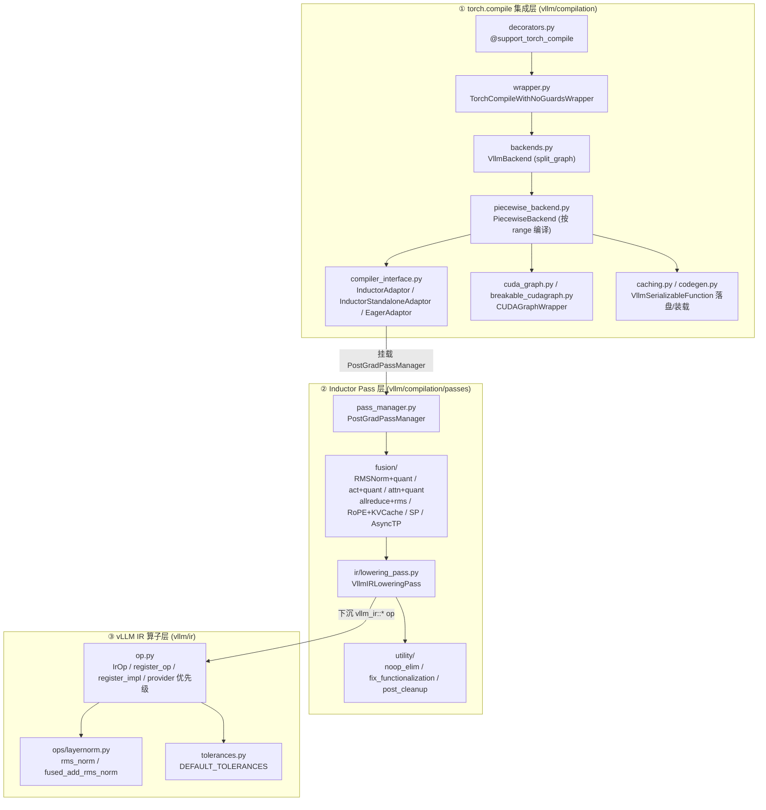
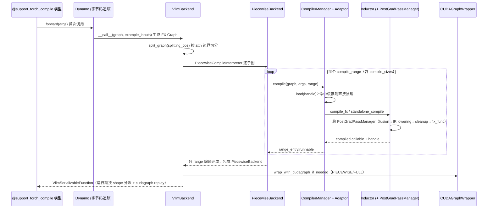

# 09 · 编译与 IR

[← Wiki 首页](../README.md)

本子系统是 vLLM 把 `torch.compile` 生产化的核心：在 Dynamo 字节码追踪之后接管后端，做**分片编译（piecewise）**、**形状特化**、**自定义 Inductor Pass**、**vLLM IR 算子下沉**与 **CUDA Graph 捕获/回放**，并把全部产物落盘缓存以实现"冷启动一次、热启动秒级"。它横跨 `vllm/compilation/`（编译流水线）与 `vllm/ir/`（IR 算子库）两棵子树，通过 [`平台`](../08-platforms/README.md) 注入厂商差异，通过 [`配置-compilation`](../10-config/README.md) 对外暴露开关。

## 三层架构

## torch.compile → piecewise → cudagraph → inductor 流水

## 模块导航

### 顶层（`vllm/compilation/`）

| 页 | 源码 | 职责 |
|---|---|---|
| [compiler-interface.md](compiler-interface.md) | `compiler_interface.py` | `CompilerInterface` 抽象 + Inductor/Eager/standalone 三个适配器 + `AlwaysHitShapeEnv` 缓存命中技巧 |
| [backends.md](backends.md) | `backends.py` | `VllmBackend`（torch.compile 后端入口）、`split_graph`、`CompilerManager`、`PiecewiseCompileInterpreter` |
| [piecewise-backend.md](piecewise-backend.md) | `piecewise_backend.py` | `PiecewiseBackend`：按 compile_range/compile_sizes 编译并运行期分派 |
| [wrapper.md](wrapper.md) | `wrapper.py` | `TorchCompileWithNoGuardsWrapper`：丢 guard、bytecode hook、NVTX |
| [decorators.md](decorators.md) | `decorators.py` | `@support_torch_compile` 装饰器、`dynamic_arg_dims`、AOT 装载 |
| [cuda-graph.md](cuda-graph.md) | `cuda_graph.py` | `CUDAGraphWrapper`：FULL/PIECEWISE 捕获与回放 |
| [breakable-cudagraph.md](breakable-cudagraph.md) | `breakable_cudagraph.py` | `BreakableCUDAGraphWrapper`：运行期 stream-capture 断点捕获 |
| [base-static-graph.md](base-static-graph.md) | `base_static_graph.py` | `AbstractStaticGraphWrapper` Protocol（平台扩展点） |
| [codegen.md](codegen.md) | `codegen.py` | 拼接图执行函数代码生成，消除 FX 解释开销 |
| [caching.md](caching.md) | `caching.py` | `VllmSerializableFunction`、`StandaloneCompiledArtifacts`、mega-AOT 重构 |
| [partition-rules.md](partition-rules.md) | `partition_rules.py` | `should_split`、`inductor_partition_rule_context` |
| [counter.md](counter.md) | `counter.py` | `CompilationCounter`：编译计数（测试与可观测） |
| [monitor.md](monitor.md) | `monitor.py` | `monitor_torch_compile`、cudagraph 捕获合法性闸门 |

### Pass 系统（`vllm/compilation/passes/`）

| 页 | 源码 | 职责 |
|---|---|---|
| [passes/README.md](passes/README.md) | — | Pass 系统总览 + PostGradPassManager 流水线 mermaid |
| [passes/pass-manager.md](passes/pass-manager.md) | `pass_manager.py` | `PostGradPassManager`：编排 fusion→lowering→cleanup→fix_func |
| [passes/inductor-pass.md](passes/inductor-pass.md) | `inductor_pass.py` | `InductorPass` 基类、`PassContext`、`uuid`/缓存键 |
| [passes/vllm-inductor-pass.md](passes/vllm-inductor-pass.md) | `vllm_inductor_pass.py` | `VllmInductorPass`、`VllmPatternMatcherPass`、`VllmPatternReplacement` |
| [passes/fx-utils.md](passes/fx-utils.md) | `fx_utils.py` | `is_func`/`find_auto_fn`/`find_op_nodes` 等 FX 工具 |
| [passes/fusion.md](passes/fusion.md) | `fusion/*` | 全部融合 Pass 合集（norm/act/attn/allreduce/rope/mla/sp） |
| [passes/ir.md](passes/ir.md) | `passes/ir/*` | `VllmIRLoweringPass` / `UnsafeCloneEliminationPass` / inplace functionalization |
| [passes/utility.md](passes/utility.md) | `passes/utility/*` | noop 消除 / fix_functionalization / post_cleanup / scatter_split / split_coalescing |

### vLLM IR 算子库（`vllm/ir/`）

| 页 | 源码 | 职责 |
|---|---|---|
| [ir-README.md](ir-README.md) | `vllm/ir/` | `vllm_ir` torch 库命名空间总览 |
| [ir-op.md](ir-op.md) | `op.py` | `IrOp` / `register_op` / `register_impl` / provider 优先级 / maybe_inplace |
| [tolerances.md](tolerances.md) | `tolerances.py` | `DEFAULT_TOLERANCES`：各 dtype 数值比对容差 |
| [ir-ops.md](ir-ops.md) | `ops/layernorm.py` | 内置 IR 算子 `rms_norm` / `fused_add_rms_norm` |

## 核心配置

编译行为几乎全部由 [`CompilationConfig`](../10-config/README.md)（`vllm/config/compilation.py`）驱动，关键字段：

- `mode: CompilationMode` — `NONE` / `STOCK_TORCH_COMPILE` / `DYNAMO_TRACE_ONCE` / `VLLM_COMPILE`
- `backend: str` — `inductor`（默认）/ `eager` / 厂商自定义 qualname
- `cudagraph_mode: CUDAGraphMode` — `NONE` / `PIECEWISE` / `FULL` / `FULL_DECODE_ONLY` / `FULL_AND_PIECEWISE`
- `splitting_ops` / `use_inductor_graph_partition` — FX 切分 vs Inductor 内部分区
- `compile_sizes` / `compile_ranges_endpoints` — 显式特化的 batch size
- `pass_config: PassConfig` — 各融合 Pass 开关（`fuse_norm_quant`、`enable_sp`、`fuse_attn_quant` …）
- `dynamic_shapes_config` — `BACKED` / `UNBACKED` / `BACKED_SIZE_OBLIVIOUS` + `evaluate_guards`
- 环境变量：`VLLM_USE_STANDALONE_COMPILE`、`VLLM_USE_MEGA_AOT_ARTIFACT`、`VLLM_USE_AOT_COMPILE`、`VLLM_DISABLE_COMPILE_CACHE`、`VLLM_USE_BREAKABLE_CUDAGRAPH`、`VLLM_USE_BYTECODE_HOOK`

## 与其它子系统配合

- [`平台`](../08-platforms/README.md)：`current_platform.get_compile_backend()` / `get_static_graph_wrapper_cls()` / `get_pass_manager_cls()` / `get_global_graph_pool()` 注入厂商后端、cudagraph 包装类、Pass 管理器与 graph pool。
- [`执行-cudagraph`](../02-execution/worker/cudagraph-capture.md)：Worker 触发 cudagraph 捕获的时机与 `BatchDescriptor`。
- [`模型执行-custom_op`](../03-model-execution/layers/custom-op.md)：融合 Pass 的 pattern/replacement 调用的 `torch.ops._C.*` 与 `torch.ops.vllm.*` 自定义算子。
- [`注意力`](../05-attention/README.md)：`splitting_ops` 以注意力 op 为切分点；MLA 系列融合 Pass。
- [`配置-compilation`](../10-config/README.md)：`CompilationConfig` / `PassConfig` / `DynamicShapesConfig` 的字段定义。
- [`分布式`](../07-distributed/README.md)：`AsyncTPPass`、`AllReduceFusionPass`、`SequenceParallelismPass` 依赖 TP group。

## 历史版本演进

- **v0.5–v0.6**：`torch.compile` 集成初期，仅 `inductor` 直通，无 piecewise、无自定义 Pass（待核实）。
- **v0.7（piecewise 落地）**：引入 `VllmBackend` + `split_graph` + `PiecewiseBackend`，按注意力边界把计算图切成多段分别编译；`CompilerManager` 缓存到 `~/.cache/vllm/torch_compile_cache`。
- **v0.8（IR 框架成型 + breakable 预研）**：`vllm/ir/` 命名空间成型，`IrOp`/`register_op`/`register_impl` 与 provider 优先级；`PostGradPassManager` 把 fusion Pass 串成流水线；`VllmIRLoweringPass` 把 `vllm_ir::*` 下沉为具体实现。cudagraph 引入 `FULL`/`PIECEWISE` 双模式。
- **v0.9（breakable cudagraph）**：`BreakableCUDAGraphWrapper` + `BreakableCUDAGraphCapture` 引入运行期 stream-capture 断点（受 `VLLM_USE_BREAKABLE_CUDAGRAPH` 控制），不再依赖 FX 预切分。
- **v0.10**：`InductorStandaloneAdaptor`（`VLLM_USE_STANDALONE_COMPILE`）转正，取代老 `InductorAdaptor` 的 monkey-patch 套路；`VLLM_USE_MEGA_AOT_ARTIFACT` + `StandaloneCompiledArtifacts` 去重存储。
- **v0.11 / v0.12 / main**：AOT 编译（`VLLM_USE_AOT_COMPILE` + `save_compiled_function`/`load_compiled_function`）、`BACKED_SIZE_OBLIVIOUS` 动态形状、`codegen.py` 拼接图代码生成（`exec` 生成 `execution_fn`）、MLA 系列 fusion（`mla_attn_quant`/`mla_rope_kvcache_cat`）持续扩充；MRv2 切换中 `reset_compile_wrapper` 支持弹性 EP 重编译。具体版本归属（部分待核实）。

[← 返回 Wiki 首页](../README.md)
