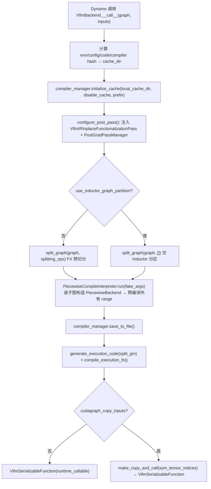

# VllmBackend 与编译编排

[← Wiki 首页](../README.md) > [编译与 IR](../README.md) > VllmBackend

源码：`vllm/compilation/backends.py`（约 1331 行）

## 是什么

`VllmBackend` 是 vLLM 注册给 `torch.compile` 的自定义后端（`CompilationMode.VLLM_COMPILE`）。它在 Dynamo 产出 FX Graph 之后接管，完成"切图→逐段编译→挂 cudagraph→生成运行期 callable"的全流程，并把产物交给 [`VllmSerializableFunction`](caching.md) 序列化。

核心成员：

- `VllmBackend`（`backends.py:800`）：后端类，`__call__(graph, example_inputs)` 是 torch.compile 入口。持有 `compiler_manager: CompilerManager`、`pass_manager`、`inductor_config`。
- `CompilerManager`（`backends.py:124`）：缓存与调度中枢。`cache: dict[(Range, graph_index, backend_name), Any]`，`load()`/`compile()`/`save_to_file()`。
- `split_graph()`（`backends.py:548`）：按 `splitting_ops` 把 FX Graph 切成多个子图 `SplitItem`，含 `_decompose_size_nodes`、`_merge_empty_only_subgraphs`。
- `PiecewiseCompileInterpreter`（`backends.py:682`）：FX Interpreter，遍历切分后的图，对每个需编译子图构造 `PiecewiseBackend` 并按 range 预编译。
- `wrap_with_cudagraph_if_needed()`（`backends.py:628`）：按 `cudagraph_mode` 用平台 static graph wrapper 包裹 piecewise backend。
- `make_copy_and_call()`（`backends.py:59`）：cudagraph 静态输入缓冲拷贝包装器。
- `set_model_tag()`（`backends.py:780`）：区分 backbone / eagle_head / encoder 的上下文管理器。

## 为什么

- **一次 Dynamo 追踪，多次特化编译**：Dynamo 只跑一次拿到 FX Graph，随后 vLLM 对每个 `compile_range`（含 `compile_sizes`）单独编译，以避免每个 batch size 都触发一次昂贵的 Dynamo 追踪。`AlwaysHitShapeEnv` + 脱离追踪上下文的编译让 Inductor 缓存可命中。
- **piecewise 切分**：注意力等 op 含动态形状且不友好 Inductor 全图编译，按 `splitting_ops`（注意力边界）切成"计算段 + 切分段"。切分段不编译，计算段单独走 Inductor，从而既享受 fusion 又规避动态 shape 难题。CUDA Graph 也因此能以 PIECEWISE 模式按段捕获。
- **双层缓存去重**：`CompilerManager.compile()` 在调用后端编译前先用 `autograd_cache_key` patch 探测：若该 cache_key 已在 `loaded_artifacts` 中（同构不同名子图，如相同 transformer 层），直接抛 `StopCompiling` 复用，省去 Inductor 重复产出与磁盘 IO（`backends.py:309-365`）。
- **运行期零开销拼接**：`generate_execution_code()`（[`codegen.py`](codegen.md)）把拼接图编译成纯 Python 函数，以 `__vllm_submods__` 列表索引子图 callable，绕开 FX GraphModule 的 `__call__`/`__getattr__` 分派开销。
- **多模型部分编译**：`prefix` + `model_tag` 区分 backbone / eagle_head / encoder，各自独立缓存目录与编译计数；encoder 的 compile_range 上界放开到 `MAX_INT32`（`piecewise_backend.py:138`）。

## 怎么做

### VllmBackend.__call__ 主流程



### split_graph 切分算法

1. `_decompose_size_nodes`（`backends.py:479`）：把 `x.size()` 调用拆成逐维 `sym_size.int`，使 `torch.Size` 不跨子图传递。
2. 遍历节点，`should_split(node, splitting_ops)` 命中则开新子图；连续切分 op 合并到同一段（`backends.py:578`）；`getitem` 跟随其输入所在子图。
3. `_merge_empty_only_subgraphs`：只含 `aten::empty` 的子图并入前一段，避免空 cudagraph。
4. `torch.fx.passes.split_module.split_module(keep_original_order=True)` 生成 `split_gm`，返回 `list[SplitItem]`。

### CompilerManager.compile 的去重早退

```python
# backends.py:328-364 简化
orig = autograd_cache_key
def autograd_cache_key(*a, **k):
    result = orig(*a, **k)
    if result and result[0] in self.loaded_artifacts:
        raise StopCompiling()           # 命中已加载的同构 artifact
    return result
with patch(autograd_cache_key, ...), config.patch(autograd_cache_normalize_inputs=True):
    try:
        compiled, handle = self.compiler.compile(graph, args, ..., maybe_key)
    except StopCompiling:
        compiled = self.loaded_artifacts[cache_key]
```

`autograd_cache_normalize_inputs=True` 让"节点名不同但结构相同"的子图（典型：同名 transformer 层）落到同一 cache_key，是去重关键。

### configure_post_pass

`backends.py:929`：把 `VllmIRInplaceFunctionalizationPass` 挂到 `inductor_config["pre_grad_custom_pass"]`（pre-AOTAutograd functionalize maybe_inplace），把 `PostGradPassManager` 挂到 `inductor_config[pass_key]`（`post_grad_custom_post_pass`）。同时把 `pre_grad_custom_pass` 加入 `_cache_config_ignore_prefix`，避免它污染 AOTAutograd 内置 cache key。

### cache 目录布局

`backends.py:1062-1074`：`cache_dir = $VLLM_CACHE_ROOT/torch_compile_cache/<hash>/<rank>_<dp_rank>/<prefix>/`，内含 `vllm_compile_cache.py`（句柄表，`pprint` + `ast.literal_eval`）、`computation_graph.py`（可读 FX 源码）、`cache_key_factors.json`（hash 因子留档）。

## 与其它模块/系统配合

- [`compiler_interface.py`](compiler-interface.md)：`make_compiler()` 选适配器；`CompilerManager` 透传 `compile/load/initialize_cache/compute_hash`。
- [`piecewise_backend.py`](piecewise-backend.md)：`PiecewiseCompileInterpreter.call_module` 构造 `PiecewiseBackend` 并交给 `wrap_with_cudagraph_if_needed`。
- [`codegen.py`](codegen.md)：`generate_execution_code` + `compile_execution_fn` 产出运行期 callable。
- [`caching.py`](caching.md)：`VllmSerializableFunction` 序列化整图 + `collect_standalone_compile_artifacts()` 收集 mega-AOT。
- [`cuda_graph.py`](cuda-graph.md)：`wrap_with_cudagraph_if_needed` 用平台 wrapper 类以 `CUDAGraphMode.PIECEWISE` 包裹。
- [`partition_rules.py`](partition-rules.md)：`should_split` 与 `inductor_partition_rule_context`。
- [`monitor.py`](monitor.md)：`torch_compile_start_time` 用于 Dynamo 字节码耗时上报。
- [`平台`](../08-platforms/README.md)：`current_platform.get_pass_manager_cls()` / `get_static_graph_wrapper_cls()` / `pass_key` 注入厂商 Pass 管理器与 cudagraph 类。
- [`执行-cudagraph`](../02-execution/worker/cudagraph-capture.md)：Worker 决定 `cudagraph_runtime_mode` 与 `BatchDescriptor`，与 `CUDAGraphWrapper` 协同。
- [`配置-compilation`](../10-config/README.md)：`use_inductor_graph_partition`、`cudagraph_copy_inputs`、`splitting_ops`、`compile_sizes`。

## 历史版本演进

- **v0.7（piecewise 落地）**：`VllmBackend` + `split_graph` + `PiecewiseCompileInterpreter` 成型；`CompilerManager` 落盘 `vllm_compile_cache.py`；引入 `model_tag` 区分多模型部分。
- **v0.8**：`configure_post_pass` 注入 `VllmIRInplaceFunctionalizationPass`（pre-grad）；`PostGradPassManager` 接 `post_grad_custom_post_pass`；splitting 支持 `use_inductor_graph_partition` 让 Inductor 自行分区。
- **v0.9**：`wrap_with_cudagraph_if_needed` 抽出共享函数（供 `reconstruct_serializable_fn_from_mega_artifact` 复用）；`make_copy_and_call` 静态缓冲 lazy 初始化。
- **v0.10**：`autograd_cache_key` patch + `autograd_cache_normalize_inputs=True` 引入同构子图去重；`_decompose_size_nodes` 修复 `torch.Size` 跨子图问题；ngram GPU kernel 临时禁用 cache（`backends.py:1080`）。
- **v0.11 / v0.12 / main**：`generate_execution_code` + `compile_execution_fn` 替代 FX 解释执行；mega-AOT `original_split_gm` 保留用于序列化；`backed_size_oblivious` 动态形状 range 调整（`backends.py:1232`）；`reset_compile_wrapper`（`wrapper.py`）支持弹性 EP 重编译。具体版本归属（部分待核实）。

[← 返回编译与 IR 首页](../README.md)

## 参见

- [piecewise-backend.md](piecewise-backend.md) — `PiecewiseBackend` 如何按 range 分派。
- [compiler-interface.md](compiler-interface.md) — `make_compiler` 与三适配器。
- [codegen.md](codegen.md) — 拼接图代码生成。
- [caching.md](caching.md) — `VllmSerializableFunction` 序列化。
- [../02-execution/worker/cudagraph-capture.md](../02-execution/worker/cudagraph-capture.md) — cudagraph 捕获时机。
