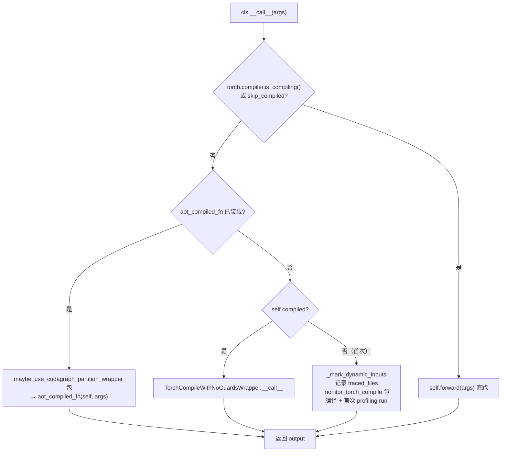

# @support_torch_compile 装饰器

[← Wiki 首页](../README.md) > [编译与 IR](../README.md) > decorators

源码：`vllm/compilation/decorators.py`（约 780 行）

## 是什么

`@support_torch_compile` 是给模型类（`nn.Module` 子类）打上的类装饰器，把它变成"编译期标记动态维 + 首次调用触发 torch.compile + 可选 AOT 装载"的编译入口。它是 vLLM 模型层与编译子系统之间的唯一耦合点。

关键成员：

- `support_torch_compile(...)`（`decorators.py:118`）：装饰器工厂，参数 `dynamic_arg_dims` / `mark_unbacked_dims` / `enable_if` / `is_encoder`。
- `ignore_torch_compile(cls)`（`decorators.py:58`）：给子类打 `_ignore_compile_vllm=True`，跳过编译。
- `_support_torch_compile`（`decorators.py:331`）：内部实现，把 `TorchCompileWithNoGuardsWrapper` 加入 `cls.__bases__`，重写 `__init__`/`__call__`。
- `_mark_dynamic_inputs`（`decorators.py:414`）：运行期按 `dynamic_arg_dims` 调 `mark_dynamic`/`mark_unbacked`。
- `_try_load_aot_compiled_fn`（`decorators.py:284`）：从磁盘装载 AOT 编译函数，含 `_verify_source_unchanged` 校验。
- `maybe_use_cudagraph_partition_wrapper`（`decorators.py:724`）：Inductor 自分区时设 `set_customized_partition_wrappers`。
- `should_torch_compile_mm_encoder`（`decorators.py:53`）：`enable_if` 工厂，控制多模态 encoder 是否编译。

## 为什么

- **解耦模型作者与编译细节**：模型作者只声明"哪些 forward 参数的哪些维是动态的"，装饰器负责把它翻译成 Dynamo 的 `mark_dynamic`/`mark_unbacked`，并按 `VllmConfig` 决定走 `VLLM_COMPILE`/`STOCK_TORCH_COMPILE`/`NONE`。
- **类型注解自动推断**：`dynamic_arg_dims=None` 时，按 `inspect.signature` 把 `torch.Tensor` / `Optional[Tensor]` / `IntermediateTensors` 参数的第 0 维标为动态（`decorators.py:208`），减少样板代码。
- **unbacked 动态形状支持**：`mark_unbacked_dims` + `DynamicShapesType.UNBACKED` 让动态维不被 0/1 特化，对 vision encoder 这类输入形状不可预测的场景必要。`shape_id`（torch 2.11+）让多个 dim 共享同一 unbacked 符号。
- **AOT 编译与磁盘装载**：`VLLM_USE_AOT_COMPILE` 下，首次编译后 `save_compiled_function` 落盘；后续启动 `_try_load_aot_compiled_fn` 用 `torch.compiler.load_compiled_function` 装载，并用源码 checksum 校验未被改动（`_verify_source_unchanged`）。
- **traced_files 收集**：patch `InliningInstructionTranslator.inline_call_` 记录 Dynamo 追踪进来的所有源文件，供 [`caching.py`](caching.md) 的 code_hash 与 AOT 装载时的源码校验使用。
- **Inductor 自分区的 cudagraph wrapper**：`use_inductor_graph_partition` 时 Inductor 在 lowering 后自行分区，vLLM 通过 `set_customized_partition_wrappers` 给每个分区套平台 static graph wrapper（`decorators.py:754`）。
- **encoder skip 路径**：`forward_context.skip_compiled`（enc-dec 模型形状/类型多变）或 `torch.compiler.is_compiling()`（TPU 等平台在 runner 内编译）时直跑 `forward`，跳过 compiled path。

## 怎么做

### 装饰后的 __call__ 分派



### 首次编译上下文

`__call__` 首次分支（`decorators.py:583`）构造一组 patch / config：

- `patch.object(InliningInstructionTranslator, "inline_call_", patched_inline_call)`：收集 traced_files。
- `dynamo_config_patches["enable_cpp_symbolic_shape_guards"]=False`：vLLM 丢 guard，C++ guard 编译无收益。
- `fx_config_patches["backed_size_oblivious"]=True`（对应 ds_type）。
- `inductor_config_patches["assume_32bit_indexing"]`（torch 2.10+）。
- `maybe_use_cudagraph_partition_wrapper(vllm_config)`。
- `monitor_torch_compile(...)` 计时；AOT 路径额外 `monitor_profiling_run()` 确保 profiling 不触发后端编译。

### _mark_dynamic_inputs

按 `normalized_dims: dict[str, dict[int, str|None]]`，对每个参数：

- `Tensor`：`mark_dynamic(arg, [(dim, shape_id), ...])`。
- `IntermediateTensors`：对其内部每个 tensor 同上。
- `UNBACKED` + torch 2.10+：`mark_unbacked(arg, dim, hint_override=arg.size()[dim], shape_id=...)`；旧版退化为 `mark_unbacked(arg, dims)`。
- `mark_unbacked_dims` 单独追加 unbacked 标记（用于 vision encoder 防 0/1 特化）。

### AOT 装载与校验

```python
# decorators.py:284 简化
loaded_fn = torch.compiler.load_compiled_function(f, f_globals=model.forward.__globals__)
_verify_source_unchanged(loaded_fn.source_info(), vllm_config)  # 校验源码 checksum
if not ds_config.evaluate_guards: loaded_fn.disable_guard_check()
with maybe_use_cudagraph_partition_wrapper(...):
    loaded_fn._artifacts.compiled_fn.finalize_loading(vllm_config)
```

`_verify_source_unchanged`（`decorators.py:265`）用 `source_info.inlined_sources` 的 content 算 checksum，与磁盘文件的 fresh checksum 比对，不一致则抛 "Source code has changed"。

### save_aot_compiled_function

`decorators.py:688`：`aot_compiled_fn.save_compiled_function(tmp)` + `os.replace(tmp, path)` 原子落盘；`was_aot_compile_fn_loaded_from_disk` 时跳过保存；`VLLM_DISABLE_COMPILE_CACHE` 直接 return。

## 与其它模块/系统配合

- [`wrapper.py`](wrapper.md)：装饰器把 `TorchCompileWithNoGuardsWrapper` 注入基类链，`__call__` 复用其编译产物。
- [`backends.py`](backends.md)：`init_backend()` 返回 `VllmBackend`，`torch.compile(backend=VllmBackend实例)` 触发 `VllmBackend.__call__`。
- [`caching.py`](caching.md)：`aot_compile_hash_factors` + `_compute_code_hash` 提供 AOT hash；`finalize_loading` 回到 `VllmBackend` 重跑。
- [`monitor.py`](monitor.md)：`monitor_torch_compile` / `monitor_profiling_run` 包住首编与 profiling。
- [`模型执行-custom_op`](../03-model-execution/layers/custom-op.md)：被装饰的 forward 内部调用 `torch.ops._C.*`/`torch.ops.vllm.*`，这些 op 是 fusion Pass 的 pattern 目标。
- [`配置-compilation`](../10-config/README.md)：`mode` / `compile_mm_encoder` / `dynamic_shapes_config` / `backend`。
- [`分布式`](../07-distributed/README.md)：弹性 EP 改 `data_parallel_size` 触发 `reset_compile_wrapper`（`wrapper.py`）。

## 历史版本演进

- **v0.6–v0.7**：`@support_torch_compile` 引入，仅 `dynamic_arg_dims` + 基础 mark_dynamic；`ignore_torch_compile` 用于子类跳过。
- **v0.8**：`is_encoder` 参数 + `should_torch_compile_mm_encoder`；`enable_if` 机制；traced_files 收集 patch。
- **v0.9**：`mark_unbacked_dims` + `DynamicShapesType.UNBACKED`；`maybe_use_cudagraph_partition_wrapper` 支持 Inductor 自分区。
- **v0.10**：`VLLM_USE_AOT_COMPILE` + `save_compiled_function`/`load_compiled_function` + `_verify_source_unchanged`；`enable_cpp_symbolic_shape_guards=False`；`assume_32bit_indexing`（torch 2.10+）。
- **v0.11 / v0.12 / main**：`shape_id`（torch 2.11+）支持 dim 间符号共享；`BACKED_SIZE_OBLIVIOUS`；`_USE_LAYERNAME` 编码 layer name 用于 attn/rope fusion pattern。具体版本归属（部分待核实）。

[← 返回编译与 IR 首页](../README.md)

## 参见

- [wrapper.md](wrapper.md) — `TorchCompileWithNoGuardsWrapper` 的 guard 丢弃与 bytecode hook。
- [backends.md](backends.md) — `init_backend` 与 `VllmBackend`。
- [caching.md](caching.md) — AOT 装载与源码校验。
- [monitor.md](monitor.md) — 编译/profiling 计时上下文。
- [../03-model-execution/layers/custom-op.md](../03-model-execution/layers/custom-op.md) — forward 内 op 与 fusion 的关系。
