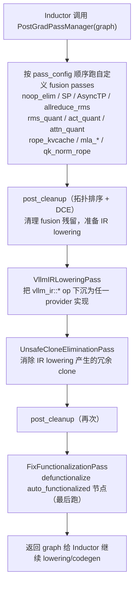

# Pass 系统

[← Wiki 首页](../../README.md) > [编译与 IR](../README.md) > [Pass 系统](README.md)

`vllm/compilation/passes/` 是 vLLM 注入 Inductor 的自定义图 Pass 集合。它们挂在 Inductor 的 `post_grad_custom_post_pass`（post-AOTAutograd）与 `pre_grad_custom_pass`（pre-AOTAutograd）两个 hook 上，在编译期对 FX Graph 做融合、IR 下沉、清理与去功能化，把 vLLM 的自定义算子与 fused kernel 串成高效图。

## PostGradPassManager 流水线

> Pass 顺序由 `PostGradPassManager.__call__`（`pass_manager.py:104`）固定；各 fusion pass 是否启用由 `PassConfig` 开关与平台条件共同决定（`configure()`）。

## 子模块

| 页 | 源码 | 职责 |
|---|---|---|
| [pass-manager.md](pass-manager.md) | `pass_manager.py` | `PostGradPassManager`：编排 + `uuid` 参与缓存键 |
| [inductor-pass.md](inductor-pass.md) | `inductor_pass.py` | `InductorPass` 基类、`PassContext`、`enable_fake_mode` |
| [vllm-inductor-pass.md](vllm-inductor-pass.md) | `vllm_inductor_pass.py` | `VllmInductorPass`/`VllmPatternMatcherPass`/`VllmPatternReplacement` |
| [fx-utils.md](fx-utils.md) | `fx_utils.py` | FX 节点/`auto_functionalized`/getitem 工具 |
| [fusion.md](fusion.md) | `fusion/*` | 全部融合 Pass 合集 |
| [ir.md](ir.md) | `ir/*` | IR lowering / clone 消除 / inplace functionalization |
| [utility.md](utility.md) | `utility/*` | noop 消除 / fix_functionalization / post_cleanup / scatter_split / split_coalescing |

## 关键约定

- **`uuid()` 参与缓存**：每个 pass 的 `uuid()`（源码 hash 或字典 hash）被 `PostGradPassManager.uuid` 汇总，作为 Inductor code-cache key 的一部分。pass 实现变更→uuid 变→强制重编译。
- **`is_applicable_for_range(compile_range)`**：部分 fusion 仅对特定 batch size 区间生效（如 SP 需大 token 数），`PostGradPassManager` 跳过不适用的 pass。
- **platform 条件导入**：`pass_manager.py:21-49` 按 `current_platform.is_cuda()/is_xpu()/is_rocm()` 选择性 import fusion 类，非目标平台不加载。
- **PassContext**：`pass_context(compile_range)`（`inductor_pass.py:43`）在编译期注入当前 range 与 `donated_input_ids`，供 inplace functionalization 与 clone elimination 共享。
- **pattern matcher 复用**：fusion pass 大量使用 `torch._inductor.pattern_matcher.register_replacement`，`VllmFusionPatternMatcherPass._trace_fn` 统一做 `view_to_reshape` + noop permute 清理 + `fold_consecutive_reshapes`。

## 与其它模块/系统配合

- [`backends.md`](../backends.md)：`configure_post_pass` 把 `PostGradPassManager` 注入 `inductor_config[pass_key]`；`VllmIRInplaceFunctionalizationPass` 注入 `pre_grad_custom_pass`。
- [`ir.md`](ir.md) / [`vllm/ir/`](../ir-README.md)：`VllmIRLoweringPass` 调 `IrOp.dispatch` 选 provider 实现；`get_ir_op` 识别 `vllm_ir::*` 节点。
- [`配置-compilation`](../../10-config/README.md)：`PassConfig` 全部开关；`CompilationConfig.inductor_passes` 允许用户注入额外 pass。
- [`平台`](../../08-platforms/README.md)：`current_platform.get_pass_manager_cls()` / `pass_key`；`rocm_aiter_ops.is_enabled()` / `is_cuda_alike()` / `is_xpu()` 条件。
- [`模型执行-custom_op`](../../03-model-execution/layers/custom-op.md)：fusion 的 pattern/replacement 调 `torch.ops._C.*` / `torch.ops.vllm.*` / `torch.ops.vllm_ir.*`。
- [`注意力`](../../05-attention/README.md)：`attn_quant` / `mla_attn_quant` / `mla_rope_kvcache_cat` / `qk_norm_rope` 直接依赖 Attention 层结构。
- [`分布式`](../../07-distributed/README.md)：`AsyncTPPass` / `AllReduceFusionPass` / `SequenceParallelismPass` 依赖 TP group。

## 历史版本演进

- **v0.7**：`PostGradPassManager` + `InductorPass` 基类引入，仅 `NoOpEliminationPass` + `RMSNormQuantFusionPass`。
- **v0.8（IR 框架成型）**：`VllmIRLoweringPass` / `VllmIRInplaceFunctionalizationPass` / `UnsafeCloneEliminationPass` 落地；fusion 扩充 act_quant、attn_quant、allreduce_rms、qk_norm_rope。
- **v0.9**：`VllmPatternReplacement` 抽象 + `VllmFusionPatternMatcherPass`；rope_kvcache、mla_attn_quant、mla_rope_kvcache_cat、sequence_parallelism、AsyncTP 加入；ROCm aiter fusion 矩阵扩充。
- **v0.10 / main**：`is_applicable_for_range` 区间感知；`uuid` 含 compile_range；`BACKED_SIZE_OBLIVIOUS` 支持；nvfp4 量化 fusion。具体版本归属（部分待核实）。

[← 返回编译与 IR 首页](../README.md)
