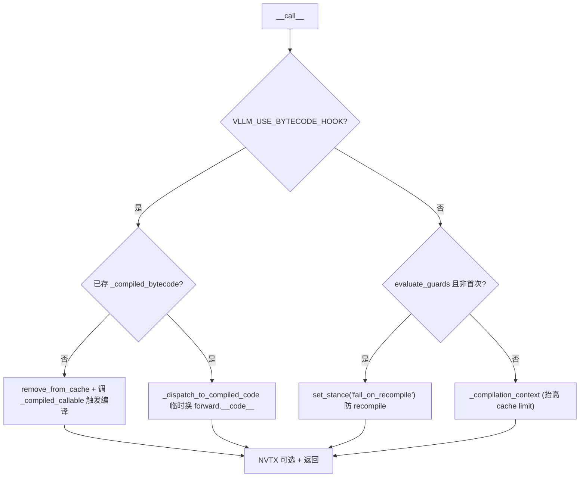

# TorchCompileWithNoGuardsWrapper

[← Wiki 首页](../README.md) > [编译与 IR](../README.md) > Wrapper

源码：`vllm/compilation/wrapper.py`（约 346 行）

## 是什么

`TorchCompileWithNoGuardsWrapper`（`wrapper.py:47`）是所有被 `@support_torch_compile` 装饰的模型类的混入基类。它把 `torch.compile(self.forward, fullgraph=True, dynamic=False, backend=<VllmBackend|inductor|eager>)` 包成"一次性编译 + 运行期直跑"的包装器，核心是**丢弃 Dynamo guards**，让首次 `__call__` 触发唯一一次编译、之后永不重编译。

关键成员：

- `_compiled_callable`：`torch.compile(self.forward, ...)` 产物。
- `_compiled_bytecode: CodeType | None`：bytecode hook 路径下保存编译后字节码。
- `evaluate_guards` / `ds_type`：从 `dynamic_shapes_config` 读取，决定是否用 `guard_filter_fn` 保留 SHAPE_ENV guard。
- `_call_with_optional_nvtx_range`：按 `enable_layerwise_nvtx_tracing` 包 NVTX range。
- `bytecode_hook`（`wrapper.py:210`）：`torch._dynamo.convert_frame.register_bytecode_hook` 回调，保存编译后 bytecode 并做 depyf 反编译落盘。
- `_dispatch_to_compiled_code`（`wrapper.py:272`）：临时把 `self.__class__.forward.__code__` 替换成编译后 bytecode 再调用。
- `reset_compile_wrapper(model)`（`wrapper.py:293`）：弹性 EP 场景重置编译状态、重跑 `__init__`。
- `_compilation_context()`：临时把 `dynamo.config.cache_size_limit=2048` / `accumulated_cache_size_limit=8192`，避免 qwen2_5_vl 类模型重编译超限。

## 为什么

- **避免 guard 驱动的重编译**：标准 `torch.compile` 会因 shape/type guard 失败反复重编译，推理服务里这是灾难。vLLM 的模式是一次性把所有 shape 编完（piecewise + compile_sizes），运行期只分发不重编译，因此 `guard_filter_fn=lambda x: [False for _ in x]`（torch<2.10）或 `torch.compiler.skip_all_guards_unsafe`（torch 2.10+）丢掉全部 guard。
- **backed dynamic shapes 可选保留 SHAPE_ENV guard**：`dynamic_shapes_config.type==BACKED` 且 `evaluate_guards=True` 时，只保留 `guard_type == "SHAPE_ENV"` 的 guard，用作"若 Dynamo 仍按动态形状 guard 特化就报错"的调试模式（须 `VLLM_USE_BYTECODE_HOOK=0`）。
- **bytecode hook 直跑编译后代码**（torch<2.8 旧路径，`VLLM_USE_BYTECODE_HOOK=1`）：Dynamo 编译产出新 bytecode；hook 把它存下，后续 `__call__` 直接 swap `forward.__code__` 调用，绕过 Dynamo eval frame。该路径在新版 torch 上可被 `skip_all_guards_unsafe` 取代。
- **cudagraph 安全检查**：`bytecode_hook` 检测编译后代码是否含 `update`（`nn.Module` buffer 修改），若在 cudagraph 模式下出现则抛错——因为 cudagraph 内修改 buffer 会静默错乱（`wrapper.py:250`）。
- **NVTX 分层追踪**：`enable_layerwise_nvtx_tracing` 时把每次 compiled call 包一层 NVTX range，供 nsight systems 可视化。
- **弹性 EP 重编译**：`reset_compile_wrapper` 清零 `compilation_counter`、清 `aot_compiled_fn`、重置 `cache_dir`、重跑 `TorchCompileWithNoGuardsWrapper.__init__`，使改 `data_parallel_size` 后能重新编译。

## 怎么做

### __init__ 选择 backend 与 options

```python
# wrapper.py:72-154 简化
mode = vllm_config.compilation_config.mode
backend = vllm_config.compilation_config.init_backend(
    vllm_config, prefix=compile_prefix, is_encoder=is_encoder)
options = inductor_compile_config if backend=="inductor" else {}
if mode != STOCK_TORCH_COMPILE:
    if self.evaluate_guards:
        options["guard_filter_fn"] = lambda x: [e.guard_type=="SHAPE_ENV" for e in x]
    else:
        options["guard_filter_fn"] = torch.compiler.skip_all_guards_unsafe  # 2.10+
        # or lambda x: [False for _ in x]  旧版
self._compiled_callable = torch.compile(self.forward, fullgraph=True, dynamic=False,
                                        backend=backend, options=options)
if VLLM_USE_BYTECODE_HOOK and mode != STOCK_TORCH_COMPILE:
    self._bytecode_hook_handle = register_bytecode_hook(self.bytecode_hook)
```

### __call__ 分派



非 hook 路径用 `torch.compiler.set_stance("fail_on_recompile")` 在第二次起"若再编译就抛错"，等价于 guard 检查的兜底。

### bytecode_hook 内部

1. 沿调用栈找到 Dynamo `_compile` 帧，校验 `frame.f_locals["self"] is self`。
2. 存 `self._compiled_bytecode = new_code`。
3. 若 `compile_debug_dump_path()` 存在，用 `depyf.decompile` 写 `transformed_code.py`。
4. 若 `cudagraph_mode != NONE` 且 `co_names` 含 `update`，抛 RuntimeError。

### reset_compile_wrapper

清零 `CompilationCounter` 全部字段 → 清 `aot_compiled_fn` 与 `was_aot_compile_fn_loaded_from_disk` → 清 `cache_dir`/`local_cache_dir` → 把 `forward.__code__` 复位 → 重跑 `TorchCompileWithNoGuardsWrapper.__init__(model, ...)`。

## 与其它模块/系统配合

- [`decorators.py`](decorators.md)：`_support_torch_compile` 把本类加入 `cls.__bases__` 并在重写 `__init__` 里调 `TorchCompileWithNoGuardsWrapper.__init__`。
- [`backends.py`](backends.md)：`init_backend()` 返回 `VllmBackend` 实例时，`torch.compile` 会调 `VllmBackend.__call__`。
- [`monitor.py`](monitor.md)：`monitor_torch_compile` 包住首次编译计时；`reset_compile_wrapper` 不直接用 monitor。
- [`caching.py`](caching.md)：AOT 路径下 `self.aot_compiled_fn` 来自 `self.aot_compile()`，`reset_compile_wrapper` 清之。
- [`平台`](../08-platforms/README.md)：`init_backend()` 解析 `current_platform.get_compile_back()`。
- [`配置-compilation`](../10-config/README.md)：`mode` / `dynamic_shapes_config` / `cudagraph_mode` / `observability_config.enable_layerwise_nvtx_tracing`。
- [`可观测性`](../16-observability/README.md)：`compile_debug_dump_path()` 与 depyf dump。

## 历史版本演进

- **v0.6–v0.7**：`TorchCompileWithNoGuardsWrapper` 引入，guard 丢弃靠 `guard_filter_fn=lambda: [False...]`；bytecode hook 作为 torch<2.8 主路径。
- **v0.8**：引入 `evaluate_guards` + SHAPE_ENV 过滤调试模式；`_compilation_context` 抬高 cache_size_limit 解决 qwen2_5_vl 重编译。
- **v0.9**：`reset_compile_wrapper` 加入，支持 Elastic EP 改 `data_parallel_size` 后重编译（清 `aot_compiled_fn` 防陈旧 kernel 参数）。
- **v0.10**：torch 2.10+ 优先 `torch.compiler.skip_all_guards_unsafe`；`aot_compile()` 入口；`set_stance("fail_on_recompile")` 兜底。
- **v0.11 / v0.12 / main**：`BACKED_SIZE_OBLIVIOUS` 动态形状；bytecode hook 路径在新 torch 上逐步退化为可选。具体版本归属（部分待核实）。

[← 返回编译与 IR 首页](../README.md)

## 参见

- [decorators.md](decorators.md) — `@support_torch_compile` 如何挂入本类。
- [backends.md](backends.md) — backend 的选择与 `VllmBackend`。
- [monitor.md](monitor.md) — 编译计时与 cudagraph 闸门。
- [../10-config/README.md](../10-config/README.md) — `CompilationMode` / `DynamicShapesConfig`。
