# 10 · 配置体系

[← Wiki 首页](../README.md)

本子系统是 vLLM 的"参数面"：所有运行行为的控制项都汇集为 `vllm/config/` 下的一组 Pydantic dataclass，由顶层 [`VllmConfig`](vllm-config.md) 聚合，经 `EngineArgs` 从 CLI/SDK 拼装，再 pickle 传递到每个 worker。配置子系统的核心约束是：**凡影响编译图形状的字段必须参与 `compute_hash`**，从而支撑 `torch.compile` 缓存命中与 DP worker 一致性校验。

代码根目录：`vllm/config/`（30 个 `.py`，约 1.2 万行）。

## 设计要点速览

- **`@config` 装饰器统一基底**：所有子配置经 `vllm/config/utils.py` 的 `@config` 装饰为 Pydantic dataclass，默认 `extra="forbid"`，支持 `Field`/`model_validator`/`field_validator` 与 `__post_init__`/`InitVar` 双语义（见 [utils.md](utils.md)）。
- **`VllmConfig` 单一真相源**：28 个子配置字段聚合在一处，`__post_init__`（`vllm/config/vllm.py:869`）集中做跨配置一致性校验、平台默认注入、优化级别展开、cudagraph 尺寸推导（见 [vllm-config.md](vllm-config.md)）。
- **不可变 + 哈希**：`replace`/`update_config` 做复制式更新；各子配置实现 `compute_hash()`，`VllmConfig.compute_hash` 聚合为编译缓存键。
- **进程级上下文**：`set_current_vllm_config` 把当前配置放全局变量，`get_cached_compilation_config` 用 `lru_cache` 加速热路径，供 CustomOp / IR op dispatch 读取。
- **三态开关模式**：`async_scheduling`/`disable_hybrid_kv_cache_manager`/`disable_nccl_for_dp_synchronization` 等字段用 `bool | None`：显式 True/False 走硬校验，`None` 由 `__post_init` 按平台/特性自动决定。
- **优化级别一键化**：`OptimizationLevel` O0–O3 把"编译模式 + cudagraph 模式 + 融合开关 + 内核 autotune"打包成 4 档，支持 `enable_allreduce_rms_fusion` 等以 `VllmConfig` 为参的 callable 默认。

## 聚合关系

```mermaid
flowchart TD
    V["VllmConfig<br/>(vllm.py)"]
    V --> M[ModelConfig<br/>model.py]
    V --> MA[ModelArchitectureConfig<br/>model_arch.py]
    V --> C[CacheConfig<br/>cache.py]
    V --> P[ParallelConfig + EPLBConfig<br/>parallel.py]
    V --> S[SchedulerConfig<br/>scheduler.py]
    V --> D[DeviceConfig<br/>device.py]
    V --> L[LoadConfig<br/>load.py]
    V --> O[OffloadConfig + UVA + Prefetch + OffloadBackend<br/>offload.py]
    V --> A[AttentionConfig<br/>attention.py]
    V --> MB[MambaConfig + MambaBackendEnum<br/>mamba.py]
    V --> K[KernelConfig + IrOpPriorityConfig<br/>kernel.py]
    V --> CO[CompilationConfig + CompilationMode + CUDAGraphMode + PassConfig + DynamicShapesConfig<br/>compilation.py]
    V --> LO[LoRAConfig<br/>lora.py]
    V --> MM[MultiModalConfig<br/>multimodal.py]
    V --> SP[SpeculativeConfig<br/>speculative.py]
    V --> DF[DiffusionConfig<br/>diffusion.py]
    V --> SO[StructuredOutputsConfig<br/>structured_outputs.py]
    V --> OB[ObservabilityConfig<br/>observability.py]
    V --> PR[ProfilerConfig<br/>profiler.py]
    V --> KVT[KVTransferConfig<br/>kv_transfer.py]
    V --> KVE[KVEventsConfig<br/>kv_events.py]
    V --> ECT[ECTransferConfig<br/>ec_transfer.py]
    V --> WT[WeightTransferConfig<br/>weight_transfer.py]
    V --> RS[ReasoningConfig<br/>reasoning.py]
    V --> PO[PoolerConfig<br/>pooler.py]
    V --> ST[SpeechToTextConfig + SpeechToTextParams<br/>speech_to_text.py]
    V --> QA[QuantizationConfigArgs + QuantSpec<br/>quantization.py]
    V --> QU[QuantizationConfig<br/>外部: model_executor/layers/quantization]
    V -.派生.-> QU
    M -.内含.-> MA
    M -.内含.-> MM
    M -.内含.-> PO
    M -.内含.-> QA
    V --> U["utils: @config / replace / update_config / SupportsHash / compute_hash_cached / normalize_value"]
    U -.装饰/支撑.-> V
    U -.装饰/支撑.-> M
    U -.装饰/支撑.-> C
    style V fill:#fde,stroke:#c30
    style U fill:#eef,stroke:#36c
```

## 子配置总表

> "影响图形状"列：✅=该配置 `compute_hash` 纳入 `VllmConfig.compute_hash`；—=哈希为空（不直接影响编译图）；⊆=经父配置间接纳入。

| 文档 | 源码 | 主类 | 影响图形状 | 简述 |
|---|---|---|---|---|
| [vllm-config.md](vllm-config.md) | `vllm.py` | `VllmConfig` + `OptimizationLevel` | ✅(聚合) | 顶层聚合 + `__post_init` 跨配置校验 + 优化级别 |
| [utils.md](utils.md) | `utils.py` | `@config`/`replace`/`update_config`/`SupportsHash` | —(基础设施) | Pydantic dataclass 装饰器、不可变更新、哈希工具链 |
| [model-config.md](model-config.md) | `model.py` | `ModelConfig` | ✅ | 模型路径/dtype/分词/量化/多模态/pooler/runner |
| [model-arch.md](model-arch.md) | `model_arch.py` | `ModelArchitectureConfig` | ⊆ | vLLM 运行时需要的架构派生量 |
| [cache-config.md](cache-config.md) | `cache.py` | `CacheConfig` | ✅ | KV cache 块/dtype/前缀缓存/Mamba cache/卸载 |
| [parallel-config.md](parallel-config.md) | `parallel.py` | `ParallelConfig` + `EPLBConfig` | ✅ | TP/PP/DP/EP/EPLB/DCP/NUMA/all2all |
| [scheduler-config.md](scheduler-config.md) | `scheduler.py` | `SchedulerConfig` | ✅(部分) | 批次/策略/chunked prefill/async scheduling |
| [device-config.md](device-config.md) | `device.py` | `DeviceConfig` | —(deprecated) | 设备类型，已自动从平台推导 |
| [load-config.md](load-config.md) | `load.py` | `LoadConfig` | — | 权重加载格式/safetensors 策略/下载目录 |
| [offload-config.md](offload-config.md) | `offload.py` | `OffloadConfig`+`UVAOffloadConfig`+`PrefetchOffloadConfig`+`OffloadBackend` | ✅ | 权重 CPU 卸载（UVA 零拷贝 / 异步预取） |
| [attention-config.md](attention-config.md) | `attention.py` | `AttentionConfig` | ✅ | 注意力后端/MLA prefill/flex-attn tile |
| [mamba-config.md](mamba-config.md) | `mamba.py` | `MambaConfig` + `MambaBackendEnum` | ⊆ | Mamba SSU 后端/随机舍入 |
| [kernel-config.md](kernel-config.md) | `kernel.py` | `KernelConfig` + `IrOpPriorityConfig` | ✅ | IR op 优先级/MoE/linear 后端/autotune |
| [compilation-config.md](compilation-config.md) | `compilation.py` | `CompilationConfig`+`CompilationMode`+`CUDAGraphMode`+`PassConfig`+`DynamicShapesConfig` | ✅ | torch.compile/cudagraph/Inductor pass |
| [lora-config.md](lora-config.md) | `lora.py` | `LoRAConfig` | ✅ | LoRA rank/dtype/sharding/MoE 混合 |
| [multimodal-config.md](multimodal-config.md) | `multimodal.py` | `MultiModalConfig` | ✅(部分) | 多模态限额/编码器 TP/IPC/FP8 ViT |
| [speculative-config.md](speculative-config.md) | `speculative.py` | `SpeculativeConfig` | ✅ | Eagle/MTP/ngram/dflash/dspark/suffix |
| [diffusion-config.md](diffusion-config.md) | `diffusion.py` | `DiffusionConfig` | ⊆ | 离散扩散 dLLM canvas/denoising |
| [structured-outputs-config.md](structured-outputs-config.md) | `structured_outputs.py` | `StructuredOutputsConfig` | — | JSON/regex 结构化输出后端 |
| [observability-config.md](observability-config.md) | `observability.py` | `ObservabilityConfig` | — | metrics/OTLP traces/KV 驻留指标 |
| [profiler-config.md](profiler-config.md) | `profiler.py` | `ProfilerConfig` | — | torch/cuda profiler 调度 |
| [kv-transfer-config.md](kv-transfer-config.md) | `kv_transfer.py` | `KVTransferConfig` | ✅(空) | 分布式 KV 迁移/PD disagg connector |
| [kv-events-config.md](kv-events-config.md) | `kv_events.py` | `KVEventsConfig` | — | KV 事件 zmq 发布/重放 |
| [ec-transfer-config.md](ec-transfer-config.md) | `ec_transfer.py` | `ECTransferConfig` | ✅(空) | 编码器缓存（EC）迁移 connector |
| [weight-transfer-config.md](weight-transfer-config.md) | `weight_transfer.py` | `WeightTransferConfig` | — | RL 训练权重迁移 backend |
| [reasoning-config.md](reasoning-config.md) | `reasoning.py` | `ReasoningConfig` | — | 推理模型起止 token 边界 |
| [speech-to-text-config.md](speech-to-text-config.md) | `speech_to_text.py` | `SpeechToTextConfig` + `SpeechToTextParams` | — | 语音转写采样率/分块 |
| [pooler-config.md](pooler-config.md) | `pooler.py` | `PoolerConfig` | — | pooling 模型输出聚合/分类校准 |
| [quantization-config.md](quantization-config.md) | `quantization.py` | `QuantizationConfigArgs` + `QuantSpec` | ⊆ | 在线量化规范（linear/moe） |

`QuantizationConfig`（`vllm/model_executor/layers/quantization/base_config.py`，非 `vllm/config/`）由 `ModelConfig.quantization` + `LoadConfig` 经 `VllmConfig._get_quantization_config` 派生，挂在 `VllmConfig.quant_config`，因其哈希已由 `model_config.quantization` 覆盖而本表单列对照（见 [quantization-config.md](quantization-config.md)）。

## 阅读建议

1. 第一次进入：先读 [utils.md](utils.md) 理解 `@config`/`compute_hash` 基础设施，再读 [vllm-config.md](vllm-config.md) 看聚合与 `__post_init`。
2. 关注某一子系统：直接进对应配置页，每页底部"参见"回链到消费方子系统文档。
3. 想新增一个配置项：按 [utils.md](utils.md) "怎么做"小节模板实现 `compute_hash` 并在 `VllmConfig.compute_hash` 中登记（若影响图形状）。

[← 返回 Wiki 首页](../README.md)
