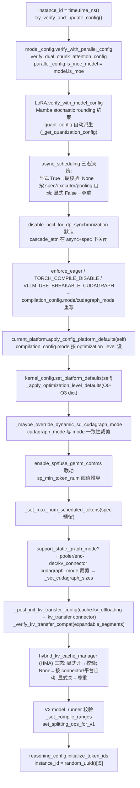

# VllmConfig 复合体 + OptimizationLevel（vllm.py）

[← Wiki 首页](../README.md) > [配置](../README.md) > VllmConfig

源码：`vllm/config/vllm.py`（约 2335 行）。`VllmConfig` 是 vLLM 的"顶层配置聚合体"，把所有子配置（`ModelConfig`/`CacheConfig`/`ParallelConfig`/…，共 28 个）打包为一个 Pydantic dataclass，统一在 `__post_init__` 中做跨配置一致性校验、平台默认值注入、优化级别展开与 CUDA graph 尺寸推导。它是整个引擎唯一的"配置真相源"，从 `EngineArgs.create_engine_config` 产出后，经 ZMQ pickle 传到每个 worker。

## 是什么

### 类声明与核心字段（`vllm.py:286`）

`@config(config=ConfigDict(arbitrary_types_allowed=True))` 装饰。字段分四类：

**1. 核心子配置（28 个）**

| 字段 | 类型 | 默认 | 含义 |
|---|---|---|---|
| `model_config` | `ModelConfig` | `None` | 模型/分词/dtype/量化等（构造时为 `None` 因下载模型昂贵，见 [model-config.md](model-config.md)） |
| `cache_config` | `CacheConfig` | `CacheConfig()` | KV cache 块大小/dtype/前缀缓存/卸载（[cache-config.md](cache-config.md)） |
| `parallel_config` | `ParallelConfig` | `ParallelConfig()` | TP/PP/DP/EP/EPLB/DCP（[parallel-config.md](parallel-config.md)） |
| `scheduler_config` | `SchedulerConfig` | `default_factory` | 批次/调度策略/chunked prefill/async（[scheduler-config.md](scheduler-config.md)） |
| `device_config` | `DeviceConfig` | `DeviceConfig()` | 设备类型（已 deprecated，[device-config.md](device-config.md)） |
| `load_config` | `LoadConfig` | `LoadConfig()` | 权重加载格式/策略（[load-config.md](load-config.md)） |
| `offload_config` | `OffloadConfig` | `OffloadConfig()` | 权重 CPU 卸载 UVA/prefetch（[offload-config.md](offload-config.md)） |
| `attention_config` | `AttentionConfig` | `AttentionConfig()` | 注意力后端/MLA prefill/flex-attn（[attention-config.md](attention-config.md)） |
| `mamba_config` | `MambaConfig` | `MambaConfig()` | Mamba SSU 后端/随机舍入（[mamba-config.md](mamba-config.md)） |
| `kernel_config` | `KernelConfig` | `KernelConfig()` | IR op 优先级/MoE/linear 后端（[kernel-config.md](kernel-config.md)） |
| `compilation_config` | `CompilationConfig` | `CompilationConfig()` | torch.compile/cudagraph/pass（[compilation-config.md](compilation-config.md)） |
| `lora_config` | `LoRAConfig \| None` | `None` | LoRA（[lora-config.md](lora-config.md)） |
| `speculative_config` | `SpeculativeConfig \| None` | `None` | 投机解码（[speculative-config.md](speculative-config.md)） |
| `diffusion_config` | `DiffusionConfig \| None` | `None` | 离散扩散 dLLM（[diffusion-config.md](diffusion-config.md)） |
| `structured_outputs_config` | `StructuredOutputsConfig` | `…()` | 结构化输出后端（[structured-outputs-config.md](structured-outputs-config.md)） |
| `observability_config` | `ObservabilityConfig` | `…()` | metrics/tracing（[observability-config.md](observability-config.md)） |
| `quant_config` | `QuantizationConfig \| None` | `None` | 由模型推导，非用户直接设 |
| `profiler_config` | `ProfilerConfig` | `ProfilerConfig()` | torch/cuda profiler（[profiler-config.md](profiler-config.md)） |
| `kv_transfer_config` | `KVTransferConfig \| None` | `None` | 分布式 KV 迁移/PD disagg（[kv-transfer-config.md](kv-transfer-config.md)） |
| `kv_events_config` | `KVEventsConfig \| None` | `None` | KV 事件发布（[kv-events-config.md](kv-events-config.md)） |
| `ec_transfer_config` | `ECTransferConfig \| None` | `None` | 编码器缓存迁移（[ec-transfer-config.md](ec-transfer-config.md)） |
| `reasoning_config` | `ReasoningConfig \| None` | `None` | 推理模型 token 边界（[reasoning-config.md](reasoning-config.md)） |
| `weight_transfer_config` | `WeightTransferConfig \| None` | `None` | RL 训练时权重迁移（[weight-transfer-config.md](weight-transfer-config.md)） |
| `additional_config` | `dict \| SupportsHash` | `{}` | 平台/树外扩展不透明配置，参与哈希 |
| `instance_id` | `str` | `""` | 实例 ID（`__post_init__` 中赋 `time.time_ns()`，最后再缩为 `random_uuid()[:5]`） |
| `optimization_level` | `OptimizationLevel` | `O2` | 优化级别 O0–O3（见下） |
| `performance_mode` | `PerformanceMode` | `"balanced"` | `balanced`/`interactivity`/`throughput` |
| `shutdown_timeout` | `int` | `0` | 优雅关停宽限秒数 |

**2. `OptimizationLevel`（`vllm.py:77`）**——`IntEnum`：

| 级别 | 含义 |
|---|---|
| `O0` | 无优化，零启动开销：无编译、无 cudagraph |
| `O1` | 快速优化：Dynamo+Inductor 编译 + Piecewise cudagraph |
| `O2`（默认）| 全面优化：O1 + Full + Piecewise cudagraph |
| `O3` | 当前等同 O2 |

每级对应一份 dict（`OPTIMIZATION_LEVEL_00..03`，`vllm.py:193`–276），描述 `compilation_config.pass_config.*` 的融合开关、`cudagraph_mode`、`kernel_config.enable_flashinfer_autotune`。值可是 bool、`False`，也可是 `enable_norm_fusion`/`enable_allreduce_rms_fusion` 等以 `VllmConfig` 为参的 callable（`vllm.py:104` 起），在 `_apply_optimization_level_defaults` 中惰性求值。

**3. 模块级全局与上下文管理**

- `_current_vllm_config`（`vllm.py:2228`）：进程级全局，存"当前激活"的 `VllmConfig`。
- `set_current_vllm_config(vllm_config, check_compile, prefix)`（`vllm.py:2232`）：contextmanager。进入时设全局并清 `get_cached_compilation_config` 的 lru_cache；退出时校验 `compilation_counter.num_models_seen` 是否增加（未增加 → 模型不支持 `torch.compile`，打 warning）。
- `get_current_vllm_config()`（`vllm.py:2293`）：读全局；未设置时 raise（提示用 `default_vllm_config` pytest fixture）。
- `get_current_vllm_config_or_none()`：非抛错版。
- `get_cached_compilation_config()`（`vllm.py:2287`）：`@lru_cache(1)` 缓存 `get_current_vllm_config().compilation_config`，供 CustomOp dispatch 热路径使用。
- `get_layers_from_vllm_config(vllm_config, layer_type, layer_names)`（`vllm.py:2313`）：遍历模型抽指定类型层，供编译 pass / warmup 用。

**4. 关键派生属性与方法**

| 成员 | 位置 | 含义 |
|---|---|---|
| `compute_hash()` | `vllm.py:383` | 聚合所有子配置 `compute_hash()` 为 10 位 hex，作为编译缓存键；任何新增影响图形状的字段都须纳入 |
| `max_concurrent_batches` | `vllm.py:491` | PP 需要 `pp_size` 个并发 batch 填流水线；async scheduling 需 2 个；V2+async+PP=`pp_size+1` |
| `num_speculative_tokens` | `vllm.py:504` | 取 `speculative_config.num_speculative_tokens` 或 `diffusion_config.canvas_length` |
| `use_v2_model_runner` | `vllm.py:518` | 由 `VLLM_USE_V2_MODEL_RUNNER`、模型架构（MoE/混合/attention-free）、Triton 可用性、不可用特性集合综合判定 |
| `needs_dp_coordinator` | `vllm.py:576` | DP>1 且（MoE 或 非外部 LB）时需 `DPCoordinator` 进程 |
| `with_hf_config(hf_config, architectures)` | `vllm.py:669` | 深拷 `model_config`，贴上新 `hf_config`，`replace` 返回新 `VllmConfig`；处理 `tie_word_embeddings` 跨 text_config 的传播 |
| `try_verify_and_update_config()` | `vllm.py:1931` | 按 `architecture` 查 `MODELS_CONFIG_MAP`，调模型专属 `verify_and_update_config(self)`；处理 hybrid、`classify` 转换、RunAI URI |
| `__post_init__` | `vllm.py:869` | 巨型校验/派生入口（见下） |
| `_set_cudagraph_sizes` | `vllm.py:1669` | 推导 `cudagraph_capture_sizes` 与 `max_cudagraph_capture_size` |
| `_set_max_num_scheduled_tokens` | `vllm.py:1619` | 投机解码时从 `max_num_batched_tokens` 扣除 drafter 预留槽 |
| `_set_compile_ranges` | `vllm.py:1836` | 为 inductor 计算 `compile_ranges_endpoints`（含 allreduce-fusion 与 SP 阈值） |
| `_validate_v2_model_runner` | `vllm.py:2137` | 不支持特性集合非空则 raise（V2 不静默回退） |
| `validate_block_size` | `vllm.py:2154` | DCP interleave / Mamba align 模式下的 block_size 约束 |
| `enable_trace_function_call_for_thread` | `vllm.py:599` | `VLLM_TRACE_FUNCTION` 时按线程设函数追踪日志 |

## 为什么

- **单一真相源**：v1 之前各子系统分别读 `CacheConfig`/`SchedulerConfig`…，跨配置约束散落。`VllmConfig` 把它们聚合后，所有跨字段校验（如"async scheduling 仅兼容 Eagle/MTP/draft/ngram_gpu/dspark"、"kv_transfer 与 expandable_segments 冲突除非 cumem"、"enable_return_routed_experts 与 PP/KV connector 互斥"）都在 `__post_init__` 一处完成，避免运行期才发现的静默错误。
- **不可变 + 哈希**：`compute_hash` 让 `torch.compile` 缓存按"图形状指纹"命中，跨进程/跨重启复用；DP worker 用同一哈希做配置一致性校验，防 hang。
- **优化级别一键化**：`-O0`/`-O1`/`-O2`/`-O3` 把"编译模式 + cudagraph 模式 + 融合开关 + 内核 autotune"打包成 4 档，callable 形式支持 `enable_allreduce_rms_fusion` 这类依赖 TP/平台/flashinfer 的条件默认。`_apply_optimization_level_defaults` 只在字段仍为 `None` 时填默认，用户显式设值不被覆盖。
- **上下文全局**：CustomOp / IR op 在 forward 热路径上要读 `compilation_config.custom_ops` 决定 dispatch，不便层层传参。`set_current_vllm_config` + `get_cached_compilation_config` 用进程级全局 + lru_cache 解决，且 contextmanager 保证进入/退出时清缓存避免串味。
- **载体统一**：ZMQ pickle 一个 `VllmConfig` 即把所有配置送达 worker，无需单独序列化各子配置。

## 怎么做

### `__post_init__` 主流程（`vllm.py:869`）



关键校验点（节选）：
- `enable_return_routed_experts` 与 PP>1 / KV connector 互斥（`vllm.py:886`–908）。
- `async_scheduling` 与 ROCm DeepEP HT DBO、非 Eagle/MTP/draft/ngram_gpu/dspark spec、`disable_padded_drafter_batch`、不支持 executor 互斥（`vllm.py:961`–1045）。
- `kv_transfer_config` 与 `PYTORCH_CUDA_ALLOC_CONF=expandable_segments:True` 冲突，除非 `enable_cumem_allocator`（`vllm.py:826`）。
- `nvfp4` KV cache 与 MLA 互斥（`vllm.py:2201`）。
- `mamba_block_size` 仅在 `enable_prefix_caching` 时可设（`vllm.py:2213`）。
- pooling / encoder-decoder 模型 cudagraph_mode 被强制降为 PIECEWISE/FULL_DECODE_ONLY（`vllm.py:1267`–1291）。

### 优化级别应用

`OPTIMIZATION_LEVEL_TO_CONFIG[level]` 是嵌套 dict，`_apply_optimization_level_defaults` 递归下钻：遇到 dataclass 字段就递归，否则只在当前值为 `None` 时调 callable（以 `self` 为参）或填静态值。因此用户已设的 `pass_config.fuse_norm_quant=True` 不会被 `-O2` 的 `enable_norm_fusion` 覆盖。

### 设/读当前配置

```python
with set_current_vllm_config(vllm_config, check_compile=True):
    model = ModelRegistry.load_model(vllm_config)
    # 任何 CustomOp 内部可 get_current_vllm_config() 读到 vllm_config
# 退出后自动恢复 + 校验 num_models_seen 增加
```

### 重建带新 hf_config

```python
new_cfg = vllm_config.with_hf_config(hf_config, architectures=["Qwen2ForCausalLM"])
```

## 与其它模块/系统配合

- **EngineArgs（`vllm/engine/arg_utils.py`）**：把 CLI/LLM kwargs 解析成各子配置，`create_engine_config()` 组装 `VllmConfig` 并触发 `__post_init__`。
- **AsyncLLM / EngineCore（[`01-engine-core/`](../01-engine-core/README.md)）**：构造时持 `vllm_config`，经 ZMQ 把它 pickle 给 worker；`EngineCore.step` 读 `scheduler_config`/`cache_config` 决定步调度。
- **Worker / ModelRunner（[`02-execution/`](../02-execution/README.md)）**：`Worker.__init__` 收 `vllm_config`；`ModelRunner` 在 `set_current_vllm_config` 上下文里 load 模型，使 CustomOp 能读到 `compilation_config`/`kernel_config`。
- **编译子系统（[`09-compilation-ir/`](../09-compilation-ir/README.md)）**：`compilation_config.compute_hash` 被 `VllmConfig.compute_hash` 聚合 → 缓存目录名；`set_splitting_ops_for_v1` 按 `all2all_backend`/`data_parallel_size` 设拆分点。
- **平台层（[`08-platforms/`](../08-platforms/README.md)）**：`current_platform.apply_config_platform_defaults(self)` 与 `check_and_update_config(self)` 在 `__post_init` 末段注入平台特有默认（block_size、cudagraph 支持性、compile range 收紧等）。
- **分布式（[`07-distributed/`](../07-distributed/README.md)）**：`parallel_config` 的 EP/DP/EPLB/elastic-ep/DCP 直接驱动 executor 与 KV connector 选择；`needs_dp_coordinator` 决定是否起独立协调进程。
- **KV 管理（[`01-engine-core/kv-cache-management/`](../01-engine-core/kv-cache-management/README.md)）**：`cache_config` + `scheduler_config.disable_hybrid_kv_cache_manager` + `kv_transfer_config` 共同决定 HMA 是否启用、块池规格。
- **metrics（[`16-observability/`](../16-observability/README.md)）**：`observability_config` 控制 hidden metrics / OTLP traces / KV 驻留指标采样。

## 历史版本演进

- **v0.5/v0.6（v0）**：无 `VllmConfig`；`EngineArgs` 直接产出一堆独立 dataclass 传给 `LLMEngine`。配置间约束散落，跨配置冲突靠运行期报错。
- **v0.7（v1 落地，关键里程碑）**：引入 `VllmConfig` 复合体，集中 `__post_init__` 校验；`compute_hash` 初版上线支撑 `torch.compile` 缓存；`set_current_vllm_config`/`get_current_vllm_config` 进程级上下文成形。
- **v0.8（v1 默认）**：`VllmConfig.default` 工厂与 `_get_quantization_config` 抽静态方法；分布式 EP/EPLB/elastic-ep 字段涌入 `parallel_config`；KV connector 兼容性校验（`is_kv_transfer_instance`）加入。
- **v0.8.x**：`compilation_config`/`kernel_config` 子配置分离出独立模块；`cudagraph_mode` 多模式（FULL/PIECEWISE/FULL_DECODE_ONLY/FULL_AND_PIECEWISE）引入。
- **v0.9**：`async_scheduling` 三态决策（True/None/False）落地；`kv_load_failure_policy`；`_handle_invalid_blocks` 恢复路径；`disable_hybrid_kv_cache_manager` 三态 + `SupportsHMA` connector 协议；MRv2 `use_v2_model_runner` 引入与 `_validate_v2_model_runner`。
- **v0.10**：`OptimizationLevel` O0–O3 + `OPTIMIZATION_LEVEL_*` dict 正式化（取代散落的 `compilation_config` 默认推导）；`performance_mode`（balanced/interactivity/throughput）加入并影响 `cudagraph_capture_sizes`（interactivity 走 1..32 细粒度）；DP prefill 节拍 `prefill_schedule_interval`；动态投机 `dynamic_sd_lookup` 与 `_maybe_override_dynamic_sd_cudagraph_mode`。
- **v0.11 / v0.12 / main**：`enable_return_routed_experts` 与 PP/KV connector 互斥校验；`weight_transfer_config`/`ec_transfer_config`/`diffusion_config` 子配置补齐；`_post_init_kv_transfer_config` 把 `cache_config.kv_offloading_size` 自动翻译为 `kv_transfer_config` connector；`validate_nvfp4_kv_cache_with_mla` / `validate_mamba_block_size` 等 `@model_validator`；`HAS_OPAQUE_TYPE` 触发的 `fast_moe_cold_start` 重写；`use_v2_model_runner` 默认对 dense 模型开启（commit `a2f713002`）。具体版本归属（待核实）。

[← 返回配置首页](../README.md)

## 参见

- [utils.md](utils.md) — `@config`/`replace`/`update_config`/`compute_hash` 工具链。
- [README.md](README.md) — 子配置总表与聚合关系图。
- [../00-overview/version-timeline.md](../00-overview/version-timeline.md) — 顶层版本演进主线。
