# 11 · 多模态子系统

[← Wiki 首页](../README.md)

本子系统覆盖 `vllm/multimodal/` 目录以及其在 v1 引擎中的全部集成点，负责把用户提交的图像 / 视频 / 音频 / 预计算 embedding 等多模态原始数据，转换成模型可消费的 `MultiModalFeatureSpec`、占位符 token 区间（`PlaceholderRange`）以及编码器输出 embedding。它与 [`04-model-zoo`](../04-model-zoo/README.md) 中的 VLM 架构、[`01-engine-core`](../01-engine-core/README.md) 的输入处理 / 调度器 / 编码器缓存、[`02-execution`](../02-execution/README.md) 的 `model_runner`/`EncoderRunner` 紧密耦合，是 LLaVA、Qwen-VL、Gemini-Lite、Ultravox 等模型家族得以在 vLLM 上运行的底座。

## 端到端数据处理流水

```mermaid
flowchart LR
    subgraph Frontend["API 前端进程 P0"]
        URL["image_url / video_url / audio_url"] --> MC["MediaConnector<br/>media/connector.py"]
        MC --> MIO["ImageMediaIO / VideoMediaIO / AudioMediaIO<br/>(media/image|video|audio.py)"]
        MIO --> RAW["PIL.Image / np.ndarray / (ndarray, sr)"]
        RAW --> PARS["MultiModalDataParser<br/>parse.py"]
        PARS --> ITEMS["MultiModalDataItems<br/>(ImageProcessorItems / ... )"]
        ITEMS --> PROC["BaseMultiModalProcessor.apply<br/>processing/processor.py"]
        PROC -->|"调用 HF Processor"| HFP["transformers.ProcessorMixin"]
        HFP --> KW["MultiModalKwargsItems<br/>inputs.py"]
        PROC --> UPD["PromptReplacement / PromptInsertion<br/>(占位符展开)"]
        UPD --> IDS["prompt_token_ids + mm_placeholders"]
        KW --> HASH["MultiModalHasher.hash_kwargs<br/>hasher.py"]
        HASH --> CACHE["ProcessorCache (P0 侧)<br/>cache.py"]
        CACHE -->|"命中即置空 data"| SPEC["MultiModalFeatureSpec 列表"]
        IDS --> SPEC
    end

    subgraph Core["EngineCore 进程 P1"]
        SPEC -->|"EngineCoreRequest (msgspec/ZMQ)"| RCVCACHE["ReceiverCache (P1 侧)<br/>cache.py"]
        RCVCACHE --> SCH["Scheduler<br/>(encoder_compute_budget / can_allocate)"]
        SCH -->|"scheduled_encoder_inputs"| MR["GPU ModelRunner + EncoderRunner<br/>v1/worker/gpu/"]
    end

    subgraph Encoder["编码器塔"]
        MR --> ENC["model.embed_multimodal<br/>(ViT / AudioEncoder)"]
        ENC --> EOUT["encoder_outputs (Tensor)"]
        EOUT --> CACHE2["EncoderCache (GPU)"]
        CACHE2 --> EMB["inputs_embeds = embed_input_ids(...)"]
    end

    EMB --> LLM["LLM 前向（含双向注意力区间）"]
```

## 子系统边界与对外接口

- **上行（前端 API → 引擎核）**：`EngineCoreRequest.mm_features: list[MultiModalFeatureSpec]`，每项含 `data`（可能为 `None` 表示已被处理缓存命中）、`modality`、`identifier`、`mm_position: PlaceholderRange`、`mm_hash`。
- **调度器接口**：`MultiModalBudget`（`encoder_budget.py`）向 `Scheduler` 暴露 `encoder_compute_budget` / `encoder_cache_size` / `mm_max_items_per_prompt` / `mm_max_items_per_batch`，由 `EncoderCacheManager`（`vllm/v1/core/encoder_cache_manager.py`）执行准入与驱逐。
- **执行层接口**：`EncoderRunner`（`vllm/v1/worker/gpu/mm/encoder_runner.py`）通过 `model.embed_multimodal` 跑编码器塔，把输出写入 `EncoderCache.encoder_outputs`；`gather_mm_embeddings` 按 `PlaceholderRange.is_embed` 把对应行投递到 `inputs_embeds`。
- **注意力层接口**：`attn_utils.compute_mm_prefix_ranges` 把图像 / 视频的 `extract_embeds_range()` 转成 PrefixLM 双向注意力的 `mm_req_doc_ranges`，使视觉 token 之间可相互 attend。
- **配置**：行为开关集中在 [`MultiModalConfig`](../10-config/multimodal-config.md)（`limit_per_prompt`、`mm_processor_cache_gb`、`mm_processor_cache_type`、`mm_tensor_ipc`、`mm_ipc_gpu_memory_gb`、`enable_mm_embeds` 等）。

## 设计要点速览

- **注册中心化**：全局 `MULTIMODAL_REGISTRY`（`__init__.py:7`）通过 `register_processor` 装饰器把每个 VLM 模型类与三个工厂（`info` / `processor` / `dummy_inputs`）绑定，运行时按 `model_config` 懒构造。
- **数据形态分层**：原始媒体 → `ModalityDataItems`（`parse.py`，per-modality 容器）→ HF Processor 输出 → `MultiModalKwargsItem`（per-item，`inputs.py`）→ `MultiModalKwargsItems`（per-modality list）→ `BatchedTensorInputs`（跨请求合并）→ GPU `inputs_embeds`。每一层都显式建模，便于缓存与跨进程序列化。
- **P0/P1 双侧缓存**：`cache.py` 区分 sender（API 进程，仅存元数据或 SHM 地址）与 receiver（engine/worker 进程，存张量），用 `mm_hash` 镜像驱逐顺序，避免重复 HF 处理与重复 IPC。
- **预算驱动调度**：`MultiModalBudget` 在初始化期通过 `get_mm_max_toks_per_item`（优先调用模型实现的快速路径，回退到 dummy inputs + 全流程）计算"每个模态单项最大 token 数"，再交给 `compute_mm_encoder_budget` 推出编码器计算/缓存预算，供 `Scheduler` 在每个 step 做 `can_allocate` 准入。
- **占位符语义**：`PlaceholderRange` 不仅记录 `offset/length`，还支持 `is_embed` 布尔掩码（混入 timestamp / vision_start 等文本 token 的模型，如 Qwen3-VL），`get_embeds_indices_in_range` 把"调度窗口"映射到"真正需要从编码器输出取的 embedding 行"。
- **front-end GPU 准入**：当媒体解码发生在 API 进程的 GPU 上（`mm_ipc_gpu_memory_gb`），`gpu_ipc_memory.py` 用字节计数信号量把多模态解码与引擎的 KV/权重显存隔离。

## 子目录导航表

### 顶层模块页

| 文档 | 简介 | 主要源码 |
|---|---|---|
| [registry.md](registry.md) | `MultiModalRegistry` + `MULTIMODAL_REGISTRY`，processor 工厂与缓存构造 | `vllm/multimodal/registry.py` |
| [inputs.md](inputs.md) | `Item` 类型别名、`MultiModalFieldElem`/`MultiModalKwargsItems`、`MultiModalFeatureSpec`、`PlaceholderRange`、`NestedTensors` | `vllm/multimodal/inputs.py` |
| [parse.md](parse.md) | `MultiModalDataParser` → `MultiModalDataItems`，图片/视频/音频/embedding 分支 | `vllm/multimodal/parse.py` |
| [cache.md](cache.md) | sender / receiver 双侧缓存（LRU + SHM ObjectStore）与镜像驱逐 | `vllm/multimodal/cache.py` |
| [hasher.md](hasher.md) | `MultiModalHasher`：blake3/sha256/sha512 哈希与多类型序列化 | `vllm/multimodal/hasher.py` |
| [encoder-budget.md](encoder-budget.md) | `MultiModalBudget` + `get_mm_max_toks_per_item`：编码器预算与每批次上限 | `vllm/multimodal/encoder_budget.py` |
| [evs.md](evs.md) | Elastic Vision Streaming：视频 embedding 剪枝 + mrope 重算 | `vllm/multimodal/evs.py` |
| [gpu-ipc-memory.md](gpu-ipc-memory.md) | 前端 GPU 多模态解码内存池（`MultiModalGPUMemoryPool`） | `vllm/multimodal/gpu_ipc_memory.py` |
| [audio.md](audio.md) | `AudioSpec` / `AudioResampler` / `normalize_audio` / `split_audio` | `vllm/multimodal/audio.py` |
| [image.md](image.md) | `convert_image_mode` / `normalize_image` / `rgba_to_rgb` | `vllm/multimodal/image.py` |
| [video.md](video.md) | `VIDEO_LOADER_REGISTRY` + 多个 `VideoBackend`（PyAV/TorchCodec/PyNvVideoCodec/OpenCV/Qwen*/GLM*/...） | `vllm/multimodal/video.py` |
| [utils.md](utils.md) | `argsort_mm_positions` / `group_and_batch_mm_items` / `get_mm_features_in_window` / `fetch_*` | `vllm/multimodal/utils.py` |
| [media.md](media.md) | `MediaIO` 抽象、`MediaConnector`、`MEDIA_CONNECTOR_REGISTRY`、`MediaWithBytes` | `vllm/multimodal/media/*` |
| [processing.md](processing.md) | `BaseMultiModalProcessor` / `EncDecMultiModalProcessor` / `PromptUpdate` 体系 / `InputProcessingContext` / `BaseDummyInputsBuilder` | `vllm/multimodal/processing/*` |
| [v1-integration.md](v1-integration.md) | v1 侧 mm 集成：`EncoderCacheManager` / `InputProcessor` / `tensor_ipc` / `model_runner` / `Scheduler` / 双向注意力 / encoder cudagraph | `vllm/v1/core/encoder_cache_manager.py` 等 |

## 阅读建议

1. 第一次进入本子系统：先读本 README 的 mermaid 流水，再读 [inputs.md](inputs.md) 与 [parse.md](parse.md) 搞清数据形态层次。
2. 关注缓存/性能：[hasher.md](hasher.md) → [cache.md](cache.md) → [encoder-budget.md](encoder-budget.md)。
3. 关注定制模型集成：[processing.md](processing.md)（写一个新 VLM 处理器的核心）→ [registry.md](registry.md)。
4. 关注 v1 引擎集成与调度：[v1-integration.md](v1-integration.md) 配合 [`01-engine-core/kv-cache-management/encoder-cache.md`](../01-engine-core/kv-cache-management/encoder-cache.md) 与 [`02-execution/worker/gpu-model-runner.md`](../02-execution/worker/gpu-model-runner.md)。
5. 关注具体媒体后端：[media.md](media.md) → [video.md](video.md)（backends 最复杂）→ [audio.md](audio.md)。

[← 返回 Wiki 首页](../README.md)

## 参见

- [引擎核心-输入处理](../01-engine-core/input-processor.md)
- [引擎核心-编码器缓存](../01-engine-core/kv-cache-management/encoder-cache.md)
- [引擎核心-调度器](../01-engine-core/scheduler/scheduler.md)
- [执行层-model_runner](../02-execution/worker/gpu-model-runner.md)
- [模型库-VLM](../04-model-zoo/architecture-families/llava.md)
- [注意力-变长](../05-attention/README.md)
- [配置-multimodal](../10-config/multimodal-config.md)
- [tokenizers-transformers](../14-tokenizers-transformers/README.md)
