[← Wiki 首页](../README.md) > LoRA

# LoRA 子系统

> LoRA（Low-Rank Adaptation）子系统让 vLLM 在单一基座模型之上同时服务成百上千个低秩微调适配器，按请求路由、按 slot 激活、按 Punica 内核批量计算，几乎不增加显存与延迟开销。整个子系统由 `vllm/lora/` 包实现，并在 v1 执行路径中以 Mixin 形式接入 Worker/ModelRunner。

## 是什么

`vllm/lora/` 包含四大功能块，外加 v1 执行层集成：

| 功能块 | 核心文件 | 职责 |
|---|---|---|
| **请求与配置** | `request.py`、`resolver.py`、`peft_helper.py` | `LoRARequest` 携带适配器身份/路径；`LoRAResolver` 按名解析适配器；`PEFTHelper` 解析 PEFT `adapter_config.json` |
| **权重与模型** | `lora_weights.py`、`lora_model.py` | `LoRALayerWeights`/`PackedLoRALayerWeights` 描述单层 A/B 矩阵；`LoRAModel` 汇总一个适配器的全部层权重 |
| **管理器** | `model_manager.py`、`worker_manager.py` | `LoRAModelManager` 管 GPU slot 激活；`WorkerLoRAManager` 管 CPU 加载/LRU；`AdapterLRUCache` 提供淘汰钩子 |
| **层替换与内核** | `layers/`、`ops/`、`punica_wrapper/` | `BaseLayerWithLoRA` 系列替换原模型层；Punica wrapper 驱动 shrink/expand Triton/Torch 算子 |

v1 集成入口在 `vllm/v1/worker/lora_model_runner_mixin.py`、`vllm/v1/worker/gpu/lora_utils.py`、`vllm/v1/worker/gpu/mm/lora.py`，分别负责 ModelRunner 钩子、cudagraph 捕获/派发、多模态 tower/connector 路由。

整体数据流（一次 step）：

```mermaid
flowchart LR
    A["LoRARequest<br/>(请求携带 lora_int_id)"] --> B["WorkerLoRAManager<br/>set_active_adapters"]
    B --> C{"是否已加载?"}
    C -- 否 --> D["_load_adapter<br/>from_local_checkpoint"]
    D --> E["LoRAModel<br/>(CPU 权重)"]
    C -- 是 --> F["LoRAModelManager<br/>activate_adapter"]
    E --> F
    F --> G["set_lora 写入<br/>lora_a/b_stacked GPU slot"]
    G --> H["LoRAMapping<br/>token->slot 索引"]
    H --> I["PunicaWrapper<br/>update_metadata"]
    I --> J["BaseLayerWithLoRA.forward<br/>add_lora_linear / add_lora_logits"]
    J --> K["Triton/Torch ops<br/>shrink + expand"]
```

## 为什么

- **多租户低成本**：基座模型只载入一份，每个适配器仅 `2×rank×dim` 参数；通过 slot 复用让单 GPU 同时服务数千适配器。
- **批内异构**：Punica（SGMV/BGMV）内核让同一 batch 内不同 token 用不同适配器，无需按适配器拆批，吞吐不塌。
- **与 vLLM 编译/cudagraph 兼容**：通过 `LoRAMapping` 把 token→adapter 映射在 step 前注入 Punica wrapper，前向图保持静态，cudagraph 按 `num_active_loras` 分桶捕获。
- **MoE 适配器**：`FusedMoEWithLoRA`/`FusedMoE3DWithLoRA` 把 LoRA 注入专家路由路径，支持 2D/3D 权重布局与 EP 切片。

## 怎么做

### 启用

CLI 开关 `--enable-lora`，配合 `LoRAConfig`（详见 [配置-LoRA](../10-config/lora-config.md)）的 `max_loras`、`max_lora_rank`、`max_cpu_loras`、`lora_dtype`、`target_modules`、`fully_sharded_loras`、`enable_tower_connector_lora`、`enable_mixed_moe_lora_format`、`specialize_active_lora` 等字段。

运行期通过 API（OpenAI/OpenAI server 的 `lora_request` 字段，或 `LLM.generate` 的 `lora_request` 参数）提交 `LoRARequest(lora_name, lora_int_id, lora_path)`。

### 关键路径

1. **加载**：`WorkerLoRAManager._load_adapter` → `PEFTHelper.from_local_dir` 校验 → `LoRAModel.from_local_checkpoint` 读 safetensors → `LoRAModelManager.add_adapter` + `activate_adapter` 把 A/B 拷进 GPU slot。
2. **激活**：`LoRAModelManager.activate_adapter` 找空 slot index，对所有注册的 `BaseLayerWithLoRA` 调 `set_lora(index, A, B)`；非活跃或无该层的调 `reset_lora`。
3. **映射**：每 step `set_active_loras` 由 `InputBatch.make_lora_inputs` 生成 `LoRAMapping(token_mapping, prompt_mapping)`，经 `convert_mapping` 转成索引张量灌入 Punica wrapper。
4. **前向**：被替换的 `BaseLinearLayerWithLoRA.apply` 先跑基座量化方法，再调 `punica_wrapper.add_lora_linear` 叠加 LoRA 增量。

### 关键代码导航

| 关注点 | 位置 |
|---|---|
| 请求结构 | `vllm/lora/request.py:8` |
| PEFT 配置解析 | `vllm/lora/peft_helper.py:60` |
| 单层权重 | `vllm/lora/lora_weights.py:13` |
| 适配器模型 | `vllm/lora/lora_model.py:60` |
| GPU slot 管理 | `vllm/lora/model_manager.py:71` |
| Worker 加载/LRU | `vllm/lora/worker_manager.py:26` |
| 层替换总入口 | `vllm/lora/model_manager.py:385` |
| Punica 抽象 | `vllm/lora/punica_wrapper/punica_base.py:124` |
| v1 ModelRunner 钩子 | `vllm/v1/worker/lora_model_runner_mixin.py:30` |
| cudagraph 派发 | `vllm/v1/worker/gpu/lora_utils.py:39` |
| 多模态 LoRA 路由 | `vllm/v1/worker/gpu/mm/lora.py:13` |

## 与其它模块/系统配合

- [执行层-Worker](../02-execution/worker/README.md)：`GPUModelRunner` 通过 `LoRAModelRunnerMixin` 持有 `lora_manager`，并在 `prepare_inputs`/`execute_model` 前调 `set_active_loras`。另见 [执行层-LoRA Mixin](../02-execution/worker/lora-mixin.md)。
- [模型执行-Linear](../03-model-execution/layers/linear.md)：`ColumnParallelLinear`/`RowParallelLinear`/`MergedColumnParallelLinear` 是 LoRA 包装的原型层。
- [模型执行-FusedMoE](../03-model-execution/layers/fused-moe.md)：`MoERunner` 被 `FusedMoEWithLoRA` 包装，注入 `MoELoRAContext`。
- [引擎-InputProcessor](../01-engine-core/input-processor.md)：请求的 `lora_request` 在前端绑定，随调度下传到 worker。
- [配置-LoRA](../10-config/lora-config.md)：`LoRAConfig` 字段约束。
- [多模态](../11-multimodal/README.md)：`enable_tower_connector_lora` 让 vision tower/connector 也可挂 LoRA，`set_active_mm_loras` 单独路由。

## 历史版本演进

- **v0.5（首版 LoRA）**：引入 `LoRARequest`、`LoRAModel`、`LoRAModelManager`、基于 Punica 的层替换；仅支持线性层与 logits processor，单后端 CUDA Triton。
- **v0.7（v1 mixin）**：新增 `vllm/v1/worker/lora_model_runner_mixin.py`，把 LoRA 以 Mixin 接入 V1 `GPUModelRunner`；`LRUCacheWorkerLoRAManager` 成为默认。
- **v0.9（Punica 多后端）**：`punica_wrapper/` 拆分 `PunicaWrapperGPU`/`PunicaWrapperCPU`/`PunicaWrapperXPU` + `punica_selector.get_punica_wrapper`，按 `current_platform` 选型；`ops/` 拆 `torch_ops`/`triton_ops`/`xpu_ops`。
- **v0.11（MoE LoRA 3D）**：`FusedMoE3DWithLoRA` 支持 3D 融合 `gate_up_proj` 布局；`MoEEPLoadSpec` + EP 切片在加载期裁剪非本地专家；`enable_mixed_moe_lora_format` 让 2D/3D 适配器共存。
- **main**：`VLLM_LORA_ENABLE_DUAL_STREAM` 双 CUDA 流重叠基座与 LoRA；`specialize_active_lora` 按 active 数量分桶 cudagraph；`load_inplace` 支持热替换；非门控 MoE（`is_non_gated_moe`）padding；tower/connector LoRA 实验性落地。

## 模块导航

| 页 | 主题 |
|---|---|
| [request.md](request.md) | `LoRARequest` msgspec struct |
| [resolver.md](resolver.md) | `LoRAResolver` ABC + 注册表 |
| [peft-helper.md](peft-helper.md) | `PEFTHelper` 解析 adapter_config.json |
| [lora-weights.md](lora-weights.md) | `LoRALayerWeights` + `PackedLoRALayerWeights` |
| [lora-model.md](lora-model.md) | `LoRAModel` + `MoEEPLoadSpec` |
| [model-manager.md](model-manager.md) | `LoRAModelManager` + `LRUCacheLoRAModelManager` + `AdapterLRUCache` |
| [worker-manager.md](worker-manager.md) | `WorkerLoRAManager` + `LRUCacheWorkerLoRAManager` |
| [utils.md](utils.md) | `from_layer` / `from_layer_logits_processor` 等 |
| [layers.md](layers.md) | `layers/` 层实现总览 |
| [ops.md](ops.md) | `ops/` torch/triton/xpu 算子 |
| [punica.md](punica.md) | `punica_wrapper/` 多后端封装 |
| [v1-integration.md](v1-integration.md) | v1 Worker/ModelRunner/cudagraph/多模态集成 |

## 参见

- [执行层-Worker](../02-execution/worker/README.md)
- [执行层-LoRA Mixin](../02-execution/worker/lora-mixin.md)
- [模型执行-Linear](../03-model-execution/layers/linear.md)
- [模型执行-FusedMoE](../03-model-execution/layers/fused-moe.md)
- [配置-LoRA](../10-config/lora-config.md)
- [多模态](../11-multimodal/README.md)
