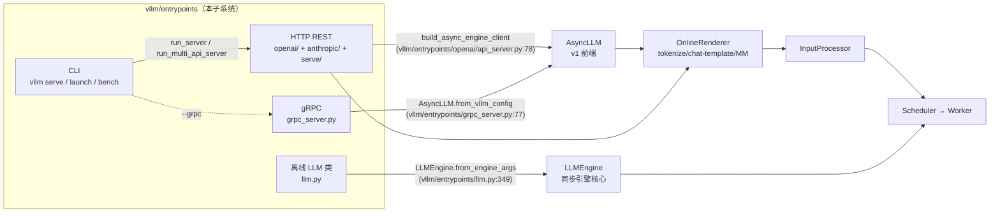
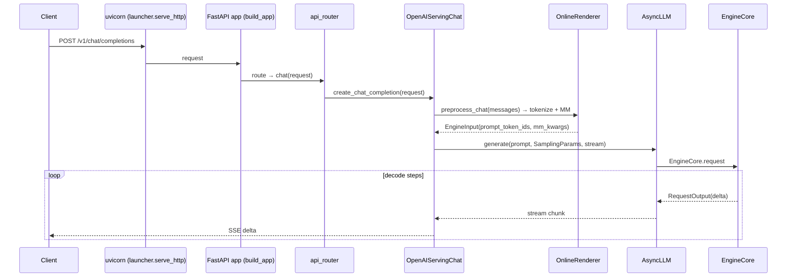

[← Wiki 首页](../README.md) > API 入口

# API 入口子系统

> `vllm/entrypoints/` 是 vLLM 对外暴露的全部"入口"集合：把引擎核心（`AsyncLLM`/`LLMEngine`）的能力包装成四种可消费形态——HTTP REST（OpenAI/Anthropic 兼容）、gRPC、CLI、离线 Python `LLM` 类，并按任务类型（generate / chat / pooling / speech-to-text / responses / scale-out）拆出可插拔的 serving 子包。所有在线入口最终都复用同一套 `OnlineRenderer` + `AsyncLLM` 请求管线。

## 是什么

本子系统由顶层模块 + 8 个子包构成：

| 子包/文件 | 核心职责 | 关键入口 |
|---|---|---|
| `llm.py` | 离线同步 Python API（`LLM` 类） | `vllm/entrypoints/llm.py:66` |
| `chat_utils.py` | Chat 消息解析、多模态内容解析、chat template 加载 | `vllm/entrypoints/chat_utils.py:1863` |
| `offline_utils.py` | `LLM` 的 generate/chat 预处理与执行 mixin | `vllm/entrypoints/offline_utils.py:49` |
| `launcher.py` | uvicorn HTTP 启动器 + 信号/drain/SSL 刷新/watchdog | `vllm/entrypoints/launcher.py:26` |
| `grpc_server.py` | gRPC 服务器（smg-grpc-servicer 后端） | `vllm/entrypoints/grpc_server.py:56` |
| `openai/` | OpenAI 兼容 REST API（chat/completion/responses/models/batch） | [`openai/README.md`](openai/README.md) |
| `anthropic/` | Anthropic Messages API 兼容层 | [`anthropic/README.md`](anthropic/README.md) |
| `cli/` | `vllm` 命令行（serve/launch/openai/bench/run-batch/collect-env） | [`cli/README.md`](cli/README.md) |
| `serve/` | 通用 serving 工具集（middleware/utils/health/metrics/tokenize/lora/profile/elastic-ep/sagemaker/dev） | [`serve/README.md`](serve/README.md) |
| `pooling/` | 池化任务（embed/classify/score/rerank） | [`pooling/README.md`](pooling/README.md) |
| `generate/` | 生成任务基类 + beam search + generative scoring | [`generate/README.md`](generate/README.md) |
| `scale_out/` | 渲染/反渲染/token-in-token-out（多阶段拆分） | [`scale-out/README.md`](scale-out/README.md) |
| `speech_to_text/` | 转写/翻译/实时 ASR | [`speech-to-text/README.md`](speech-to-text/README.md) |
| `mcp/` | Model Context Protocol 工具执行（与 Responses API 联动） | [`mcp/README.md`](mcp/README.md) |

四类入口与引擎复用关系：



请求在 HTTP 入口内的流转（以 `/v1/chat/completions` 为例）：



## 为什么

- **统一前端、可换后端**：所有在线入口都构造 `EngineClient`（`build_async_engine_client`），同一套 serving 代码既能跑单进程 `AsyncLLM`，也能跑多 `api-server-count` / DP supervisor / Rust frontend，无需改动 handler。
- **协议兼容为先**：`openai/` 复刻 OpenAI REST schema（chat/completion/responses/models/batch）；`anthropic/` 复刻 Anthropic Messages + count_tokens；二者共享底层 `OpenAIServingChat`/`OnlineRenderer`，避免逻辑双份。
- **按任务类型切包**：`pooling/`、`generate/`、`speech_to_text/`、`scale_out/` 各自实现 factories + serving + protocol，由 `build_app` 按 `supported_tasks` 动态挂载路由，未启用的任务零开销。
- **离线与在线同源**：`LLM` 类通过 `OfflineInferenceMixin`/`PoolingOfflineMixin`/`BeamSearchOfflineMixin` 复用 renderer/input_processor，保证离线脚本能在线服务的一致语义。
- **可观测与韧性内建**：`launcher.serve_http` 内置 SIGINT/SIGTERM drain、`watchdog_loop`（`vllm/entrypoints/launcher.py:156`）探测引擎死亡、SSL 证书热刷新；`serve/instrumentator/` 暴露 Prometheus `/metrics` 与 `/health`。

## 怎么做

### 启动一条 HTTP 服务

```bash
vllm serve <model> --host 0.0.0.0 --port 8000
```

`vllm serve` 子命令（`vllm/entrypoints/cli/serve.py:44`）解析参数 → 选择单 server / multi api server / headless / dp_supervisor 分支 → 调 `run_server`（`vllm/entrypoints/openai/api_server.py:685`）→ `setup_server` 绑端口 → `build_async_engine_client` 构造引擎 → `build_app` 拼装 FastAPI 路由 → `init_app_state` 实例化各 serving 对象 → `serve_http` 起 uvicorn。

### 用离线 LLM 类

```python
from vllm import LLM, SamplingParams
llm = LLM(model="<model>")
outs = llm.generate(["Hello"], SamplingParams(max_tokens=10))
```

`LLM.__init__`（`vllm/entrypoints/llm.py:176`）→ `LLMEngine.from_engine_args`（`vllm/entrypoints/llm.py:349`）→ `generate`（`vllm/entrypoints/llm.py:422`）经 `OfflineInferenceMixin._run_engine`。

### 关键代码导航

| 关注点 | 位置 |
|---|---|
| HTTP app 构建 | `vllm/entrypoints/openai/api_server.py:157` |
| app state 初始化 | `vllm/entrypoints/openai/api_server.py:297` |
| 引擎 client 工厂 | `vllm/entrypoints/openai/api_server.py:78` |
| uvicorn 启动/drain | `vllm/entrypoints/launcher.py:26` |
| CLI 总入口 | `vllm/entrypoints/cli/main.py:17` |
| serve 子命令 | `vllm/entrypoints/cli/serve.py:44` |
| 离线 LLM 类 | `vllm/entrypoints/llm.py:66` |
| chat 消息解析 | `vllm/entrypoints/chat_utils.py:1863` |
| gRPC serve | `vllm/entrypoints/grpc_server.py:56` |
| serving 基类 | `vllm/entrypoints/serve/engine/serving.py:29` |
| generate 基类 | `vllm/entrypoints/generate/base/serving.py:113` |

## 与其它模块/系统配合

- [引擎核心-AsyncLLM 前端](../01-engine-core/async-llm-frontend.md)：所有在线入口的 `EngineClient` 即 `AsyncLLM`，请求经 `generate()` 进入 EngineCore 进程。
- [引擎核心-InputProcessor](../01-engine-core/input-processor.md)：`OnlineRenderer` 把 chat/completion 文本转 `EngineInput` 后由 InputProcessor 做最终规整。
- [多模态](../11-multimodal/README.md)：`chat_utils.MultiModalContentParser` 解析 image/audio/video URL，`MultiModalItemTracker` 收集媒体项交由 MM processor。
- [LoRA](../12-lora/README.md)：`OpenAIServingModels` 维护静态/动态 LoRA 适配器，请求 `model` 字段路由到 adapter；见 [`serve/lora-serves.md`](serve/lora-serves.md)。
- [tokenizers-transformers](../14-tokenizers-transformers/README.md)：`chat_utils.load_chat_template`、`tool_parsers/`、`reasoning/`、`renderers/` 都在此挂接。
- [采样-结构化输出](../06-sampling-decoding/structured-output/README.md)：`ResponseFormat`/`JsonSchemaResponseFormat`（`vllm/entrypoints/openai/engine/protocol.py:131`）下发到 `StructuredOutputsParams`。
- [配置-scheduler](../10-config/scheduler-config.md)：`shutdown_timeout` 决定 launcher drain 模式（abort/drain）。
- [可观测-metrics](../16-observability/README.md)：`serve/instrumentator/` 暴露 `vllm:*` 指标，`OpenAIHTTPPropagator` 注入 tracing。
- [执行层-DP supervisor 关联]：`openai/dp_supervisor.py` 在多端口外部 LB 模式下 spawn 子 API server 进程，见 [`openai/dp-supervisor.md`](openai/dp-supervisor.md)。

## 历史版本演进

- **v0.5–v0.6（早期单体）**：`api_server.py` 单文件承载 OpenAI server，`LLM` 类与 `AsyncLLMEngine` 共用 engine；chat/completion handler 内联在 api_server。
- **v0.7–v0.8（V1 引擎落地）**：迁移到 `AsyncLLM`（`vllm.v1.engine.async_llm`）+ `EngineCore` 子进程；`build_async_engine_client_from_engine_args` 引入 multiprocess RPC 选项。
- **v0.9（serve/ 工具集拆分）**：把 server_utils/api_utils/instrumentator/tokenize/lora/profile/sagemaker 从 api_server 抽到 `serve/` 子包；引入 `CLISubcommand` 框架与 `vllm serve` 命令。
- **v0.10（Responses API + Anthropic + Scale-out）**：新增 `openai/responses/`（含 `HarmonyContext`、`streaming_events` SSE 分发）；`anthropic/serving.py` 复刻 Messages + count_tokens；`scale_out/` 引入 render/derender/token-in-token-out 支持预处理/推理/后处理跨进程拆分。
- **v0.10.x（DP supervisor / 弹性 EP）**：`openai/dp_supervisor.py` 落地多端口外部 LB 监督进程；`serve/elastic_ep/` 加入 `ScalingMiddleware` 与 scale/is-scaling 端点；`serve/dev/rlhf/` 加 weight transfer 系列。
- **v0.11（实时 ASR + MCP）**：`speech_to_text/realtime/` WebSocket 实时转写（`RealtimeConnection`）；`mcp/` 实现 `MCPToolServer` 与 Responses API 的 tool 调用闭环。
- **v0.12/main**：`chat_completion/batch_serving.py` 增 `/v1/chat/completions/batch`；`openai/parser/harmony_utils.py` 收敛 harmony 渲染；`launch render` 子命令支持纯 CPU 渲染 server；`OfflineInferenceMixin` 重构为 `_preprocess_cmpl`/`_preprocess_chat` 双管线；`run_batch.py` 支持转录/翻译/嵌入/打分批处理。

## 模块导航

### 顶层
| 页 | 主题 |
|---|---|
| [llm.md](llm.md) | `LLM` 离线类 + 三 mixin |
| [chat-utils.md](chat-utils.md) | chat 消息/多模态解析 + template |
| [offline-utils.md](offline-utils.md) | `OfflineInferenceMixin` |
| [launcher.md](launcher.md) | uvicorn serve_http + drain/watchdog |
| [grpc-server.md](grpc-server.md) | gRPC serve_grpc |

### 子目录
| 子系统 | 入口 |
|---|---|
| [openai/](openai/README.md) | OpenAI REST（chat/completion/responses/models/batch/dp-supervisor） |
| [anthropic/](anthropic/README.md) | Anthropic Messages API |
| [cli/](cli/README.md) | `vllm` 命令行 |
| [serve/](serve/README.md) | 通用 serving 工具集 |
| [pooling/](pooling/README.md) | embed/classify/score |
| [generate/](generate/README.md) | 生成基类 + beam search |
| [scale-out/](scale-out/README.md) | render/derender/token-in-token-out |
| [speech-to-text/](speech-to-text/README.md) | 转写/翻译/实时 |
| [mcp/](mcp/README.md) | MCP 工具执行 |

## 参见

- [← Wiki 首页](../README.md)
- [引擎核心-AsyncLLM 前端](../01-engine-core/async-llm-frontend.md)
- [多模态](../11-multimodal/README.md)
- [LoRA](../12-lora/README.md)
- [tokenizers-transformers](../14-tokenizers-transformers/README.md)
- [可观测-metrics](../16-observability/README.md)
