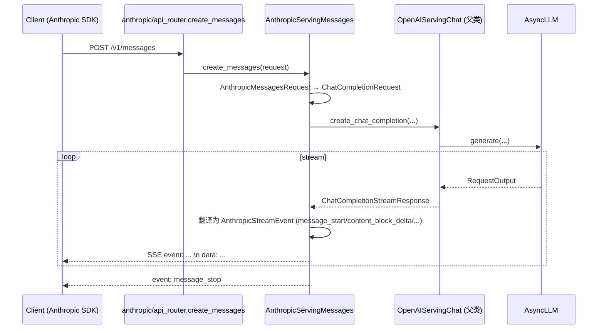

[← Wiki 首页](../README.md) > [API 入口](../README.md) > Anthropic

# Anthropic 兼容（anthropic/）

> `vllm/entrypoints/anthropic/` 复刻 Anthropic Messages API（`/v1/messages`、`/v1/messages/count_tokens`）：把 Anthropic 请求协议翻译成内部 `ChatCompletionRequest`，复用 `OpenAIServingChat` 的渲染与引擎链路，再把输出包回 Anthropic 响应/流事件格式。

## 是什么

| 文件/类 | 位置 | 职责 |
|---|---|---|
| `protocol.py: AnthropicMessagesRequest` | `vllm/entrypoints/anthropic/protocol.py:118` | Anthropic 请求 schema |
| `protocol.py: AnthropicMessagesResponse`/`AnthropicStreamEvent`/`AnthropicDelta` | `:203/182/163` | 响应与流事件 |
| `protocol.py: AnthropicContentBlock`/`AnthropicMessage`/`AnthropicTool`/`AnthropicToolChoice`/`AnthropicJsonOutputFormat`/`AnthropicOutputConfig`/`AnthropicContextManagement` | `:34/65/72/91/104/111/227` | 内容块/工具/结构化输出/上下文管理 |
| `protocol.py: AnthropicCountTokensRequest`/`AnthropicCountTokensResponse` | `:233/259` | token 计数端点 |
| `protocol.py: AnthropicError`/`AnthropicErrorResponse` | `:11/18` | 错误响应 |
| `protocol.py: AnthropicUsage` | `:25` | usage（含 cache_read/cache_creation） |
| `serving.py: AnthropicServingMessages` | `vllm/entrypoints/anthropic/serving.py:103` | 主 handler，继承 `OpenAIServingChat` |
| `serving.py: _get_cached_tokens`/`_build_anthropic_usage` | `:56/63` | usage 转换 |
| `serving.py: wrap_data_with_event` | `:99` | SSE event 包装 |
| `api_router.py: messages`/`create_messages`/`count_tokens`/`translate_error_response`/`attach_router` | `vllm/entrypoints/anthropic/api_router.py:33/61/107/37/136` | 路由 + 错误翻译 |

`AnthropicServingMessages`（`serving.py:103`）继承 `OpenAIServingChat`，复用其 `create_chat_completion`：把 `AnthropicMessagesRequest` 转 `ChatCompletionRequest`，调父类，再把 `ChatCompletionResponse`/stream 翻译成 Anthropic 结构。

`_build_anthropic_usage`（`:63`）处理 token 计数差异：vLLM `prompt_tokens` 含缓存命中，Anthropic 需拆 `input_tokens`/`cache_read_input_tokens`/`cache_creation_input_tokens`（`cache_creation` 在 OpenAI usage 无对应，置 0）。

`translate_error_response`（`api_router.py:37`）把 OpenAI `ErrorResponse` 翻译成 Anthropic `AnthropicErrorResponse`，保持错误类型映射一致。

## 为什么

- **复用 OpenAI 渲染**：Anthropic messages 与 OpenAI chat 在底层都是"messages → tokens"，直接继承 `OpenAIServingChat` 省 90% 逻辑，仅做协议互译。
- **协议差异吸收**：Anthropic 用 `content blocks`（text/tool_use/tool_result）、`stop_reason`、`usage` 字段不同，`AnthropicServingMessages` 在边界做转换，内部仍跑 OpenAI schema。
- **cache 计费对齐**：Anthropic 区分 cache read/creation 计费，`_build_anthropic_usage` 把 vLLM prefix cache 命中映射成 `cache_read_input_tokens`，让计费/观测一致。
- **count_tokens 端点**：Anthropic 客户端常先 count_tokens 预估，本包提供 `/v1/messages/count_tokens` 复用 tokenize 路径。
- **SSE 事件差异**：Anthropic 流事件（`message_start`/`content_block_delta`/`message_delta`/`message_stop`）与 OpenAI `data: {...}` 不同，`wrap_data_with_event` 做 `event:` + `data:` 包装。

## 怎么做

### 路由

`api_router.py:attach_router`（`:136`）注册 `/v1/messages`（POST）、`/v1/messages/count_tokens`（POST）。

### 流程

### 关键代码导航

| 关注点 | 位置 |
|---|---|
| AnthropicServingMessages | `vllm/entrypoints/anthropic/serving.py:103` |
| usage 转换 | `vllm/entrypoints/anthropic/serving.py:63` |
| SSE 包装 | `vllm/entrypoints/anthropic/serving.py:99` |
| 路由 attach | `vllm/entrypoints/anthropic/api_router.py:136` |
| create_messages | `vllm/entrypoints/anthropic/api_router.py:61` |
| count_tokens | `vllm/entrypoints/anthropic/api_router.py:107` |
| 错误翻译 | `vllm/entrypoints/anthropic/api_router.py:37` |
| AnthropicMessagesRequest | `vllm/entrypoints/anthropic/protocol.py:118` |
| AnthropicUsage | `vllm/entrypoints/anthropic/protocol.py:25` |
| AnthropicCountTokensRequest | `vllm/entrypoints/anthropic/protocol.py:233` |

## 与其它模块/系统配合

- [openai/chat-completion.md](../openai/chat-completion.md)：`AnthropicServingMessages` 继承 `OpenAIServingChat`。
- [openai/engine-protocol.md](../openai/engine-protocol.md)：内部用 `ChatCompletionRequest`/`UsageInfo`/`ErrorResponse`。
- [chat-utils.md](../chat-utils.md)：messages 渲染。
- [可观测-metrics](../../16-observability/README.md)：`AnthropicContextManagement`（`:227`）支持上下文管理（缓存控制，待核实与 prefix cache 协同）。
- [采样-结构化](../../06-sampling-decoding/structured-output/README.md)：`AnthropicJsonOutputFormat`/`AnthropicOutputConfig` 翻译到 `JsonSchemaResponseFormat`。

## 历史版本演进

- **v0.10（Anthropic 兼容首发）**：`anthropic/serving.py` + `protocol.py` + `api_router.py`；`/v1/messages` + `/v1/messages/count_tokens`；继承 `OpenAIServingChat`；cache_read usage 映射。
- **v0.10.x（context management + tools）**：`AnthropicContextManagement`、`AnthropicTool`/`AnthropicToolChoice`、`AnthropicJsonOutputFormat`。
- **v0.11/main**：streaming 事件族完善（`content_block_*`/`message_delta`）；error 类型映射扩展；与Responses/harmony 不互通（Anthropic 走 OpenAI chat 路径）。

## 参见

- [← 返回 API 入口首页](../README.md)
- [openai/chat-completion.md](../openai/chat-completion.md)
- [openai/engine-protocol.md](../openai/engine-protocol.md)
