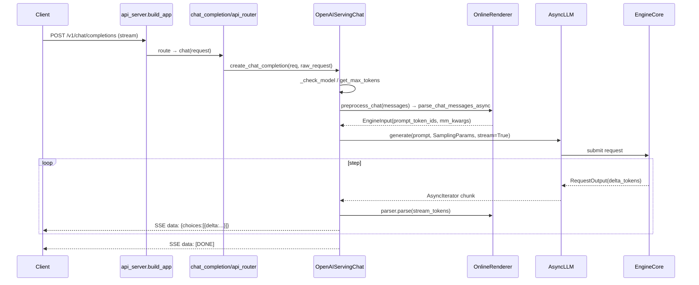

[← Wiki 首页](../README.md) > [API 入口](../README.md) > OpenAI REST

# OpenAI 兼容 REST API（openai/）

> `vllm/entrypoints/openai/` 是 vLLM 对外最成熟的入口：实现 OpenAI REST 协议（chat/completion/responses/models/batch），把请求转成 `EngineInput` 喂给 `AsyncLLM`，并以 SSE 流或 JSON 一次性返回。它同时承载 app 构建、引擎 client 工厂、CLI 参数、DP supervisor、批处理等"server 骨架"。

## 是什么

| 子模块 | 核心 | 职责 |
|---|---|---|
| `api_server.py` | `build_app`/`init_app_state`/`run_server` | FastAPI app 拼装、state 初始化、uvicorn 调度 |
| `cli_args.py` | `FrontendArgs`/`make_arg_parser` | serve 的全部 CLI 参数定义与校验 |
| `dp_supervisor.py` | `DPSupervisor`/`run_dp_supervisor` | 多端口外部 LB 监督进程 |
| `run_batch.py` | `run_batch`/`BatchProcessor` | JSONL 批处理（chat/embed/rerank/transcribe） |
| `engine/protocol.py` | `OpenAIBaseModel`/`UsageInfo`/`DeltaMessage` | OpenAI schema 的 Pydantic 基类与共享协议 |
| `models/` | `OpenAIServingModels` | `/v1/models`、LoRA 加载/卸载 |
| `chat_completion/` | `OpenAIServingChat`/`OpenAIServingChatBatch` | `/v1/chat/completions`（含 batch） |
| `completion/` | `OpenAIServingCompletion` | `/v1/completions` |
| `responses/` | `OpenAIServingResponses` + harmony/streaming | `/v1/responses`（Responses API） |
| `parser/harmony_utils.py` | `build_harmony_preamble`/`render_for_completion` | harmony 消息渲染工具 |

请求时序（chat completion 流式）：

## 为什么

- **协议兼容为主目标**：vLLM 早期即以"OpenAI drop-in 替换"著称，本子包严格对齐 OpenAI schema（`extra="allow"` 透传未知字段并 `logger.debug`）；`/v1/responses` 在 v0.10 落地以对齐 OpenAI 新一代 API。
- **app 构建按任务动态挂载**：`build_app`（`api_server.py:157`）按 `supported_tasks` 决定挂哪些 factories（generate/pooling/speech/scale-out），未启用任务零路由开销，同时强制挂 `serve/` 公共路由（health/metrics/tokenize/lora/profile）。
- **渲染/引擎解耦**：serving 类只持有 `OnlineRenderer` 与 `engine_client`，不关心 EngineCore 是同进程还是 RPC；`init_render_app_state`（`:424`）甚至支持无引擎的纯 CPU 渲染 server（`vllm launch render`）。
- **DP supervisor 隔离复杂度**：多端口外部 LB 模式下 spawn 多个 `api-server-count` 子进程，supervisor 自身只做健康探测与信号转发，子进程复用同一 `run_server_worker`。
- **统一协议基类**：`OpenAIBaseModel`（`engine/protocol.py:28`）缓存 `field_names` 并在 `__log_extra_fields__` 记录被忽略字段，所有 chat/completion/responses 协议继承它。

## 怎么做

### 启动

`vllm serve <model>` → `ServeSubcommand.cmd`（`cli/serve.py:50`）→ 单进程分支 `uvloop.run(run_server(args))`（`api_server.py:685`）→ `run_server_worker`（`:701`）→ `build_async_engine_client`（`:78`）上下文 → `build_and_serve`（`:592`）→ `serve_http`。

### 路由挂载顺序（`build_app`）

1. `register_vllm_serve_api_routers(app)`（health/metrics/tokenize/lora/profile）。
2. `register_models_api_router`（`/v1/models`、`/v1/load_lora_adapter`、`/v1/unload_lora_adapter`）。
3. `register_sagemaker_api_router`（按 supported_tasks）。
4. `register_vllm_dev_api_routers`（仅 `VLLM_SERVER_DEV_MODE`）。
5. generate task → `register_generate_api_routers` + `elastic_ep_attach_router`。
6. generate/render → `register_scale_out_api_routers`。
7. transcription/realtime → `register_speech_to_text_api_routers`。
8. pooling tasks → `register_pooling_api_routers`。
9. middleware：CORS / 异常 handler / Authentication / XRequestId / Scaling / 自定义 `--middleware`。

### `init_app_state`（`:297`）实例化

`OpenAIServingModels`、`OnlineRenderer`、`OnlineDerenderer`、`ServingTokenization`，再按 task 调 `init_generate_state`/`init_scale_out_state`/`init_speech_to_text_state`/`init_pooling_state` 挂对应 serving 对象到 `state`。

### 关键文件导航

| 关注点 | 文件 |
|---|---|
| app 构建 | `vllm/entrypoints/openai/api_server.py:157` |
| state 初始化 | `vllm/entrypoints/openai/api_server.py:297` |
| 引擎工厂 | `vllm/entrypoints/openai/api_server.py:78` |
| render-only 入口 | `vllm/entrypoints/openai/api_server.py:640` |
| CLI 参数 | `vllm/entrypoints/openai/cli_args.py:339` |
| DP supervisor | `vllm/entrypoints/openai/dp_supervisor.py:266` |
| 协议基类 | `vllm/entrypoints/openai/engine/protocol.py:28` |

## 与其它模块/系统配合

- [launcher.md](../launcher.md)：`serve_http` 实际起 uvicorn。
- [serve/README.md](../serve/README.md)：`build_app` 大量挂载 `serve/` 公共路由与 middleware。
- [generate/README.md](../generate/README.md)：`OpenAIServingChat`/`Completion`/`Responses` 都继承 `GenerateBaseServing`。
- [scale-out/README.md](../scale-out/README.md)：render-only state 与 derender 为 Responses/多阶段服务。
- [anthropic/README.md](../anthropic/README.md)：`AnthropicServingMessages` 继承 `OpenAIServingChat`，复用渲染/引擎。
- [引擎核心-AsyncLLM 前端](../../01-engine-core/async-llm-frontend.md)：`build_async_engine_client_from_engine_args` 构造 `AsyncLLM`。
- [多模态](../../11-multimodal/README.md)：chat/responses 经 `OnlineRenderer.preprocess_chat` 调 MM processor。
- [LoRA](../../12-lora/README.md)：`OpenAIServingModels` 管静态/动态 LoRA。
- [采样-结构化](../../06-sampling-decoding/structured-output/README.md)：`ResponseFormat`/`JsonSchemaResponseFormat` 下发。
- [可观测-metrics](../../16-observability/README.md)：`instrumentator` + `lifespan` stats。

## 历史版本演进

- **v0.5–v0.6（单体 api_server）**：`api_server.py` 单文件含所有 handler 与协议；`LLM` 与 server 共用 `AsyncLLMEngine`。
- **v0.7–v0.8（V1 + 子包拆分）**：迁到 `AsyncLLM`；把 chat/completion/models 协议与 serving 拆到 `chat_completion/`、`completion/`、`models/` 子包；`build_app` 引入按 task 挂载。
- **v0.9（cli_args + serve/ 抽离）**：参数定义移到 `cli_args.py`；公共 server 工具移到 `serve/`；`run_server_worker` 支持多 api-server-count。
- **v0.10（Responses + DP supervisor）**：新增 `responses/`（含 harmony/streaming_events/context）；`dp_supervisor.py` 多端口外部 LB；`models/serving.py` 拆 `OpenAIModelRegistry`（只读）与 `OpenAIServingModels`（带 LoRA）支持 render-only server。
- **v0.10.x（render-only & harmony parser）**：`init_render_app_state`/`build_and_serve_renderer`；`openai/parser/harmony_utils.py` 收敛 harmony 渲染逻辑；`chat_completion/batch_serving.py` 落地 `/v1/chat/completions/batch`。
- **v0.11/main**：`run_batch.py` 扩展 transcription/translation/embed/score；`elastic_ep` 路由与 `ScalingMiddleware` 必挂；`hub`/`grader` 等 harmony 工具（待核实）；retry/backoff（待补充）。

## 模块导航

| 页 | 主题 |
|---|---|
| [api-server.md](api-server.md) | `api_server.py`：build_app/init_app_state/setup_server/run_server |
| [cli-args.md](cli-args.md) | `cli_args.py`：FrontendArgs + make_arg_parser |
| [dp-supervisor.md](dp-supervisor.md) | `dp_supervisor.py`：多端口 LB 监督进程 |
| [run-batch.md](run-batch.md) | `run_batch.py`：JSONL 批处理 |
| [engine-protocol.md](engine-protocol.md) | `engine/protocol.py`：OpenAI 共享协议 |
| [models.md](models.md) | `models/serving.py`：/v1/models + LoRA |
| [chat-completion.md](chat-completion.md) | `chat_completion/serving.py` + `batch_serving.py` |
| [completion.md](completion.md) | `completion/serving.py` |
| [responses.md](responses.md) | `responses/serving.py` + context + harmony + streaming_events |

## 参见

- [← 返回 API 入口首页](../README.md)
- [launcher.md](../launcher.md)
- [serve/README.md](../serve/README.md)
- [generate/README.md](../generate/README.md)
- [anthropic/README.md](../anthropic/README.md)
