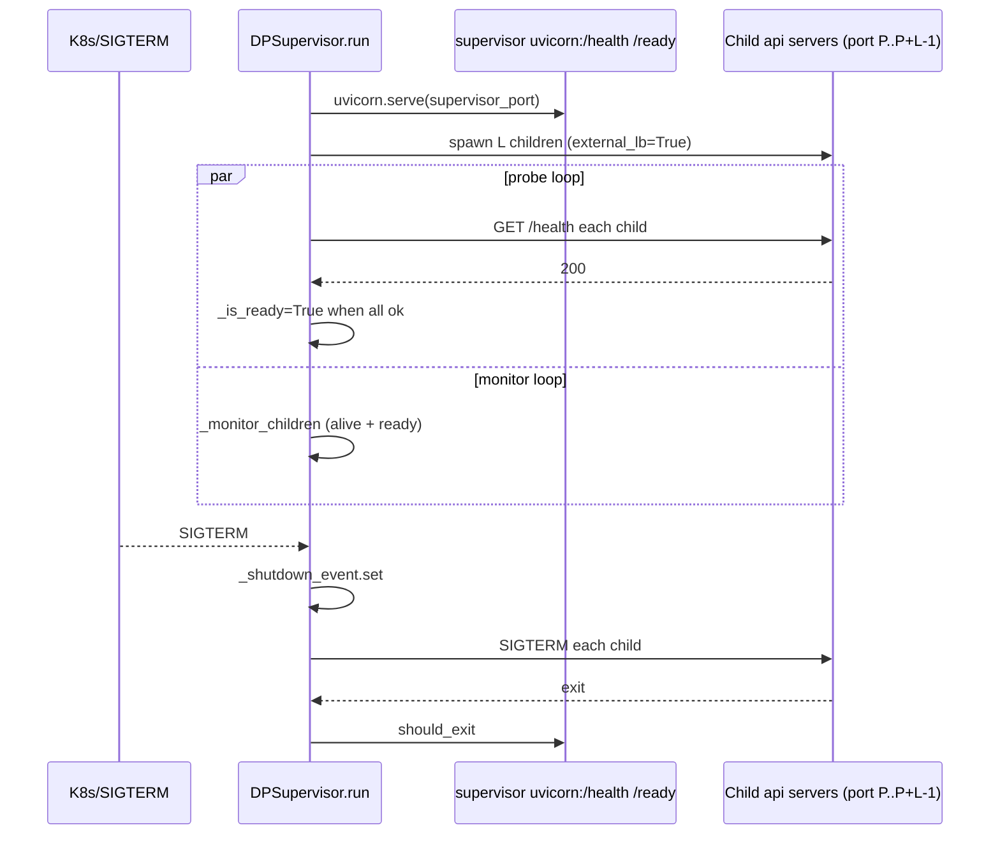

[← Wiki 首页](../../README.md) > [API 入口](../README.md) > [OpenAI](README.md) > dp_supervisor

# dp_supervisor.py（多端口 DP 监督进程）

> `vllm/entrypoints/openai/dp_supervisor.py` 在 `--data-parallel-multi-port-external-lb` 模式下运行一个轻量 FastAPI 监督进程：为每个 local DP rank spawn 一个独立 `vllm serve` 子进程（各占一端口），周期健康探测，K8s SIGTERM 时优雅级联关闭。它是"外部 LB + 单端口 per rank"部署形态的编排器。

## 是什么

| 组件 | 位置 | 职责 |
|---|---|---|
| `infer_multi_port_external_lb_start_rank` | `vllm/entrypoints/openai/dp_supervisor.py:38` | 推断 DP start rank（`data_parallel_start_rank` 或 `node_rank*local_size`） |
| `validate_multi_port_external_lb_args` | `:48` | 校验：禁 `--grpc`/`--uds`、SSL 成对、`api_server_count==1`、不可与 hybrid/external-lb 共用、`dp_size>=2`、`local_size>=2` 且整除、端口不与 supervisor 重叠 |
| `_build_vllm_dp_server_args` | `:114` | 为每个 local rank 拷贝 args：`port=base+local_rank`、`data_parallel_rank=start+local_rank`、`data_parallel_external_lb=True`、`api_server_count=1` |
| `_build_device_ids` | `:133` | 构造每个 rank 的 `device_ids` |
| `_child_base_url` | `:154` | 拼 child `http://host:port` |
| `_join_processes_with_timeout` | `:164` | 等子进程启动或超时 |
| `_probe_endpoint` | `:173` | aiohttp `GET /health` 探测 |
| `_build_dp_supervisor_app` | `:216` | supervisor 自己的 FastAPI：`/health`、`/ready` |
| `_run_python_vllm_dp_server` / `_run_rust_vllm_dp_server` / `_run_vllm_dp_server` | `:237/243/249` | 子进程 target：选 Python 或 Rust 前端 |
| `DPSupervisor` | `:266` | 主类：`run()`、`_start_children`、`_probe_all_children`、`_monitor_children`、`_shutdown_children` |
| `run_dp_supervisor` | `:521` | 顶层入口：`DPSupervisor(args).run()`（同步阻塞） |

supervisor 自己只暴露 `/health`（永远 ok）与 `/ready`（`_is_ready and not shutdown_event`），自身**不转发**推理流量——外部 LB 直连 child 端口；supervisor 仅做编排与就绪门控（`vllm/entrypoints/openai/dp_supervisor.py:216` 起）。

子进程拉起：`_start_children`（`:356`）用 `multiprocessing.get_context("spawn")`，对每个 local rank 构造 `child_args` → `context.Process(target=_run_vllm_dp_server, name=f"APIServer_DPRank_{rank}")`。

## 为什么

- **每 rank 独立端口**：单进程多 client 的内部 LB（`api_server_count>1`）在一个端口上 `SO_REUSEPORT` 多进程抢接受锁，外部硬件 LB 不便逐 rank 探测；"多端口"模式让每个 DP rank 暴露独立端口，外部 LB 按 rank 健康独立摘除。
- **supervisor 不在数据面**：把数据转发职责留给外部 LB（或 Rust frontend），supervisor 只负责 spawn/health/shutdown，故障域更小，自身重启不影响推理。
- **K8s 就绪门控**：`/ready` 在所有 child 就绪且未在 shutdown 时才 200，K8s `readinessProbe` 据此摘流；`/health` 仅表进程存活。
- **probe 容忍抖动**：`_probe_all_children`（`:372`）带 `dp_supervisor_probe_timeout_s` 与 `dp_supervisor_probe_failure_threshold`，ready 前阈值=1，ready 后按配置，避免误杀。
- **级联优雅关闭**：SIGTERM → `_handle_signal`（`:335`）置 `_shutdown_event` → `_monitor_children` 退出循环 → `_shutdown_children`（`:479`）向每个 child 发 SIGTERM，`CHILD_EXIT_GRACE_S=5.0` 后强杀。
- **兼容 Rust frontend**：`_run_vllm_dp_server` 按 `VLLM_RUN_DP_SERVER_ON_RUST` 或 args 选 Rust 二进制路径（待核实具体 env 名），让 Rust frontend 也能被 supervisor 编排。

## 怎么做

### 启动条件

CLI：`vllm serve <model> --data-parallel-size N --data-parallel-size-local L --data-parallel-multi-port-external-lb --port P --data-parallel-supervisor-port S`。

`ServeSubcommand`（`cli/serve.py:139`）检测 `is_multi_port` → `run_dp_supervisor(args)` → `DPSupervisor.run()`。children 数量 = `data_parallel_size_local`，端口 `P..P+L-1`，rank `start_rank..start_rank+L-1`。

### supervisor 流程

### child 参数差异（`_build_vllm_dp_server_args`）

child `args` 相对 supervisor：

- `port = base + local_rank`
- `data_parallel_rank = start_rank + local_rank`
- `data_parallel_size_local = 1`（单 rank）
- `data_parallel_external_lb = True`（取消 multi-port）
- `api_server_count = 1`
- `device_ids` 按 local_rank 切分

### 关键代码导航

| 关注点 | 位置 |
|---|---|
| start_rank 推断 | `vllm/entrypoints/openai/dp_supervisor.py:38` |
| 校验 | `vllm/entrypoints/openai/dp_supervisor.py:48` |
| child args | `vllm/entrypoints/openai/dp_supervisor.py:114` |
| supervisor app | `vllm/entrypoints/openai/dp_supervisor.py:216` |
| DPSupervisor.run | `vllm/entrypoints/openai/dp_supervisor.py:284` |
| 信号处理 | `vllm/entrypoints/openai/dp_supervisor.py:335` |
| spawn children | `vllm/entrypoints/openai/dp_supervisor.py:356` |
| probe loop | `vllm/entrypoints/openai/dp_supervisor.py:372` |
| monitor | `vllm/entrypoints/openai/dp_supervisor.py:430` |
| shutdown children | `vllm/entrypoints/openai/dp_supervisor.py:479` |
| run_dp_supervisor | `vllm/entrypoints/openai/dp_supervisor.py:521` |

## 与其它模块/系统配合

- [cli/serve-cmd.md](../cli/serve-cmd.md)：`is_multi_port` 分支调 `run_dp_supervisor`。
- [cli-args.md](cli-args.md)：`validate_parsed_serve_args` 委托 `validate_multi_port_external_lb_args`。
- [api-server.md](api-server.md)：child 跑 `run_server_worker`/Rust frontend，复用 `setup_server`。
- [执行层-DP supervisor 关联]：与 `data_parallel_external_lb`/`data_parallel_start_rank` 配合；外部 LB 直连 child 端口。
- [可观测-metrics](../../16-observability/README.md)：child 各自 `/metrics`，supervisor 不聚合（待核实是否暴露汇总）。
- [配置-scheduler](../../10-config/scheduler-config.md)：`parallel_config.data_parallel_*` 字段约束 supervisor 行为。

## 历史版本演进

- **v0.10（多端口 LB 引入）**：新增 `dp_supervisor.py`，支持多节点多端口外部 LB；supervisor 用 uvicorn 暴露 `/health`/`/ready`；spawn Python 子进程。
- **v0.10.x（Rust frontend 兼容）**：`_run_rust_vllm_dp_server` 分支；`VLLM_RUST_FRONTEND_PATH` 与 multi-port 协同（仍要求 `api_server_count==1`）。
- **v0.11（probe 阈值）**：`dp_supervisor_probe_timeout_s`/`dp_supervisor_probe_failure_threshold` 参数化；ready 前后不同阈值。
- **main**：`data_parallel_start_rank` 显式覆盖（`:38`）；device_ids 切分支持异构（`:133`）；Elastic EP 与 multi-port 互斥校验（待核实是否在 supervisor 层）。

## 参见

- [← 返回 OpenAI 首页](README.md)
- [cli/serve-cmd.md](../cli/serve-cmd.md)
- [api-server.md](api-server.md)
- [执行层-DP supervisor 关联]（../../02-execution/README.md）
