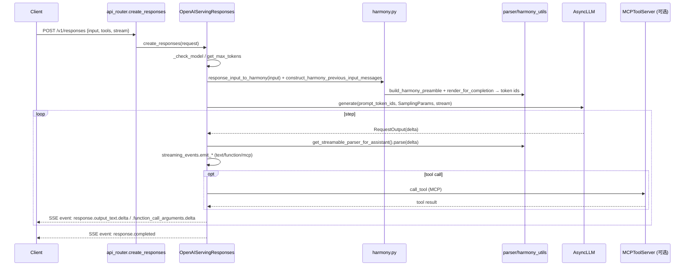

[← Wiki 首页](../../README.md) > [API 入口](../README.md) > [OpenAI](README.md) > responses

# responses/（Responses API + harmony + streaming）

> `openai/responses/` 实现 OpenAI **Responses API**（`/v1/responses`，v0.10 引入）：一种面向"对话状态 + 工具 + reasoning"的统一 API，底层用 harmony 消息格式渲染、`SimpleStreamingEventProcessor` 把引擎 token 流分发成 OpenAI Responses 事件流，并原生支持 MCP 工具调用。它是 vLLM 最复杂的在线 handler。

## 是什么

| 文件 / 类 | 位置 | 职责 |
|---|---|---|
| `serving.py: OpenAIServingResponses` | `vllm/entrypoints/openai/responses/serving.py:150` | 主 handler，继承 `GenerateBaseServing` |
| `serving.py: _extract_allowed_tools_from_mcp_requests` | `:111` | 从 MCP tool 请求抽 `allowed_tools` 映射 |
| `context.py: ConversationContext` | `vllm/entrypoints/openai/responses/context.py:105` | 抽象会话上下文 |
| `context.py: TurnMetrics` | `:73` | 单轮计时 |
| `context.py: SimpleContext` | `:165` | 非 harmony 上下文 |
| `context.py: ParsableContext` | `:287` | 需 parser 的上下文 |
| `context.py: HarmonyContext` | `:592` | harmony 上下文 |
| `harmony.py: response_input_to_harmony` | `vllm/entrypoints/openai/responses/harmony.py:148` | 把 Responses input 转 harmony `Message` |
| `harmony.py: construct_harmony_previous_input_messages` | `:228` | previous_input 转 harmony |
| `harmony.py: harmony_to_response_output` | `:435` | harmony 输出 → `ResponseOutputItem` |
| `harmony.py: _parse_function_call` / `_parse_mcp_call` / `_parse_reasoning` | `:309/388/329` | 解析 harmony 各种 recipient |
| `streaming_events.py: StreamingState` | `vllm/entrypoints/openai/responses/streaming_events.py:105` | 流式状态机上下文 |
| `streaming_events.py: emit_*_events` | `:144` 起 | 各类 delta/done 事件发射器（text/reasoning/function/mcp/code_interpreter/browser） |
| `streaming_events.py: SimpleStreamingEventProcessor` | `:1147` | 简单（非 harmony）事件处理器 |
| `streaming_events.py: split_delta` | `:1115` | 把 `DeltaMessage` 拆成多通道增量 |
| `protocol.py: ResponsesRequest` / `ResponsesResponse` / `ResponseUsage` | `vllm/entrypoints/openai/responses/protocol.py:136/617/93` | 请求/响应/usage schema |
| `protocol.py: ResponseCreatedEvent`/`ResponseInProgressEvent`/`ResponseCompletedEvent` | `:805/809/801` | 生命周期事件 |
| `utils.py: build_response_output_items` | `vllm/entrypoints/openai/responses/utils.py:49` | 构造输出 item（message/function_call/mcp_call） |
| `utils.py: construct_input_messages` | `:158` | input + previous_input → messages |
| `api_router.py: create_responses` | `vllm/entrypoints/openai/responses/api_router.py:60` | `/v1/responses` POST |
| `api_router.py: retrieve_responses` / `cancel_responses` | `:82/112` | 查询/取消（待核实持久化） |

Responses API 与 chat completion 的差异：

- **input/output item 模型**：请求 `input` 是 message/工具结果/推理的混合列表；响应 `output` 是 `ResponseOutputItem` 列表（不再只有 `choices`）。
- **事件流**：流式不止发 `response.output_text.delta`，还发 `response.created`/`response.in_progress`/`response.output_item.added`/`response.function_call_arguments.delta`/`response.completed` 等（见 OpenAI Responses streaming spec）。
- **harmony 协议**：内部把 input 渲染成 harmony `Message` 列表（含 `developer`/`system`/`user`/`assistant`/`tool` 角色 + recipient 路由），由 `parser/harmony_utils.py` 统一编码；输出再从 harmony 解出 `ResponseOutputItem`。
- **MCP 联动**：`tools` 含 `MCP` 类型时，`_extract_allowed_tools_from_mcp_requests` 抽 `allowed_tools`，`ToolServer`（[mcp/tool-server.md](../mcp/tool-server.md)）执行远程工具调用，结果回灌 input。

## 为什么

- **统一文本/工具/推理/RAG**：Responses API 用一种端点描述"模型 + 工具 + 上下文管理"，避免客户端拼装多个端点；harmony 作为统一中间表示，让 vLLM 复用 OpenAI 的 harmony 模型（gpt-oss 系列）与 schema。
- **harmony 渲染收敛**：`parser/harmony_utils.py`（`build_harmony_preamble`/`render_for_completion`/`get_streamable_parser_for_assistant`）把 harmony 细节收敛，serving 与 chat completion 经 `use_harmony` 共享，减少双份渲染代码。
- **streaming 事件分拣**：`StreamingState` + `split_delta`（`:1115`）把混合 delta 按内容类型分通道，每通道一套 `emit_*_delta_events` + `emit_*_done_events`，保证事件顺序符合 OpenAI 规范（先 `output_item.added`，后若干 `delta`，最后 `output_item.done`）。
- **双上下文**：`SimpleContext`/`ParsableContext`/`HarmonyContext` 抽象让非 harmony 模型也能跑 Responses（简单文本），harmony 模型走完整工具/reasoning 解析，单 handler 适配多模型族。
- **MCP 原生**：把 MCP server 作为 `Tool` 一等公民，`MCPToolServer` 在流中实时调用远程 MCP server 并把结果作为 `response.output_item` 流回，匹配 OpenAI Responses + MCP 集成范式。
- **retrieve/cancel 钩子**：`retrieve_responses`/`cancel_responses` 路由为异步任务/批处理预留（待核实是否需配合外部存储）。

## 怎么做

### 路由

`responses/api_router.py:attach_router`（`:127`）注册：

- `POST /v1/responses` → `create_responses`（`:60`，流式与非流式分派）。
- `GET /v1/responses/{response_id}` → `retrieve_responses`（`:82`）。
- `POST /v1/responses/{response_id}/cancel` → `cancel_responses`（`:112`）。

流式经 `_convert_stream_to_sse_events`（`:34`）把 `OpenAIServingResponses` 的 async generator 转成 SSE。

### 请求流（harmony 模型）

### 关键代码导航

| 关注点 | 位置 |
|---|---|
| OpenAIServingResponses | `vllm/entrypoints/openai/responses/serving.py:150` |
| MCP allowed_tools | `vllm/entrypoints/openai/responses/serving.py:111` |
| ConversationContext 抽象 | `vllm/entrypoints/openai/responses/context.py:105` |
| HarmonyContext | `vllm/entrypoints/openai/responses/context.py:592` |
| input → harmony | `vllm/entrypoints/openai/responses/harmony.py:148` |
| harmony → output | `vllm/entrypoints/openai/responses/harmony.py:435` |
| StreamingState | `vllm/entrypoints/openai/responses/streaming_events.py:105` |
| split_delta | `vllm/entrypoints/openai/responses/streaming_events.py:1115` |
| SimpleStreamingEventProcessor | `vllm/entrypoints/openai/responses/streaming_events.py:1147` |
| emit_text_delta_events | `vllm/entrypoints/openai/responses/streaming_events.py:144` |
| emit_mcp_delta_events | `vllm/entrypoints/openai/responses/streaming_events.py:287` |
| build_response_output_items | `vllm/entrypoints/openai/responses/utils.py:49` |
| ResponsesRequest | `vllm/entrypoints/openai/responses/protocol.py:136` |
| 路由 | `vllm/entrypoints/openai/responses/api_router.py:60` |
| SSE 转换 | `vllm/entrypoints/openai/responses/api_router.py:34` |

## 与其它模块/系统配合

- [generate/base-serves.md](../generate/base-serves.md)：`GenerateBaseServing` 基类。
- [engine-protocol.md](engine-protocol.md)：`OpenAIBaseModel`/`ErrorResponse`/`DeltaMessage`。
- [models.md](models.md)：`_check_model`。
- [mcp/tool-server.md](../mcp/tool-server.md)：`MCPToolServer`、`list_server_and_tools`，实时工具调用。
- [mcp/tool.md](../mcp/tool.md)：`HarmonyBrowserTool`/`HarmonyPythonTool`，harmony 内工具。
- [chat-completion.md](chat-completion.md)：`use_harmony` 共享 `OnlineRenderer._make_request_with_harmony`。
- [聊天渲染/harmony](../../14-tokenizers-transformers/README.md)：`openai_harmony` 包、`parser/harmony_utils.py`。
- [采样-结构化输出](../../06-sampling-decoding/structured-output/README.md)：`text.format`/`json_schema` 下发。
- [可观测-metrics](../../16-observability/README.md)：`RequestResponseMetadata`、per-request timing。

## 历史版本演进

- **v0.10（Responses API 首发）**：新增 `openai/responses/` 子包；`OpenAIServingResponses` + `protocol.py` + `api_router.py`；harmony 渲染（`response_input_to_harmony`/`harmony_to_response_output`）；`StreamingState` + `emit_*` 事件族；`/v1/responses` POST/GET/cancel。
- **v0.10.x（MCP 集成）**：`mcp/tool_server.py` + `_extract_allowed_tools_from_mcp_requests`；流中实时 MCP 调用与 `response.mcp_call.*` 事件；`harmony._parse_mcp_call`/`_parse_mcp_recipient`。
- **v0.10.x（context 抽象）**：拆 `SimpleContext`/`ParsableContext`/`HarmonyContext`，让非 harmony 模型走 `SimpleStreamingEventProcessor`。
- **v0.11（browser/code_interpreter 工具）**：`emit_browser_tool_events`/`emit_code_interpreter_*`；`HarmonyBrowserTool`/`HarmonyPythonTool`（mcp/tool.py）。
- **main**：`build_response_output_items` 支持 `previous_response_id` 链式（`construct_harmony_previous_input_messages`）；structured output `text.format.json_schema`；`allowed_tools` 支持 `McpAllowedToolsMcpToolFilter` 对象（`serving.py:138`）；retrieve/cancel 持久化（待补充）。

## 参见

- [← 返回 OpenAI 首页](README.md)
- [chat-completion.md](chat-completion.md)
- [mcp/tool-server.md](../mcp/tool-server.md)
- [mcp/tool.md](../mcp/tool.md)
- [generate/base-serves.md](../generate/base-serves.md)
- [tokenizers-transformers](../../14-tokenizers-transformers/README.md)
