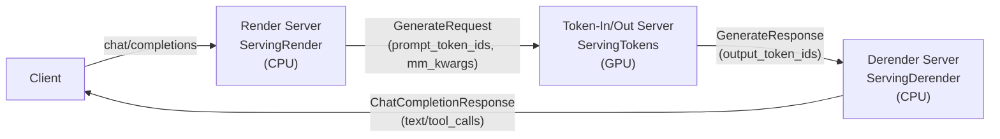

[← Wiki 首页](../README.md) > [API 入口](../README.md) > Scale-out

# Scale-out（render/derender/token-in-token-out）

> `vllm/entrypoints/scale_out/` 实现 vLLM 的"多阶段服务拆分"：把推理流水线切成 render（预处理）、token-in-token-out（纯推理）、derender（后处理）三段，可分别部署到不同节点（CPU render + GPU 推理 + CPU derender），用 token 级协议跨进程通信。是 vLLM 极致水平扩展的关键。

## 是什么

| 文件/类 | 位置 | 职责 |
|---|---|---|
| `factories.py: init_render_state` | `vllm/entrypoints/scale_out/factories.py:19` | render-only server state |
| `factories.py: init_scale_out_state` | `:39` | 推理节点 state（含 render+derender） |
| `factories.py: register_scale_out_api_routers` | `:61` | 按 supported_tasks（generate/render）挂路由 |
| `render/serving.py: ServingRender` | `vllm/entrypoints/scale_out/render/serving.py:38` | render 端点（预处理出 token） |
| `render/api_router.py: render_chat_completion`/`render_completion` | `vllm/entrypoints/scale_out/render/api_router.py:37/62` | `/render/chat/completions`、`/render/completions` |
| `token_in_token_out/serving.py: ServingTokens` | `vllm/entrypoints/scale_out/token_in_token_out/serving.py:61` | token-in/token-out 纯推理端点，继承 `GenerateBaseServing` |
| `token_in_token_out/protocol.py: GenerateRequest`/`GenerateResponse`/`DerenderChatRequest`/`DerenderCompletionRequest` | `vllm/entrypoints/scale_out/token_in_token_out/protocol.py:66/215/239/268` | token 级请求/响应 + derender 输入 |
| `token_in_token_out/api_router.py: generate`/`attach_router` | `vllm/entrypoints/scale_out/token_in_token_out/api_router.py:58/76` | `/generate`（token 级） |
| `token_in_token_out/mm_serde.py: encode_mm_kwargs_item`/`decode_mm_kwargs_item` | `vllm/entrypoints/scale_out/token_in_token_out/mm_serde.py:17/24` | 多模态 kwargs 跨进程序列化 |
| `derender/serving.py: ServingDerender` | `vllm/entrypoints/scale_out/derender/serving.py:38` | derender 端点（token→文本/parser） |
| `derender/api_router.py: derender_chat_completion`/`derender_completion` | `vllm/entrypoints/scale_out/derender/api_router.py:39/64` | `/derender/chat/completions`、`/derender/completions` |

三段流水线：

- **Render**：收 OpenAI 请求 → renderer 预处理 → 输出 `GenerateRequest{prompt_token_ids, mm_features, sampling_params}`（`protocol.py:66`）。
- **Token-In/Out**：收 `GenerateRequest` → 直接 `engine_client.generate`（不经 renderer，已是 token）→ 输出 `GenerateResponse{output_token_ids}`（`:215`）。多模态特征经 `mm_serde`（`:17`）base64 序列化跨进程传。
- **Derender**：收 `DerenderChatRequest`（含 token + 原始 messages/context，`:239`）→ `OnlineDerenderer` 把 token 经 parser/detokenizer 还原成 `ChatCompletionResponse`。

## 为什么

- **预处理/后处理剥离 GPU**：render/derender 是 CPU 密集（chat template、MM processor、parser），剥离让 GPU 节点专注推理，提升 GPU 利用率与吞吐。
- **token 级协议省序列化**：render↔推理 传 `prompt_token_ids` 而非文本+messages，省去重复 tokenize；多模态用 `mm_serde` 紧凑序列化特征张量。
- **独立 scale**：三段可按负载独立扩缩容（render 多 CPU、推理多 GPU、derender 多 CPU），比单体 server 弹性高。
- **`init_render_state` 支持 render-only**：`vllm launch render` 起纯 render server（[launch-cmd.md](../cli/launch-cmd.md)），无 engine，仅 `init_render_state`（`:19`）。
- **derender 复用 `OnlineDerenderer`**：与主 server 的 `OnlineRenderer` 对称，parser/detokenizer 一致，保证拆分后行为不变。

## 怎么做

`build_app`（`api_server.py:216`）在 `generate` 或 `render` task 时调 `register_scale_out_api_routers`；`init_app_state`/`init_render_app_state` 调对应 state init。

### 部署形态

- 单体：render+推理+derender 同进程（默认）。
- 拆分：`vllm launch render` 起 render server；`vllm serve` 在 GPU 节点起 token-in/out + derender；或三者各自独立。

### 关键代码导航

| 关注点 | 位置 |
|---|---|
| init_render_state | `vllm/entrypoints/scale_out/factories.py:19` |
| init_scale_out_state | `vllm/entrypoints/scale_out/factories.py:39` |
| register_scale_out_api_routers | `vllm/entrypoints/scale_out/factories.py:61` |
| ServingRender | `vllm/entrypoints/scale_out/render/serving.py:38` |
| render 端点 | `vllm/entrypoints/scale_out/render/api_router.py:37` |
| ServingTokens | `vllm/entrypoints/scale_out/token_in_token_out/serving.py:61` |
| GenerateRequest | `vllm/entrypoints/scale_out/token_in_token_out/protocol.py:66` |
| GenerateResponse | `vllm/entrypoints/scale_out/token_in_token_out/protocol.py:215` |
| DerenderChatRequest | `vllm/entrypoints/scale_out/token_in_token_out/protocol.py:239` |
| mm_serde | `vllm/entrypoints/scale_out/token_in_token_out/mm_serde.py:17` |
| generate 端点 | `vllm/entrypoints/scale_out/token_in_token_out/api_router.py:58` |
| ServingDerender | `vllm/entrypoints/scale_out/derender/serving.py:38` |
| derender 端点 | `vllm/entrypoints/scale_out/derender/api_router.py:39` |

## 与其它模块/系统配合

- [openai/api-server.md](../openai/api-server.md)：`build_app`/`init_render_app_state` 集成。
- [cli/launch-cmd.md](../cli/launch-cmd.md)：`vllm launch render`。
- [generate/base-serves.md](../generate/base-serves.md)：`ServingTokens` 继承 `GenerateBaseServing`。
- [多模态](../../11-multimodal/README.md)：`mm_serde` 序列化 `MultiModalKwargsItem`；`_extract_mm_features`（render/derender）。
- [chat-utils.md](../chat-utils.md)：render 内部调 `parse_chat_messages`。
- [引擎核心-AsyncLLM](../../01-engine-core/async-llm-frontend.md)：token-in/out 用 `engine_client.generate`。

## 历史版本演进

- **v0.10（scale-out 首发）**：render/derender/token-in-token-out 三段；`GenerateRequest`/`DerenderChatRequest` 协议；`mm_serde`；`vllm launch render`。
- **v0.10.x（多模态序列化）**：`encode/decode_mm_kwargs_item` 支持图像/音频特征跨进程；`MultiModalFeatures` protocol（`:42`）。
- **v0.11/main**：`ServingRender._extract_mm_features`（`:212`）；render/derender 与 harmony Responses 协同（待核实）；`init_render_state` 在 render-only server 复用。

## 模块导航

| 页 | 主题 |
|---|---|
| [factories.md](factories.md) | scale-out 装配 |
| [render.md](render.md) | `ServingRender` |
| [derender.md](derender.md) | `ServingDerender` |
| [token-in-token-out.md](token-in-token-out.md) | `ServingTokens` + 协议 |

## 参见

- [← 返回 API 入口首页](../README.md)
- [openai/api-server.md](../openai/api-server.md)
- [cli/launch-cmd.md](../cli/launch-cmd.md)
- [多模态](../../11-multimodal/README.md)
