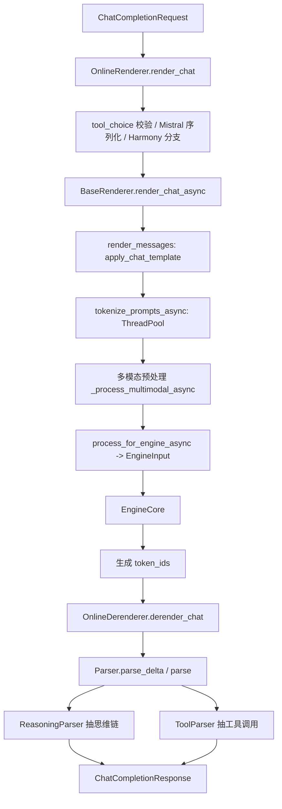

[← Wiki 首页](../README.md)

# 14 分词与转换器子系统

> vLLM 把所有"模型仓库/tokenizer/chat 模板/工具调用/思维链解析/前端渲染"的胶水代码集中放在五个紧密协作的子模块中。本子系统是 OpenAI 兼容 API、Responses API、Serving 入口与引擎核心之间的"翻译层"。

## 是什么

本子系统由五个目录构成，覆盖从"模型仓库字节"到"可被 EngineCore 接受的 `EngineInput`"之间的全部文本/多模态转换逻辑：

| 目录 | 角色 | 关键抽象 |
|---|---|---|
| [`vllm/tokenizers/`](tokenizers/README.md) | 分词器后端 | `TokenizerLike` Protocol、`TokenizerRegistry`、`cached_get_tokenizer` |
| [`vllm/transformers_utils/`](transformers_utils/README.md) | HF/Mistral 配置与 processor 加载 | `get_config`、`get_processor`、`_CONFIG_REGISTRY`、chat 模板回退 |
| [`vllm/tool_parsers/`](tool_parsers/README.md) | 工具调用解析 | `ToolParser` ABC、`ToolParserManager`、~45 个模型专用 parser |
| [`vllm/reasoning/`](reasoning.md) | 思维链解析 | `ReasoningParser` ABC、`ReasoningParserManager`、~30 个模型专用 parser |
| [`vllm/renderers/`](renderers.md) | 前端渲染 render/反渲染 derender | `BaseRenderer` ABC、`RendererRegistry`、`OnlineRenderer`/`OnlineDerenderer` |

外部还与 `vllm/parser/`（统一 Parser 与流式 Parser 引擎框架）紧密协作；该框架是本子系统在 v0.11+/main 引入的"声明式引擎化"演进，下文会反复引用，但本身作为 13-entrypoints 的子模块单列（待补充）。

## 为什么

1. **多分词器后端共存**：HF fast/slow、Mistral 自家 `mistral_common`、TikToken（Kimi-Audio）、DeepSeek 自有 DSML 模板——每种都有不同的 chat 编码规则，必须由统一 `TokenizerLike` 接口掩盖差异。
2. **HF 生态兼容**：vLLM 不重写模型配置/processor，而是包装 transformers 的 `AutoConfig`/`AutoProcessor`，并对约 60 个未上游化模型注册自定义 `PretrainedConfig`，对约 35 个多模态模型注册自定义 `ProcessorMixin`。
3. **工具调用与思维链的格式爆炸**：每家厂商一套格式（Hermes 的标签对、Mistral 的 `[ARGS]`、Llama 的 Pythonic 列表、Granite 的 JSON 数组、DeepSeek 的 DSML、Harmony/GPT-OSS 的 channel 等），需要可插拔的 `ToolParser`/`ReasoningParser` 注册表。
4. **前端一体化**：v0.11 起引入 `BaseRenderer`，把"消息->提示词->token->多模态预处理->EngineInput"折叠到一个对象中，供 chat/completion/tokenize 三类 API 复用；同时 `OnlineRenderer`/`OnlineDerenderer` 把 parser、tool 选择校验、Harmony/GPT-OSS 特例都集中起来。
5. **结构化输出与 grammar**：Mistral 的 `grammar_factory`、xgrammar 的 `structural_tag`（Hermes/Llama/DeepSeek/Qwen3 等内建模板）需要 tokenizer 暴露 `supports_grammar`、`llg_tokenizer`、`structural_tag_model` 等扩展点。

## 怎么做

请求预处理主线（chat completion 为例）：

注册/加载主线：

- 启动时 `register_lazy_tool_parsers()` / `register_lazy_reasoning_parsers()` 把字典里所有名字注册为 lazy 映射，第一次访问才 import。
- `renderer_from_config(config)` 根据 tokenizer 模式选定 `HfRenderer`/`MistralRenderer`/`DeepseekV32Renderer`/`DeepseekV4Renderer`/`TerratorchRenderer`，kimi_audio 复用 `HfRenderer`。
- `ParserManager.get_parser(tool_parser_name, reasoning_parser_name, ...)` 动态生成一个 `DelegatingParser` 子类组合两者；若模型是 `gpt_oss` 则返回 `HarmonyParser`，Mistral 工具 parser 则返回 `MistralParser`。

## 与其它模块/系统配合

- **API 入口**：[`13-entrypoints/openai/chat-completion.md`](../13-entrypoints/openai/chat-completion.md)、[`13-entrypoints/openai/responses.md`](../13-entrypoints/openai/responses.md) — `OnlineRenderer`/`OnlineDerenderer` 是 serving 层的左膀右臂。
- **引擎核心**：[`01-engine-core/input-processor.md`](../01-engine-core/input-processor.md) — Renderer 产出的 `EngineInput` 进入 InputProcessor；Detokenizer 反向调用 `detokenize_incrementally`（见 [tokenizers/detokenizer-utils.md](tokenizers/detokenizer-utils.md)）。
- **多模态**：[`11-multimodal/processing.md`](../11-multimodal/processing.md) — `BaseRenderer` 持有 `mm_processor`，`_process_multimodal` 调 `BaseMultiModalProcessor.apply`。
- **采样与解码**：[`06-sampling-decoding/thinking-budget.md`](../06-sampling-decoding/thinking-budget.md) — `reasoning_effort` 由 `MistralTokenizer`/`DeepseekV4Tokenizer` 在 `apply_chat_template` 阶段消费；`count_reasoning_tokens` 用于计费/截断。
- **模型库**：[`04-model-zoo/registry.md`](../04-model-zoo/registry.md) — `_CONFIG_REGISTRY` 与模型注册表协同决定一个仓库加载成哪个架构。
- **配置体系**：`config_format` / `hf_overrides` / `trust_remote_code` 由 `ModelConfig` 持有，最终在 `get_config` 落地。

## 历史版本演进

| 版本 | 变更要点 | 触发动/影响 |
|---|---|---|
| v0.5（PR #5649） | OpenAI 兼容工具 API + Hermes/Mistral 最初 streaming | `tool_parsers` 雏形（Hermes、Mistral） |
| v0.6（PR #7739, #8343） | `MistralTokenizer` 包装 `mistral_common`；Llama 3.1/3.2 工具 | tokenizer 注册表分模式；`llama3_json`/`pythonic` parser |
| v0.7–v0.8 | 持续扩充模型专用 parser（InternLM、Jamba、 Granite 等） | 注册表机制稳定下来 |
| v0.9（PR #36127） | Kimi-Audio（TikToken）后端 | `_VLLM_TOKENIZERS` 增加 `kimi_audio` |
| v0.10 | DeepSeek-R1 思维链热 → `ReasoningParser` ABC + `BaseThinkingReasoningParser`；DeepSeek-V3.2 chat 模板（DSML） + `deepseek_v32` tokenizer 模式（PR #29837） | `vllm/reasoning/` 子系统诞生；tool_parsers 与 reasoning 解耦 |
| v0.11（PR #30200/#32863/#33479/#34308） | 引入 `BaseRenderer` 抽象，先 chat、再 completion/tokenize；抽象化、拆 `base.py` | `vllm/renderers/` 子系统诞生，前端预处理一体化 |
| v0.11（PR #41741/#43168） | `VLLM_USE_FASTOKENS` 集成 fastokens Rust BPE shim | `get_tokenizer` 前置 patch |
| v0.11–v0.12 | 大量 tool/reasoning parser 扩充：Cohere、Ernie、Granite4、Hunyuan、Kimi-K2、MiniMax、Olmo3、Phi4、Step3、XLAM、GigaChat、Gemini 等 | `__init__.py` 的 `_*_TO_REGISTER` 字典增长到 ~45/~30 项 |
| v0.12/main（PR #45413/#45588/#45755/#45877/#45915/#46314） | 引入 Streaming Parser Engine 框架（`vllm/parser/engine/`），把 Qwen3/Nemotron/Gemma4/DeepSeek-V4/GLM4.7/seed_oss 等迁移到声明式引擎化实现 | 新增 `engine_based_streaming=True` 路径与 `OnlineDerenderer`；传统 `DelegatingParser` 与引擎化 parser 并存 |
| main | 强制 transformers ≥ 5.0.0（`vllm/transformers_utils/config.py:55`）；`structural_tag_model` 与 `VLLM_ENFORCE_STRICT_TOOL_CALLING` 引入严格工具调用 | xgrammar builtin structural tag 模板覆盖 11 个家族 |

---

## 子模块导航

- [tokenizers/](tokenizers/README.md) — 分词器后端总览与 9 个页面
- [transformers_utils/](transformers_utils/README.md) — 配置/processor/仓库工具
- [tool_parsers/](tool_parsers/README.md) — 工具调用解析
- [reasoning/](reasoning.md) — 思维链解析
- [renderers/](renderers.md) — 前端渲染
- `utils.md` — `transformers_utils/` 顶层 helper 速查
