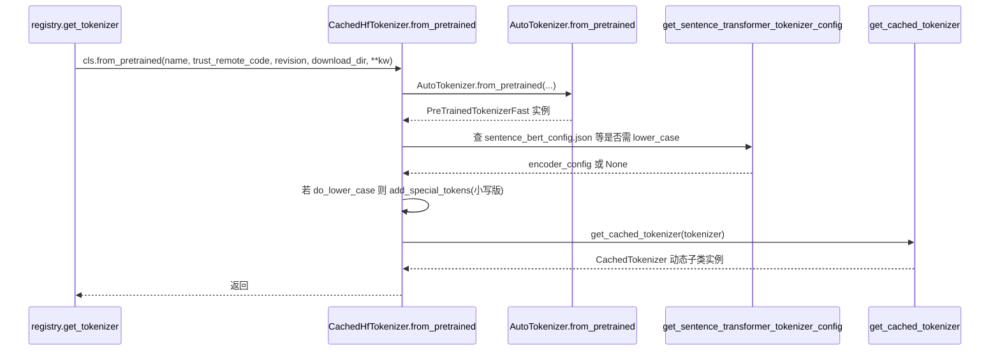

[← 分词与转换器](../README.md) > [分词器后端](README.md) > CachedHfTokenizer

# hf.py — HuggingFace 后端包装

## 是什么

`vllm/tokenizers/hf.py` 是默认 `hf` 模式后端，包含三件套：

1. **`CachedHfTokenizer(TokenizerLike)`**（`vllm/tokenizers/hf.py:163`）：注册表里 `hf` 模式对应的类。`from_pretrained` 调用 `AutoTokenizer.from_pretrained`，遇 `trust_remote_code` 缺失时给出友好错误；再按 sentence-transformer 的 `do_lower_case` 调整特殊 token 大小写；最后用 `get_cached_tokenizer` 包装。
2. **`get_cached_tokenizer(tokenizer) -> HfTokenizer`**（`vllm/tokenizers/hf.py:107`）：通过 `copy.copy` + 动态子类 `CachedTokenizer`，把 `all_special_ids` / `all_special_tokens` / `max_token_id` / `max_chars_per_token` / `get_vocab()` / `__len__` 缓存为常量/property，避免每次重复计算。同时实现 `__reduce__` 以便 pickle 还原时重新走该函数。
3. **`maybe_make_thread_pool(tokenizer, copies=1)`**（`vllm/tokenizers/hf.py:25`）：把 `PreTrainedTokenizerFast` 原地"升级"成线程安全的 `TokenizerPool*` 子类（动态生成），用 `queue.Queue` 池化深拷贝，公开方法（`__call__`/`encode`/`decode`/`batch_decode`/`apply_chat_template` 等）都通过 `_borrow_from_pool` 上下文借还。`ThreadSafeHFTokenizerMixin` 标记已是线程安全，避免重复包装。

`HfTokenizer: TypeAlias = PreTrainedTokenizer | PreTrainedTokenizerFast`（`:15`）。

## 为什么

- **属性缓存**：transformers 默认每次访问 `all_special_ids`/`get_vocab()` 都重算；vLLM 在生成循环中频繁查这些值（采样器、结构化输出），缓存能显著降低 CPU 开销。注释里直接说"transformers will recompute multiple tokenizer properties each time they are called, leading to a significant slowdown"（`:108`）。
- **线程安全池**：HF fast tokenizer 内部 Rust 对象非线程安全，而 vLLM API server 是 asyncio + ThreadPoolExecutor 并发；decoder-only 多请求同时 `apply_chat_template` 会触发数据竞争。池化深拷贝是社区常用 workaround。
- **可 pickle**：`__reduce__` 让 `TokenizerPool` 实例能跨进程（multiprocessing/ray）正确重建——通过 `maybe_make_thread_pool` 函数本身重建，cloudpickle 兼容。
- **do_lower_case 兼容**：sentence-transformers 的 BERT 类模型仓库把 `'[CLS]'` 大小写当作语义信息，vLLM 在加载时按 `encoder_config.do_lower_case` 反向调整 special_tokens_map。

## 怎么做

`CachedHfTokenizer.from_pretrained` 调用链：

`maybe_make_thread_pool` 在 Renderer 启动并发 tokenization 时按需调用（`renderer_num_workers` 控制池大小，`vllm/renderers/base.py:87`）。当池耗尽时 `_borrow_from_pool` 临时 `copy.deepcopy` 一个，保证不阻塞。

`get_cached_tokenizer` 处理 QwenTokenizer 的特殊情形：它的 `vocab_size` property 包含某些 `get_vocab()` 不返回的 special token，所以 `max_token_id = max(get_vocab values, vocab_size)`（`:120`）。

## 与其它模块/系统配合

- **`tokenizers/registry.py`**：`hf` 模式默认走 `CachedHfTokenizer`；`_MODEL_TYPES_WITH_INCORRECT_TOKENIZER_CLASS` 路径会绕过该类直接用 `TokenizersBackend`，但最后仍调 `get_cached_tokenizer` 包一层（`vllm/tokenizers/registry.py:233`）。
- **`transformers_utils/config.py`**：`get_sentence_transformer_tokenizer_config` 提供 `do_lower_case`/`max_seq_length`。
- **`renderers/hf.py`**：`HfRenderer(BaseRenderer[HfTokenizer])` 把 `HfTokenizer` 作为泛型参数；thread pool 包装让 renderer 的 `_tokenize_prompt_async` 与 `_process_multimodal_async` 可并发。
- **`vllm/utils/mistral.py`**：`is_mistral_tokenizer` 通过 `getattr(tokenizer, "IS_MISTRAL_TOKENIZER", False)` 判断（HF 类为 False），用于在 Mistral/HF 混用时切换分支。

## 历史版本演进

- **早期**：`get_cached_tokenizer` 已存在（性能必须），但无 `CachedHfTokenizer` 类——`get_tokenizer` 直接 `AutoTokenizer.from_pretrained` + `get_cached_tokenizer`。
- **v0.9/v0.10**：随着 Mistral/Kimi 等多后端注册表出现，把 `hf` 也封装为 `CachedHfTokenizer(TokenizerLike)`，签名与其它后端一致。
- **`maybe_make_thread_pool`（PR #36557 附近，main）**：为解决 renderers 并发 tokenization 的 race，引入线程池包装。注释 `see #36557` 指向该 issue。
- **main**：`ToolParserManager` 也通过 `maybe_make_thread_pool` 让 HF fast tokenizer 在 parser 阶段线程安全；`__reduce__` 修复跨进程 pickle（注释 issue #45433）。

---

[← 返回分词器后端首页](README.md)

## 参见

- [registry.md](registry.md) — `CachedHfTokenizer` 的加载入口。
- [fastokens.md](fastokens.md) — 在 HF fast tokenizer 之上再做 Rust 后端替换。
- [detokenizer-utils.md](detokenizer-utils.md) — 直接消费 `HfTokenizer` 的 `convert_tokens_to_string`。
