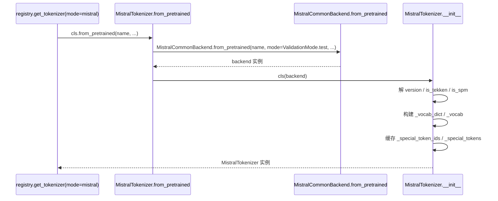

[← 分词与转换器](../README.md) > [分词器后端](README.md) > MistralTokenizer

# mistral.py — Mistral 官方分词器包装

## 是什么

`vllm/tokenizers/mistral.py` 定义 `MistralTokenizer(TokenizerLike)`（`vllm/tokenizers/mistral.py:191`），把 `mistral_common` 官方库与 transformers v5 的 `MistralCommonBackend` 桥接到 vLLM 的 `TokenizerLike`。

类标志：

- `IS_MISTRAL_TOKENIZER = True`（`:192`）：供 `vllm.utils.mistral.is_mistral_tokenizer` 识别。
- 持有三层引用：`transformers_tokenizer: MistralCommonBackend`（外层）、`mistral: MistralCommonTokenizer`（mistral_common 原始）、`instruct: InstructTokenizerBase`（指令编码器）、`tokenizer: Tokenizer`（最底层 Tekken/SentencePiece）。
- `version: int`：从 `tokenizer.version.value`（如 `"v15"`）解析出整数 15；v15+ 支持 `reasoning_effort`。
- `is_tekken` / `is_spm`：二选一，其它类型直接抛 `TypeError`。

辅助函数：`maybe_serialize_tool_calls`（`:62`，绕 pydantic #9467 的 tool_calls 迭代器 bug）、`truncate_tool_call_ids`（`:101`，Mistral 限制 id ≤ 9 字符）、`validate_request_params`（`:160`）、`_tekken_token_to_id`（`:174`，绕 tekken incomplete UTF-8 字节）。

## 为什么

- **忠实于官方协议**：Mistral 模型的 chat 编码（v3/v5/v7/v11/v13/v15）与 HF 模板 jinja 实现不完全等价；用 `mistral_common` 自家库能 100% 还原线上行为，尤其是 tool_calls、reasoning_effort、function 调用 schema。
- **Grammar 支持**：Tekken v11+ 支持 constrained decoding，`mistral_common.guidance.GrammarFactory` 把 tokenizer 转成 `llguidance.LLTokenizer`。vLLM 通过 `tokenizer.grammar_factory` / `tokenizer.llg_tokenizer` 把它接入结构化输出后端。
- **特殊 token 处理**：Tekken 的字节级 token 在不完整 UTF-8 时会变 `�`，需要 `id_to_byte_piece` 字节解码（`:530`）。SentencePiece 路径则需要特殊处理 `[TOOL_CALLS]` / `BEGIN_THINK` / `END_THINK` 不能被 decode（`:443`）。
- **validate/test 模式**：必须以 `ValidationMode.test` 创建，否则会做严格校验导致合法输入被拒（`:223`）。

## 怎么做

`from_pretrained` 流程（`:194`）：

关键方法：

- `apply_chat_template`（`:378`）：直接委托 `transformers_tokenizer.apply_chat_template`，但要先 `_validate_apply_chat_template_args`（add_generation_prompt 与 continue_final_message 互斥、检查最后一条消息角色）。v15+ 透传 `reasoning_effort`。
- `__call__`（`:321`）：调底层 backend 后再 hack 掉错误添加的 eos（`# TODO(juliendenize)` 待 transformers PR #41962 合入后移除）。
- `convert_ids_to_tokens(skip_special_tokens=True)`（`:496`）：保留 `[TOOL_CALLS]` / `BEGIN_THINK` / `END_THINK` 不被 skip（让 tool/reasoning parser 看见），其余 special token 按 tekken 字节回退方案处理。
- `supports_grammar` / `grammar_factory` / `llg_tokenizer`（`:538`/`:543`/`:554`）：grammar 接入点。

## 与其它模块/系统配合

- **`tokenizers/registry.py`**：`is_mistral_model_repo` + `tekken.json`/`tokenizer.model.v*` 自动检测切到 `mistral` 模式（`:138`）。
- **`renderers/mistral.py`**：`MistralRenderer(BaseRenderer[MistralTokenizer])` 调 `safe_apply_chat_template`（捕获 `MistralCommonException` 与 `AssertionError` 转 `ValueError`）。
- **`tool_parsers/mistral_tool_parser.py`**：`MistralToolParser` 通过 `is_mistral_tokenizer` 走 `[ARGS]`/`[TOOL_CALLS]` 分支，并使用 `MistralToolCall.generate_random_id`（9 字符 alphanumeric）。
- **`reasoning/mistral_reasoning_parser.py`**：依赖 `BEGIN_THINK`/`END_THINK` token id（来自 `InstructTokenizerV13`）。
- **结构化输出**：`tokenizer.grammar_factory` 供 xgrammar/llguidance 后端使用。

## 历史版本演进

- **v0.6（PR #7739）**：`MistralTokenizer` 诞生，目标是"improve robustness and chat encoding"（题目直接写明）。最初只支持 v3 tekken。
- **v0.6–v0.7（PR #8098, #8314）**：多模态 + 类型注解整理。
- **v0.9/v0.10**：`truncate_tool_call_ids` 加入（应对 9 字符限制）；v11+ grammar 接入；`maybe_serialize_tool_calls` 加入以绕 pydantic #9467（待 pydantic v2.11 移除）。
- **v0.11/main**：`reasoning_effort` 透传（v15+）；transformers v5 把 `MistralCommonBackend` 上游化，本文件改为包装 `transformers.tokenization_mistral_common.MistralCommonBackend`，并保留若干 `# TODO(juliendenize)` 等 PR #41962 合入后可移除的 hack。

---

[← 返回分词器后端首页](README.md)

## 参见

- [registry.md](registry.md) — 自动检测 `mistral` 模式的入口。
- [../tool_parsers/mistral.md](../tool_parsers/mistral.md) — 配套工具调用 parser。
- `../renderers/mistral.md` — 配套 renderer。
