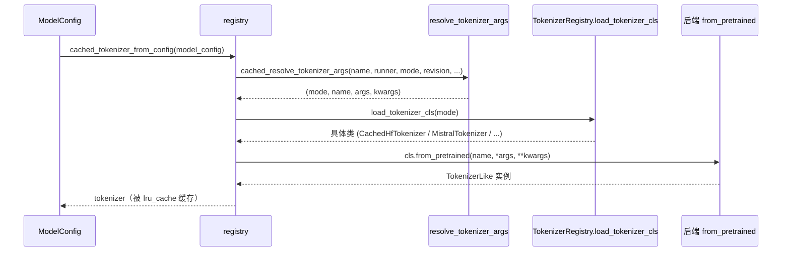

[← 分词与转换器](../README.md) > [分词器后端](README.md) > TokenizerRegistry

# registry.py — 分词器注册与缓存

## 是什么

`vllm/tokenizers/registry.py` 是 vLLM 分词器后端的总入口。它定义：

- `_TokenizerRegistry`（dataclass）：`tokenizer_mode -> (module, class_name)` 的注册表，提供 `register` / `load_tokenizer_cls` / `load_tokenizer`。
- 模块级单例 `TokenizerRegistry`，预注册 5 个内建模式（`vllm/tokenizers/registry.py:40`）：

  ```python
  _VLLM_TOKENIZERS = {
      "deepseek_v32": ("deepseek_v32", "DeepseekV32Tokenizer"),
      "deepseek_v4":  ("deepseek_v4",  "DeepseekV4Tokenizer"),
      "hf":           ("hf",           "CachedHfTokenizer"),
      "kimi_audio":   ("kimi_audio",   "KimiAudioTokenizer"),
      "mistral":      ("mistral",      "MistralTokenizer"),
  }
  ```

- `resolve_tokenizer_args(...)`（`vllm/tokenizers/registry.py:90`）：把 `tokenizer_mode` 归一化为具体后端，处理 ModelScope 下载、`truncation_side`（generate→left，pooling→right）、`slow` 模式与 Mistral 仓库自动检测。
- `get_tokenizer(...)`（`vllm/tokenizers/registry.py:176`）：实际加载器，处理 `VLLM_USE_FASTOKENS` patch、`_MODEL_TYPES_WITH_INCORRECT_TOKENIZER_CLASS`（hub 上 `tokenizer_class` 错标时强制走 `TokenizersBackend`）、`trust_remote_code` 错误提示。
- `cached_get_tokenizer = lru_cache(get_tokenizer)`（`:245`）与 `cached_tokenizer_from_config(model_config, **kwargs)`（`:248`）：进程级缓存入口，供 Renderer/ModelConfig 使用。

## 为什么

- **解耦加载路径**：上层（`ModelConfig`、`renderer_from_config`）只关心 `tokenizer_mode`，不在乎是 HF 还是 Mistral。注册表把"模式字符串"映射到"具体类的限定名"，并通过 `resolve_obj_by_qualname` 延迟导入，避免一次性导入全部后端。
- **复用与去重**：`lru_cache` 让同一 `(tokenizer_name, revision, mode, ...)` 在一个进程内只加载一次——这对多 worker/多 LoRA 场景尤其重要。
- **跨 Hub 适配**：ModelScope、`consolidated*.safetensors`（Mistral 私有格式）、错误 `tokenizer_class` 标注等"脏数据"集中在此处理，下游拿到的始终是干净对象。
- **truncation_side 默认**：generate runner 在左、pooling runner 在右，避免每个调用点重复写。

## 怎么做

加载一条 tokenizer 的完整路径：



关键分支：

1. **`slow` 模式**：等价 `mode="hf"` 且 `use_fast=False`（`vllm/tokenizers/registry.py:131`）。
2. **Mistral 自动检测**：`mode="auto"` 且仓库同时含 `consolidated*.safetensors` 与 `tekken.json`/`tokenizer.model.v*` 时切到 `mistral`（`:138`）。
3. **`auto` 兜底**：未命中 Mistral 时退回 `hf`（`:153`）。
4. **错误 `tokenizer_class`**：`step3_vl / step3p7 / unlimited-ocr` 的 hub 标注不可信，直接用 `transformers.tokenization_utils_tokenizers.TokenizersBackend` 加载并 `get_cached_tokenizer` 包一层（`:218`）。
5. **`VLLM_USE_FASTOKENS=1`**：每次 `get_tokenizer` 调用前先 `apply_fastokens_patch()`（幂等），把后续 HF fast tokenizer 的 Rust BPE 后端换成 fastokens shim（见 [fastokens.md](fastokens.md)）。

## 与其它模块/系统配合

- **`vllm/transformers_utils/config.py`**：`get_tokenizer` 在加载前先 `get_config(...)` 以便 `_maybe_register_hf_config` 把自定义 `PretrainedConfig` 注册到 `AutoConfig`，否则 `from_pretrained` 内部的 `AutoConfig.from_pretrained` 会失败（`vllm/tokenizers/registry.py:208`）。详见 [../transformers_utils/config.md](../transformers_utils/config.md)。
- **`vllm/transformers_utils/repo_utils.py`**：`is_mistral_model_repo` / `any_pattern_in_repo_files` 用于 Mistral 自动检测（带 `@cache` + 重试）。
- **`vllm/renderers/registry.py`**：`renderer_from_config` 先 `cached_tokenizer_from_config` 拿 tokenizer，再用同一 `tokenizer_args_from_config` 得到 `renderer_mode`，保证 tokenizer 与 renderer 后端一一对应（见 `../renderers/registry.md`）。
- **`vllm/model_executor/weight_utils.py`**：ModelScope 下载路径借 `get_lock` 防止多进程并发下载。
- **引擎核心 InputProcessor/Detokenizer**：见 `../01-engine-core/input-processor.md`，detokenizer 侧用 `tokenizer.convert_tokens_to_string` 等方法。

## 历史版本演进

- **早期（v0.5 之前）**：仅有 `get_tokenizer` 直调 `AutoTokenizer.from_pretrained`，无注册表概念。
- **v0.6（PR #7739）**：引入 `MistralTokenizer` 包装 `mistral_common`，注册表首次出现 `mistral` 模式 Mistral 自动检测逻辑随之加入。
- **v0.8/v0.9（PR #36127）**：`kimi_audio` 模式加入（TikToken）。
- **v0.10（PR #29837）**：`deepseek_v32` 模式 + DSML 编码加入，与 DeepSeek-V3.2 chat 模板同步。
- **v0.11（PR #43168）**：`VLLM_USE_FASTOKENS` 接入，`apply_fastokens_patch` 成为 `get_tokenizer` 的前置步骤。
- **v0.12/main（PR #45877 等）**：`deepseek_v4` 模式加入，配合 reasoning_effort 与 quick instruction task。
- **_MODEL_TYPES_WITH_INCORRECT_TOKENIZER_CLASS**：随 step3/step3p7/unlimited-ocr 模型上线逐项添加，注释明确这是"临时 workaround，长期方案是修 hub 或 transformers"（`vllm/tokenizers/registry.py:29`）。

---

[← 返回分词器后端首页](README.md)

## 参见

- [hf.md](hf.md) — 默认 `hf` 后端 `CachedHfTokenizer` 与线程安全包装。
- [protocol.md](protocol.md) — 所有后端必须实现的 `TokenizerLike` Protocol。
- [mistral.md](mistral.md) / [deepseek-v32.md](deepseek-v32.md) / [deepseek-v4.md](deepseek-v4.md) / [kimi-audio.md](kimi-audio.md) — 各专属后端。
- [../transformers_utils/config.md](../transformers_utils/config.md) — `_maybe_register_hf_config` 的另一端。
