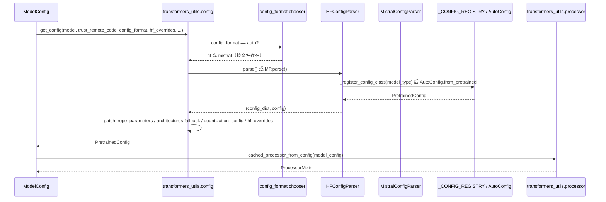

[← 分词与转换器](../README.md) > 转换器工具

# transformers_utils (vllm/transformers_utils/)

## 是什么

本目录是 vLLM 与 HuggingFace transformers / Mistral / ModelScope / S3+GCS+Azure 等模型托管生态之间的"胶水层"。它把"加载模型仓库字节、解析为 `PretrainedConfig` 与 `ProcessorMixin`"这件事集中处理，让 vLLM 自身只关心推理。

实际存在的文件：

| 文件 | 角色 | 详文 |
|---|---|---|
| `__init__.py` | ModelScope hub patch 入口 | — |
| `config.py` | 配置加载（HF/Mistral）、`_CONFIG_REGISTRY`、RoPE 修补、Pooler/Sentence-Transformer 配置 | [config.md](config.md) |
| `config_parser_base.py` | `ConfigParserBase` ABC | [config.md](config.md) |
| `processor.py` | `AutoProcessor`/`AutoImageProcessor`/`AutoFeatureExtractor`/`AutoVideoProcessor` 包装与缓存 | [processor.md](processor.md) |
| `repo_utils.py` | HF Hub API 包装（vLLM tag）、`list_repo_files`（cache+retry）、`get_hf_file_to_dict`、Mistral 仓库检测 | `utils.md` |
| `utils.py` | S3/GCS/Azure 判定、ModelScope 列文件、`maybe_model_redirect`、`parse_safetensors_file_metadata` | `../utils.md` |
| `dynamic_module.py` | `try_get_class_from_dynamic_module`（trust_remote_code 助手） | `../utils.md` |
| `s3_utils.py` / `runai_utils.py` | 对象存储 / Run:AI 流式下载 | `../utils.md` |
| `model_arch_config_convertor.py` | HF `PretrainedConfig` ↔ vLLM `ModelArchitectureConfig` 转换器 | (待补充) |
| `chat_templates/` | 模型 fallback chat 模板 + jinja 文件 | [config.md](config.md) 一节 |
| `configs/` | 约 80 个自定义 `PretrainedConfig` 子类 | [config.md](config.md) 一节 |
| `processors/` | 约 35 个自定义 `ProcessorMixin` 子类 | [processor.md](processor.md) 一节 |

用户清单提到但**本仓库不存在**的文件（按"实际存在增删"原则省略，单页不创建）：

- `weights.md` / `weights_utils.md` — vLLM 没有 `weights.py`/`weights_utils.py`；HF weight 工具粘合实际在 [`03-model-execution/model-loader/`](../../03-model-execution/model-loader/README.md) 的 `weight_utils.py`。
- `tokenizer-group.md` — 没有 `tokenizer_group.py`；分布式 tokenizer pool 在 `vllm/tokenizers/hf.py` 的 `maybe_make_thread_pool` 中（见 [../tokenizers/hf.md](../tokenizers/hf.md)）。
- `detokenizer.md`（本目录版）— `detokenizer_utils.py` 实际位于 `vllm/tokenizers/`，见 [../tokenizers/detokenizer-utils.md](../tokenizers/detokenizer-utils.md)。

## 为什么

- vLLM 期望不重写配置/processor 而复用 transformers 生态，但大量模型（DeepSeek、Kimi、Step3、Qwen3-next/3.5/3.5-moe、Hunyuan、Granite4、Speculators、Nemotron、Olmo-hybrid 等）尚未上游化，需要 vLLM 自带 `PretrainedConfig` 子类并注册到 `AutoConfig`。
- Mistral 自有 `params.json` 配置格式与 HF `config.json` 完全不同，需要专门 parser。
- `trust_remote_code`、Hub 离线、ModelScope、对象存储等是部署刚需。
- chat 模板缺失或损坏的模型需要 fallback jinja 文件兜底。

## 怎么做

加载一条 config/processor 的主线：

## 与其它模块/系统配合

- **`vllm/tokenizers/registry.py`**：`cached_tokenizer_from_config` 调 `_maybe_register_hf_config` + `get_config`，确保 tokenizer 加载时 `AutoConfig` 已注册好。
- **`vllm/model_executor/model_loader/weight_utils.py`**：通过 `get_safetensors_params_metadata` / `try_get_safetensors_metadata` 拿权重元信息。
- **`vllm/model_executor/model_loader/`**：用 `try_get_class_from_dynamic_module` 加载远程代码模型实现。
- **`vllm/config/model.py`**：`ModelConfig` 持有 `hf_config`、`encoder_config`、`hf_overrides` 等；调 `get_pooling_config`/`get_sentence_transformer_tokenizer_config` 决定 pooling 模式。
- **`vllm/multimodal/`**：多模态 processor 三件套（image/video/audio）由 `processor.py` 加载，再交给 `BaseMultiModalProcessor`。
- **`vllm/renderers/base.py`**：`mm_registry.processor_cache_from_config` 与 `cached_processor_from_config` 协同。

## 历史版本演进

- **早期**：本目录只有 `config.py`（基础 `get_config`）与 `utils.py`。
- **v0.6（PR #7739）**：Mistral 配置 parser 加入，`config_format` 概念出现。
- **v0.7–v0.9**：`configs/` 大量自定义配置加入（DeepSeek-VL2、Step3、Kimi、Ultravox 等）。
- **v0.9/v0.10**：`processors/` 子目录成型（每个定制多模态 processor 一个文件）。
- **v0.11/main**：强制 transformers ≥ 5.0.0；`speculators/` 配置族加入（`SpeculatorsConfig`、`EAGLEConfig`、`MedusaConfig`、`MLPSpeculatorConfig`）；`chat_templates/` 整理为带 registry 的子包。

---

[← 返回子系统首页](../README.md)

## 参见

- [config.md](config.md) / [processor.md](processor.md)
- `../utils.md` — 顶层 helper 速查。
- [../tokenizers/hf.md](../tokenizers/hf.md) — 共享 `get_sentence_transformer_tokenizer_config`。
