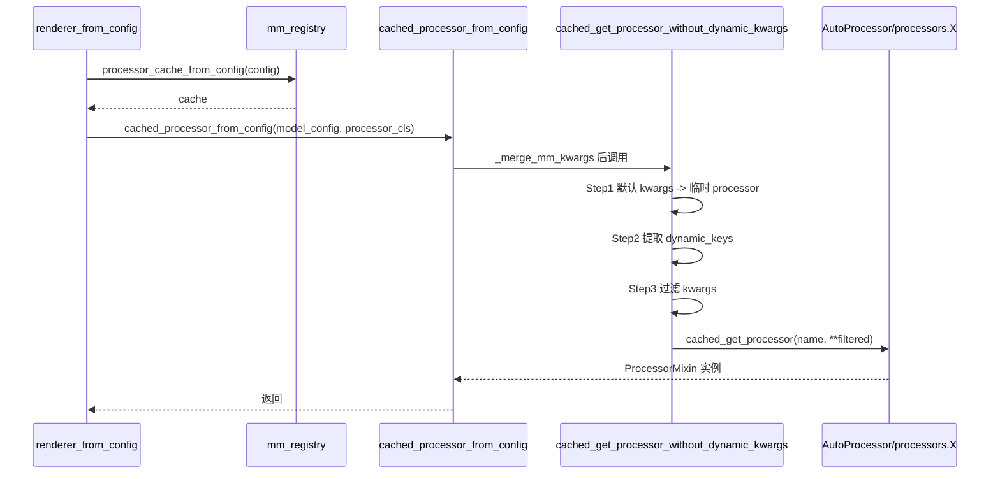

[← 分词与转换器](../README.md) > [转换器工具](README.md) > processor.py

# processor.py — HF Processor 加载与缓存

## 是什么

`vllm/transformers_utils/processor.py`（584 行）是 vLLM 加载多模态 preprocessor 的统一入口，包装 transformers 的四件套：

- `AutoProcessor`（统一入口，多模态模型主用）
- `AutoImageProcessor`
- `AutoFeatureExtractor`（音频特征）
- `AutoVideoProcessor`

公开 API（`vllm/transformers_utils/processor.py`）：

| 函数 | 行号 | 作用 |
|---|---|---|
| `get_processor(name, *, revision, trust_remote_code, processor_cls=ProcessorMixin, **kwargs)` | `:199` | 主入口：先查 `processor_config.json`/`preprocessor_config.json`/`tokenizer_config.json` 里的 `processor_class` 字段，命中 `processors/` 注册的类则用之，否则 `AutoProcessor.from_pretrained`；信任远程代码友好错误 |
| `cached_get_processor = lru_cache(get_processor)` | `:269` | 进程级缓存 |
| `cached_get_processor_without_dynamic_kwargs(name, ...)` | `:338` | 两步法：先默认 kwargs 拿临时 processor，提取 dynamic kwargs 集合后再用过滤后的 kwargs 拉 final processor（lru_cache 友好） |
| `cached_processor_from_config(model_config, processor_cls=..., **kwargs)` | `:374` | Renderer 入口；先 `_merge_mm_kwargs` 把 `MultimodalConfig` 的 mm_processor_kwargs 并入 |
| `get_feature_extractor(name, ...)` | `:388` | 音频特征 |
| `get_image_processor(name, ...)` | (后续) | 图像 |
| `get_video_processor(name, ..., video_processor_cls, **kwargs)` | (后续) | 视频 |
| `get_processor_cls_name_from_config(name, revision)` | `:145` | 读 `processor_class` 字段 |
| `get_video_processor_cls_name_from_config / get_video_processor_cls_name(model_config)` | `:161`/`:191` | 视频 processor 类名解析，含 transformers v5 `VIDEO_PROCESSOR_MAPPING_NAMES` 回退 |
| `get_processor_kwargs_type(processor)` / `get_processor_kwargs_keys(kwargs_cls)` | `:272`/`:304` | 通过 inspect `__call__` 签名与 `*ProcessorKwargs` 注解，提取动态可识别的 modality kwargs 名集合（`text_kwargs`/`images_kwargs`/`videos_kwargs`/`audio_kwargs` 与其内部字段名） |

辅助类：`HashableDict` / `HashableList`（`:88`/`:99`，让 dict/list 可作为 `lru_cache` 键）；`_merge_mm_kwargs(model_config, processor_cls, /, **kwargs)`（`:117`，把 `mm_config.merge_mm_processor_kwargs(kwargs)` 并入并用 `get_allowed_kwarg_only_overrides` 仅保留 factory 接受的 kw）。

### `processors/` 子包

`vllm.transformers_utils.processors` 注册了约 35 个自定义 `ProcessorMixin`，对应未上游化或需要 vLLM 专属逻辑的多模态模型：`funasr`、`h2ovl`、`qwen3_asr`、`unlimited_ocr`、`nano_nemotron_vl`、`hunyuan_vl_image`、`fireredasr2`、`granite4_vision`、`nemotron_vl`、`glm4v`、`isaac`、`minicpmv`/`minicpmo`、`kimi_audio`、`mimo_v2_omni`、`fireredlid`、`bagel`、`voxtral`、`nvlm_d`、`internvl`、`cheers`、`minimax_m3`、`ovis2_5`/`ovis`、`deepseek_vl2`/`deepseek_ocr`、`moondream3`、`kimi_k25_vision_fused`/`kimi_k25`、`pixtral`、`step3_vl`/`step3p5`、`hunyuan_vl`、`cohere_asr`、`openvla`。

`get_processor` 的 lookup 流程：`get_processor_cls_name_from_config` 读 `processor_class` 字段 → `getattr(processors, registered_cls_name, None)`，命中即用 vLLM 自家类，否则 `AutoProcessor`。

### 兼容性 patch

- `_transformers_v4_compatibility_import()`（`:39`）：把 transformers v5 的 `ProcessorChatTemplateKwargs` 别名为 `ChatTemplateLoadKwargs`，给仍用 v4 名字的远程 processor（`HCXVisionForCausalLM`）兜底。
- `_transformers_v4_compatibility_init()`（`:53`）：monkey-patch `ProcessorMixin.__init__` 拦截 `optional_attributes` 旧用法（`Molmo2ForConditionalGeneration` 等），可在上游化后移除。

## 为什么

- vLLM 需要支持约 35 个未上游化或行为特异的多模态 processor，但又不想分叉 transformers；通过查 `processor_class` 字段把 vLLM 子类"插队"到加载路径。
- `lru_cache` 不支持 unhashable dict/list，但 mm_processor_kwargs 经常含嵌套；用 `HashableDict`/`HashableList` 包装后才能缓存。
- `_merge_mm_kwargs` + `get_allowed_kwarg_only_overrides`：避免把无关 kwargs 传给 processor 引发 TypeError，同时保持用户 `mm_processor_kwargs` 覆盖默认的能力。
- `cached_get_processor_without_dynamic_kwargs`：很多 processor `__call__` 的 `**kwargs` 接受任意 modality kwargs（如 `images_kwargs={"size": 224}`）；直接 lru_cache 会因为参数集合变化而 miss，因此先探查签名再过滤。
- v4/v5 兼容：远程 processor 写于 v4 时代，运行在 v5 环境下会炸，patch 让旧代码继续工作。

## 怎么做

Renderer 启动期：

运行期由 `BaseMultiModalProcessor.apply` 调底层 processor；Renderer 把 `mm_processor.cache` 传过去做去重（见 `vllm/renderers/base.py:128`）。

## 与其它模块/系统配合

- **`vllm/multimodal/`**：`mm_registry.processor_cache_from_config` 与 `mm_registry.create_processor` 把这里加载的 `ProcessorMixin` 与 vLLM 的 `BaseMultiModalProcessor` 包装组合；详见 [`../../11-multimodal/processing.md`](../../11-multimodal/processing.md)。
- **`vllm/renderers/base.py`**：`BaseRenderer.__init__` 创建 `mm_processor` 与 `_readonly_mm_processor`（后者用于 tokenize-only 端点，不污染主 cache，`:140`）。
- **`vllm/transformers_utils/repo_utils.get_hf_file_to_dict`**：被 `get_processor_cls_name_from_config` 用来读 `processor_config.json`。
- **`vllm/transformers_utils/utils.convert_model_repo_to_path`**：ModelScope 路径转换。
- **远程代码**：trust_remote_code 友好错误信息与 `get_processor` 一致。

## 历史版本演进

- **早期**：vLLM 只调 `AutoProcessor.from_pretrained`，无注册表。
- **v0.7–v0.9**：随着 MiniCPM-V、InternVL、Pixtral 等加入，`processors/` 子目录成型；custom processor 通过 `processor_class` 字段注入。
- **v0.10/main**：`cached_get_processor_without_dynamic_kwargs` 引入以解决 mm_processor_kwargs 与 lru_cache 的冲突；v4/v5 兼容 patch 加入。
- **main**：`VIDEO_PROCESSOR_MAPPING_NAMES` fallback 加入；`hashable` 包装策略稳定。

---

[← 返回转换器工具首页](README.md)

## 参见

- [config.md](config.md) — 配置加载是 processor 加载的前置步骤。
- `../utils.md` — `repo_utils` / `utils` 提供底层下载。
- [../../11-multimodal/processing.md](../../11-multimodal/processing.md) — `BaseMultiModalProcessor` 如何使用加载好的 processor。
