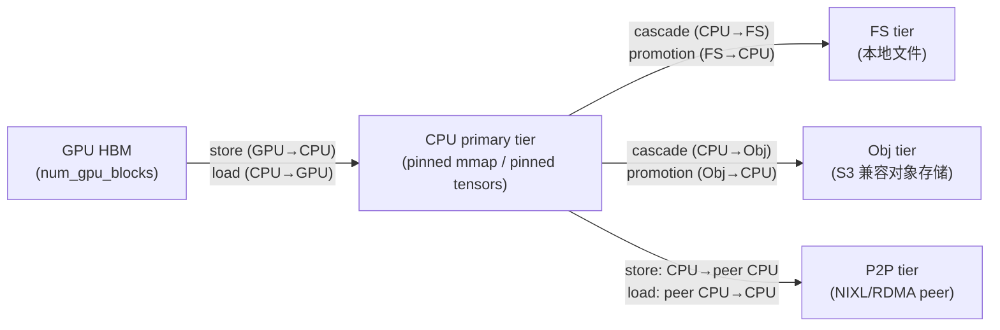
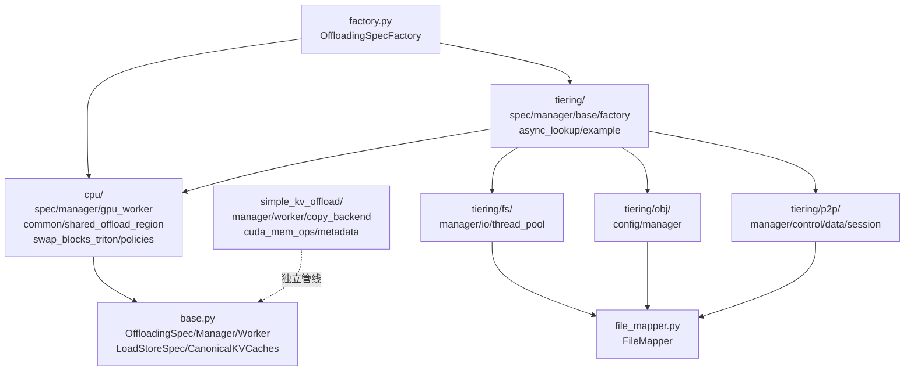

# KV 缓存卸载子系统

[← Wiki 首页](../README.md) > KV 卸载

源码根目录：`vllm/v1/kv_offload/`、`vllm/v1/simple_kv_offload/`。本子系统负责把 GPU 上计算的 KV cache 块**卸载（offload）**到更慢但更大的存储介质（CPU RAM、本地文件、对象存储、远端 peer），并在后续请求命中相同前缀时**回填（promotion/load）**到 GPU，从而：(1) 扩大有效前缀缓存半径、跨请求/跨实例共享 KV；(2) 释放 GPU 显存以承载更多并发请求；(3) 让 sleep mode、weight update 等场景能腾空 GPU 显存而不丢失已计算的 KV。

> 注意：本子系统与 [`10-config/offload-config.md`](../10-config/offload-config.md)（**权重** CPU 卸载 / UVA / prefetch）正交——后者卸载模型权重，前者卸载 KV cache 块。两者可同时启用。

---

## 是什么

KV 卸载子系统由两条并存的代码路径组成：

| 路径 | 源码 | 集成方式 | 状态 |
|---|---|---|---|
| **新管线 `vllm/v1/kv_offload/`** | `base.py` + `cpu/` + `tiering/` + `factory.py` + `file_mapper.py` | 经 `OffloadingSpec` → `OffloadingConnectorScheduler/Worker`（[07-distributed/offloading](../07-distributed/kv-transfer/offloading.md)）注入引擎 | 主线，支持 CPU + 多层 tiering (FS/Obj/P2P) |
| **旧管线 `vllm/v1/simple_kv_offload/`** | `manager.py` + `worker.py` + `copy_backend.py` + `cuda_mem_ops.py` + `metadata.py` | 经 `SimpleCPUOffloadConnector`（`vllm/distributed/kv_transfer/kv_connector/v1/simple_cpu_offload_connector.py`）注入 | 仅 CPU 卸载，支持 HMA（Hybrid Multi-step Attention）、eager / lazy 两种模式 |

两条管线的目标都是把 GPU KV 块搬到 CPU pinned 内存，但在抽象层级、配置入口、可扩展性上差异显著（详见 [simple-kv-offload.md](simple-kv-offload.md) 的对比章节）。

### 多层 tiering 拓扑

新管线以 **CPU 主层（primary tier）** 为枢纽，向下挂接任意数量的 **二级层（secondary tier）**。二级层不可直接访问 GPU，必须经 CPU 中转：

- **Store 路径**：GPU→CPU（primary）成功后 `complete_store()` 把同一批块级联（cascade）到所有 secondary tier；FS/Obj 用后台线程/NIXL 异步落盘，P2P 则等远端 peer 来 fetch。
- **Load 路径**：scheduler 先查 primary，命中即返回 `HIT`；miss 时遍历 secondary tier，命中则发起 promotion（secondary→CPU→GPU），并将 lookup 结果置为 `RETRY`，等下一步查到 CPU 后再返回 `HIT`。

### 与 #07 分布式 KV connector 的边界

KV 卸载子系统**只关心单实例内的分层存储抽象**——它定义 `OffloadingSpec/Manager/Worker`、`SecondaryTierManager`，并实际搬运字节。把它接入引擎（scheduler 与 worker 的钩子、`KVConnectorMetadata`、scheduler step 驱动 `has_pending_work`/`on_schedule_end`）的工作属于 [07-distributed/kv-transfer/offloading](../07-distributed/kv-transfer/offloading.md)——那里有 `OffloadingConnectorScheduler`、`OffloadingConnectorWorker` 及与引擎核心的对接逻辑。本子系统以"被调用方"身份出现：

- `vllm/distributed/kv_transfer/kv_connector/v1/offloading/scheduler.py` 直接 new 出 `OffloadingSpecFactory.create_spec(...)` 得到的 `OffloadingManager`，并调用其 `lookup/prepare_load/prepare_store/...`。
- 本子系统不感知 `KVConnectorMetadata`、`SchedulerOutput`、`KVCacheEvent` 等引擎层概念；事件出口仅通过 `take_events()` 吐 `OffloadingEvent`。

例外：P2P tier 需要 `kv_transfer_params` 里的 `prefill`/`decode` 子字典（含 `kv_request_id`、`remote_host`、`remote_port`）——这是 prefiller↔decoder disagg 场景由 [07-distributed/kv-transfer](../07-distributed/kv-transfer/README.md) 上层透传下来的，本子系统只读取不解释其语义。

---

## 为什么

- **跨请求/跨实例复用 KV**：同一 model+prompt 在多实例间共享可避免重复 prefill。FS/Obj tier 提供跨实例持久化（依赖 `PYTHONHASHSEED` 固定以保证 hash 一致），P2P tier 提供跨实例实时迁移。
- **冷热分层降本**：GPU HBM 最贵、CPU RAM 次之、本地盘/S3 最便宜。把"温"块留在 CPU、"冷"块下沉到 FS/Obj，可在不掉命中的前提下用更小 GPU 显存承载更大工作集。
- **Prefiller↔Decoder disaggregation**：P2P tier 让 prefiller 把 freshly-computed KV 推到 decoder，使 decoder 不必重算 prefill。
- **配合 sleep mode**：sleep 释放 GPU 显存时，KV 卸载子系统先把 KV 移到 CPU/二级层，醒来后由 promotion 路径按需取回；`reset_cache()` 与 `drain_jobs()` 保证不与正在飞的传输抢内存。
- **可插拔策略**：LRU/ARC、`store_threshold`、`offload_prompt_only`、`block_size`（offloaded 块可大于 GPU 块）等开关让长短对话、reasoning 模型等不同 workload 都能调参。

---

## 怎么做

### 入口与配置

KV 卸载通过 [10-config/kv-transfer-config](../10-config/kv-transfer-config.md) 的 `kv_connector_extra_config` 启用。常见键（在 `OffloadingSpec.__init__` 与各 tier 构造函数里被读取）：

| 键 | 适用 | 含义 |
|---|---|---|
| `spec_name` | 顶层 | `"CPUOffloadingSpec"`（默认）/`"TieringOffloadingSpec"`，由 `OffloadingSpecFactory` 解析（[factory.md](factory.md)） |
| `spec_module_path` | 顶层 | 自定义 spec 模块路径；当 `spec_name` 未注册时使用 |
| `cpu_bytes_to_use` | CPU | CPU 主层字节数（必填） |
| `block_size` | 顶层 | offloaded 块大小，须整除 GPU 块；启用"offloaded 块 > GPU 块"特性 |
| `eviction_policy` | CPU | `"lru"`（默认）/`"arc"` |
| `store_threshold` | CPU | block 在 `lookup()` 出现 N 次后才允许 offload，过滤一次性块；Tiering 模式禁用 |
| `offload_prompt_only` | 顶层 | 仅 offload prefill 块，跳过 decode 块（reasoning 模型场景） |
| `secondary_tiers` | Tiering | 二级层列表，每项 `{"type": "fs"/"obj"/"p2p"/"example", ...}` |

### 调用顺序（store 侧，新管线）

1. `OffloadingConnectorScheduler.build_connector_meta()` 在每个 step 收集新计算的块 key。
2. 调 `manager.prepare_store(keys)` → primary tier 分配 CPU 槽、可能触发 eviction、返回 `PrepareStoreOutput{keys_to_store, store_spec, evicted_keys}`。
3. worker 通过 `OffloadingWorker.submit_store(job_id, GPULoadStoreSpec, CPULoadStoreSpec)` 异步 CUDA stream 拷贝 GPU→CPU pinned。
4. worker 完成后 scheduler 调 `manager.complete_store(keys, success)`；若为 tiering manager，则进一步 cascade 到每个 secondary tier（`submit_store(job_metadata)`）。
5. secondary tier 后台完成 → `get_finished_jobs()` → primary tier `complete_read()` 释放 ref_cnt。

### 调用顺序（load 侧）

1. 新请求到达：scheduler 对每个待 prefill 的块调 `manager.lookup(key, req_context)`。
2. CPU 命中→`HIT`；DR AM in-flight→`HIT_PENDING`；miss 时遍历 secondary tier：
   - 命中 secondary → 调 `primary.prepare_write()` 在 CPU 预留槽（ref_cnt=-1，本步内不再重复 promotion），把 `submit_load` 延迟到 `on_schedule_end()` 批量提交 → 返回 `RETRY`。
   - secondary 自身未就绪 → `RETRY`；都不命中 → `MISS`。
3. `RETRY` 让 engine 继续走 step；下一个 step `_maybe_process_finished_jobs()` 把完成的 promotion 落到 CPU，`lookup()` 返回 `HIT`。
4. `manager.prepare_load()` 给 primary 块加 ref_cnt，worker 用 `submit_load` 把 CPU→GPU 拷回。

### 模块清单

各文件页索引：

| 文件 | 页面 | 摘要 |
|---|---|---|
| `base.py` | [base.md](base.md) | 顶层抽象：`OffloadKey`/`LoadStoreSpec`/`OffloadingManager`/`OffloadingWorker`/`OffloadingSpec`/`CanonicalKVCaches` |
| `factory.py` | [factory.md](factory.md) | `OffloadingSpecFactory` 注册表 + 默认注册 `CPUOffloadingSpec`/`TieringOffloadingSpec` |
| `file_mapper.py` | [file-mapper.md](file-mapper.md) | `OffloadKey → 文件/对象路径`；跨实例共享目录布局 |
| `cpu/` | [cpu.md](cpu.md) | CPU 主层：spec/manager/gpu_worker/shared_offload_region/swap_blocks_triton + policies/{lru,arc} |
| `tiering/` | [tiering.md](tiering.md) | Tiering orchestrator：spec/manager/base/factory/async_lookup/example |
| `tiering/fs/` | [tiering-fs.md](tiering-fs.md) | 本地文件系统二级层（O_DIRECT + DualQueueThreadPool） |
| `tiering/obj/` | [tiering-obj.md](tiering-obj.md) | S3 兼容对象存储二级层（NIXL OBJ backend） |
| `tiering/p2p/` | [tiering-p2p.md](tiering-p2p.md) | P2P RDMA 二级层（ZMQ control + NIXL data + 双向 session） |
| `simple_kv_offload/` | [simple-kv-offload.md](simple-kv-offload.md) | 旧管线：SimpleCPUOffloadConnector 的 manager/worker/copy_backend/cuda_mem_ops/metadata |
| `device_allocator/sleep_mode_backend.py` | [sleep-mode.md](sleep-mode.md) | sleep mode 与 KV 卸载/`reset_cache` 协作 |

---

## 与其它模块/系统配合

- [引擎核心-KV管理](../01-engine-core/kv-cache-management/README.md)：`KVCacheManager`/`BlockPool` 管理 GPU 块 ID；卸载子系统通过 `GPULoadStoreSpec.block_ids` 引用 GPU 块、通过 hash-based `OffloadKey` 引用 offloaded 块。
- [分布式-KV transfer/offloading](../07-distributed/kv-transfer/offloading.md)：本子系统的直接调用方，负责 hookup 到 scheduler/worker。
- [分布式-KV transfer](../07-distributed/kv-transfer/README.md)：P2P tier 与 `kv_transfer_params` 的 `prefill`/`decode` 字段、`kv_request_id` 由该层定义并透传。
- [配置-kv-transfer-config](../10-config/kv-transfer-config.md)：`kv_connector_extra_config` 是本子系统的全部配置入口。
- [配置-offload](../10-config/offload-config.md)：权重卸载，正交概念。
- [执行层-kv_connector mixin](../02-execution/worker/kv-connector-mixin.md)：worker 侧 connector 接口；`OffloadingWorker` 在该 mixin 内被持有与调用。
- [平台-device_allocator](../08-platforms/device-allocator.md)（待补充）：`SleepModeBackend` 与 `CuMemAllocator`/`XpuMemAllocator`；与 `reset_cache()` 协作见 [sleep-mode.md](sleep-mode.md)。

---

## 历史版本演进

| 版本 | 里程碑 |
|---|---|
| v0.5–v0.6 | v0 时代 CPU swap 路径（旧 `vllm/worker/worker.py` 内的 `swap_in/out`）；v1 重写开始引入 `simple_kv_offload/`（原 `vllm/v1/offloading/` 路径）作为 SimpleCPUOffloadConnector 后端 |
| v0.7–v0.8 | `simple_kv_offload/manager.py` 收敛 HMA 支持、`lazy_offload` 模式、`KVCacheCoordinator` 复用；引入 `KVCacheEvent` 作为缓存的统一事件出口 |
| v0.9 | **新管线 `vllm/v1/kv_offload/` 落地**：`OffloadingSpec/Manager/Worker` 三层抽象、`CPUOffloadingSpec`、`OffloadingSpecFactory`，重新设计 lookup→prepare→complete 的交互语义。旧 `simple_kv_offload` 保留以承担 HMA/eager 场景 |
| v0.10 | `kv_offload/tiering/` 框架落地：`SecondaryTierManager`/`SecondaryTierFactory`/`TieringOffloadingManager`，引入 cascade + staged promotion + RETRY 机制；首个非 CPU 二级层 `tiering/fs/`（DualQueueThreadPool + 原子 `os.replace`） |
| v0.11 | **P2P tier（`tiering/p2p/`）落地**：ZMQ control plane + NIXL/UCX data plane + 双向 `P2PSession`；服务于 prefiller↔decoder disaggregation；引入 `kv_request_id` 绑定与 `_unbound_stores` 重试 |
| main | 引入 `tiering/obj/`（S3-compatible via NIXL OBJ backend）；`ARC` eviction policy 进入 `cpu/policies/`；`SharedOffloadRegion`（`/dev/shm` mmap + `cudaHostRegister` + `MADV_POPULATE_WRITE`）替代 per-worker pinned tensor；`swap_blocks_triton` 在 CPU→GPU 小块路径上击败 cuMemcpyBatchAsync；MNNVL 相关 NIXL backend（Mooncake/LIBFABRIC）支持经 `backends` 列表配置（待核实具体版本） |

---

[← 返回 KV 卸载首页](README.md)

## 参见

- [base.md](base.md)：核心抽象与 `OffloadKey`、`CanonicalKVCaches` 编码。
- [tiering.md](tiering.md)：多层 orchestrator 与 cascade/promotion 状态机。
- [07-distributed/kv-transfer/offloading](../07-distributed/kv-transfer/offloading.md)：本子系统的引擎侧调度与 worker 钩子。
- [10-config/kv-transfer-config](../10-config/kv-transfer-config.md)：配置 schema。
