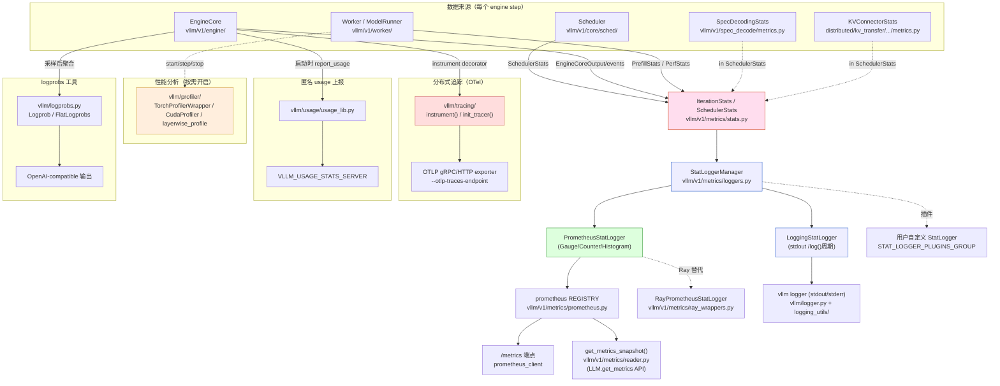

# 16 · 可观测性子系统

[← Wiki 首页](../README.md)

本子系统汇总 vLLM 运行时可观测性的四块能力：**metrics（指标）** / **profiler（性能分析）** / **tracing（分布式追踪）** / **logging（日志与格式化）**，外加 usage 上报与 logprobs/logits 工具。可观测性的目标是让用户在不开启动用沉重外部 profiler 的前提下，持续获得吞吐、延迟、KV 缓存、投机解码接受率、GPU 利用率等关键信号；在排障场景下又能切换到 torch profiler / NVTX / OTel traces 获得细粒度归因。

代码分布：

| 子块 | 路径 | 备注 |
|---|---|---|
| metrics | `vllm/v1/metrics/` | v1 指标核心（stats/loggers/perf/prometheus/reader/ray_wrappers/utils） |
| profiler | `vllm/profiler/` | torch / cuda profiler 包装 + layerwise profile |
| tracing | `vllm/tracing/` | OpenTelemetry 集成 |
| logging | `vllm/logging_utils/` + `vllm/logger.py` | Formatter / Filter / 懒求值 / dump / logtime |
| usage | `vllm/usage/usage_lib.py` | 匿名用法统计上报 |
| logprobs | `vllm/logprobs.py` | logprob 容器与计算工具（API 输出面） |
| logits_process | `vllm/logits_process.py` | v0 残留 logits processor（v1 已迁出主路径） |

> v1 spec decode 自身的 metrics 文件位于 `vllm/v1/spec_decode/metrics.py`，归属 [06-sampling-decoding/speculative-decoding/metrics.md](../06-sampling-decoding/speculative-decoding/metrics.md)，本子系仅引用不重复。

## 设计要点速览

- **stats → logger → 出口 三段式**：调度器/EngineCore 每步把原始计数（`SchedulerStats` / `IterationStats`）写入 `StatLoggerManager`，后者扇出到 `LoggingStatLogger`（stdout）和 `PrometheusStatLogger`（Prom registry）；二者共享同一份 stats 输入避免口径分裂（见 [v1/metrics/loggers.md](v1/metrics/loggers.md)）。
- **PerEngine / Aggregate 双形态**：DP 多 engine 场景下，Local Logger 可逐 engine 打日志、或聚合为 "N Engines Aggregated"；Prometheus 必须单一 logger + 多 label（`model_name`/`engine`），通过 `create_metric_per_engine` 工具统一构造。
- **插件化 stat logger**：`STAT_LOGGER_PLUGINS_GROUP` 让用户注入自定义 logger（同时可实现 `PrometheusStatLogger` 子类替换 Prometheus 后端，如 `RayPrometheusStatLogger` 走 `ray.util.metrics`）。
- **profiler 三态**：`TorchProfilerWrapper`（CPU/CUDA/XPU trace + tensorboard handler）/ `CudaProfilerWrapper`（`torch.cuda.nvtx.range` 标记）/ `layerwise_profile`（按 nn.Module 树聚合 CUDA 时间）。均实现 `WorkerProfiler` 抽象的 `start/step/stop/shutdown`。
- **OTel 单后端注册表**：`vllm/tracing/__init__.py` 维护 `_REGISTERED_TRACING_BACKENDS`，当前仅 `"otel"`；`instrument()` 装饰器在 OTel 不可用时 no-op 返回原函数，避免热路径分支。
- **logger 单根配置**：`vllm/logger.py` 在 import 时即 `_configure_vllm_root_logger()`，所有 `init_logger(name)` 都挂到 `vllm` 根 logger，统一 `NewLineFormatter` / `ColoredFormatter`。
- **`enable_trace_function_call`**：极端排障用 `sys.settrace` 全量记录函数调用，明确 warning "会拖慢代码"。

## 总览图

## 子模块导航

| 文档 | 源码 | 主类 | 简述 |
|---|---|---|---|
| [v1/metrics/stats.md](v1/metrics/stats.md) | `vllm/v1/metrics/stats.py` | `SchedulerStats`/`IterationStats`/`PrefillStats`/`CachingMetrics`/`LoRARequestStates` | 调度/迭代级原始 stats dataclass |
| [v1/metrics/loggers.md](v1/metrics/loggers.md) | `vllm/v1/metrics/loggers.py` | `StatLoggerBase`/`LoggingStatLogger`/`PrometheusStatLogger`/`StatLoggerManager` | 日志 + Prom 双出口 logger |
| [v1/metrics/perf.md](v1/metrics/perf.md) | `vllm/v1/metrics/perf.py` | `PerfStats`/`ModelMetrics`/`ComponentMetrics`/`PerfMetricsProm` | MFU / 内存带宽估算 |
| [v1/metrics/prometheus.md](v1/metrics/prometheus.md) | `vllm/v1/metrics/prometheus.py` | `get_prometheus_registry`/`unregister_vllm_metrics`/`setup_multiprocess_prometheus` | registry 多进程管理 |
| [v1/metrics/reader.md](v1/metrics/reader.md) | `vllm/v1/metrics/reader.py` | `Metric`/`Counter`/`Gauge`/`Histogram`/`get_metrics_snapshot` | 进程内 metrics 快照 API |
| [v1/metrics/ray-wrappers.md](v1/metrics/ray-wrappers.md) | `vllm/v1/metrics/ray_wrappers.py` | `RayGaugeWrapper`/`RayCounterWrapper`/`RayPrometheusStatLogger` | Ray Serve metrics 适配 |
| [v1/metrics/metrics-utils.md](v1/metrics/metrics-utils.md) | `vllm/v1/metrics/utils.py` | `create_metric_per_engine`/`PromMetric` | per-engine label 工具 |
| [profiler/profiler-readme.md](profiler/profiler-readme.md) | `vllm/profiler/` | `WorkerProfiler`/`TorchProfilerWrapper`/`CudaProfilerWrapper` | profiler 子目录总览 |
| [profiler/profiler-layer.md](profiler/profiler-layer.md) | `vllm/profiler/layerwise_profile.py` | `layerwise_profile`/`LayerwiseProfileResults` | 按 Module 树聚合的 layerwise profile |
| [tracing/tracing.md](tracing/tracing.md) | `vllm/tracing/` | `instrument`/`init_tracer`/`otel.py`/`utils.py` | OTel 集成与 span 语义约定 |
| [logging_utils/logging-readme.md](logging_utils/logging-readme.md) | `vllm/logging_utils/` | — | 日志工具子目录总览 |
| [logging_utils/formatter.md](logging_utils/formatter.md) | `vllm/logging_utils/formatter.py` | `NewLineFormatter`/`ColoredFormatter` | 多行对齐 + ANSI 着色 |
| [logging_utils/access-log-filter.md](logging_utils/access-log-filter.md) | `vllm/logging_utils/access_log_filter.py` | `UvicornAccessLogFilter`/`create_uvicorn_log_config` | 健康检查/metrics 路径免刷 |
| [logging_utils/dump-input.md](logging_utils/dump-input.md) | `vllm/logging_utils/dump_input.py` | `dump_engine_exception`/`prepare_object_to_dump` | 引擎异常时匿名列印调度输入 |
| [logging_utils/log-time.md](logging_utils/log-time.md) | `vllm/logging_utils/log_time.py` | `logtime` | 函数耗时 debug 日志装饰器 |
| [logging_utils/lazy.md](logging_utils/lazy.md) | `vllm/logging_utils/lazy.py` | `lazy` | 日志参数惰性求值包装 |
| [logging_utils/torch-tensor.md](logging_utils/torch-tensor.md) | `vllm/logging_utils/torch_tensor.py` | `tensors_str_no_data` | tensor 字符串截断打印 |
| [logger.md](logger.md) | `vllm/logger.py` | `init_logger`/`_configure_vllm_root_logger`/`enable_trace_function_call` | 全局 logger 配置入口 |
| [usage.md](usage.md) | `vllm/usage/usage_lib.py` | `UsageMessage`/`UsageContext` | 匿名使用统计上报 |
| [logprobs.md](logprobs.md) | `vllm/logprobs.py` | `Logprob`/`FlatLogprobs` | logprob 容器与构造工具 |
| [logits-process.md](logits-process.md) | `vllm/logits_process.py` | `NoBadWordsLogitsProcessor`/`LogitsProcessor` | v0 残留 logits processor（v1 已迁出主路径） |

## 阅读建议

1. 第一次进入：先读本文档"总览图"，再读 [v1/metrics/stats.md](v1/metrics/stats.md) 看原始 stats 长什么样，接着 [v1/metrics/loggers.md](v1/metrics/loggers.md) 看扇出机制。
2. 排障：[profiler/profiler-readme.md](profiler/profiler-readme.md) + [logger.md](logger.md) 的 `enable_trace_function_call` 段。
3. 分布式追踪：[tracing/tracing.md](tracing/tracing.md)。
4. 配置驱动：所有可观测开关集中在 [`ObservabilityConfig`](../10-config/observability-config.md) 与 [`ProfilerConfig`](../10-config/profiler-config.md)。

[← 返回 Wiki 首页](../README.md)

## 参见

- [10-config/observability-config.md](../10-config/observability-config.md) — 可观测性开关集中地。
- [10-config/profiler-config.md](../10-config/profiler-config.md) — profiler 调度参数。
- [06-sampling-decoding/speculative-decoding/metrics.md](../06-sampling-decoding/speculative-decoding/metrics.md) — spec decode 自带 metrics 文件。
- [01-engine-core/engine-core-process.md](../01-engine-core/engine-core-process.md) — EngineCore 调用 stats logger 的位置。
- [02-execution/README.md](../02-execution/README.md) — Worker 调 profiler 的入口。
