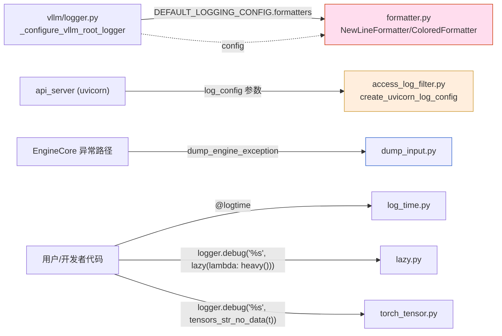

[← Wiki 首页](../../README.md) > [可观测](../README.md) > logging_utils

# Logging Utils（日志工具子目录总览）

> 源码：`vllm/logging_utils/`（`__init__.py` + `access_log_filter.py` + `dump_input.py` + `formatter.py` + `lazy.py` + `log_time.py` + `torch_tensor.py`）

## 是什么

`vllm/logging_utils/` 是 vLLM 日志工具箱——不属于 metrics/profiler/tracing 主线，而是为 [`vllm/logger.py`](../logger.md) 配套的 Formatter、Filter、装饰器、序列化 helper。`__init__.py` 重导出主要符号：

```python
from vllm.logging_utils import (
    NewLineFormatter, ColoredFormatter,
    UvicornAccessLogFilter, create_uvicorn_log_config,
    lazy, logtime, tensors_str_no_data,
)
```

文件清单：

| 文件 | 主类 | 行数 | 角色 |
|---|---|---|---|
| `formatter.py` | `NewLineFormatter` / `ColoredFormatter` | 125 | 多行对齐 + ANSI 着色 Formatter，[formatter.md](formatter.md) |
| `access_log_filter.py` | `UvicornAccessLogFilter` / `create_uvicorn_log_config` | 144 | 健康检查路径过滤 + uvicorn logging dictConfig 工厂，[access-log-filter.md](access-log-filter.md) |
| `dump_input.py` | `prepare_object_to_dump` / `dump_engine_exception` | 83 | 引擎异常时匿名列印 SchedulerOutput/Stats，[dump-input.md](dump-input.md) |
| `lazy.py` | `lazy` | 20 | 日志参数惰性求值包装，[lazy.md](lazy.md) |
| `log_time.py` | `logtime` | 34 | 函数耗时 debug 日志装饰器，[log-time.md](log-time.md) |
| `torch_tensor.py` | `tensors_str_no_data` | 10 | tensor 字符串截断打印，[torch-tensor.md](torch-tensor.md) |

`__init__.py` 仅 21 行——重导出上述符号，是 import 入口。



## 为什么

- **集中"日志副作用"工具**：Formatter/Filter/装饰器都修改日志行为，与 logger 配置紧密耦合，独立目录避免散落。
- **`NewLineFormatter` 多行对齐**：vLLM 日志常含 traceback/多行 message（如 stats 一次打多条），但 logging 默认每行只有首行有 prefix——`NewLineFormatter` 给每行加 prefix 对齐 stdout 显示。
- **`ColoredFormatter` ANSI 着色**：DEBUG/INFO/WARNING/ERROR/CRITICAL 各色，timestamp/filepath 灰色；自动检测 isatty 并尊重 `NO_COLOR`/`VLLM_LOGGING_COLOR`。
- **`UvicornAccessLogFilter` 降噪**：`/health`/`/metrics` 高频路径在 production 会刷爆 access log，Filter 按 `record.args[2]` 取 path 过滤。
- **`dump_engine_exception` 排障**：EngineCore 抛异常时，把 `SchedulerOutput`/`SchedulerStats` 用 `prepare_object_to_dump` 匿名化（tensor 只输出 shape/device/dtype，字符串外加单引号，enum 转 repr）后 `logger.error` 打出——便于从日志复现 bug。
- **`lazy` 惰性求值**：`logger.debug("state: %s", lazy(lambda: expensive_repr()))` 只在 debug 实际输出时才调 `expensive_repr()`，INFO 级别下零开销。
- **`logtime` 简化计时**：`@logtime(logger, "my_func")` 自动 `time.perf_counter()` + `logger.debug(... elapsed ...)`，避免手写 `try-finally` 模板。
- **`tensors_str_no_data` 截断**：用 `torch._tensor_str.printoptions(threshold=1, edgeitems=0)` 让 tensor `str()` 只出 shape/dtype，省去巨大 tensor 数据——`logger.debug("%s", tensors_str_no_data(logits))` 排障时极有用。
- **历史兼容**：`__init__.py` 早期导出 `vllm.logging.NewLineFormatter`，迁移到 `logging_utils/` 后 [`logger.py`](../logger.md) 在 `_configure_vllm_root_logger` 显式把配置文件里 `vllm.logging.NewLineFormatter` 替换为 `vllm.logging_utils.NewLineFormatter` 保持兼容（`logger.py:195-198`）。

## 怎么做

**用户调整日志**：见 [`vllm/logger.md`](../logger.md)——`VLLM_LOGGING_LEVEL`/`VLLM_LOGGING_STREAM`/`VLLM_LOGGING_COLOR`/`VLLM_LOGGING_CONFIG_PATH` 等环境变量。

**API server 静默健康路径**（`vllm/entrypoints/openai/api_server.py`，待核实具体调用）：

```python
from vllm.logging_utils import create_uvicorn_log_config
uvicorn.run(app, log_config=create_uvicorn_log_config(
    excluded_paths=["/health", "/metrics"],
    log_level="info",
))
```

**EngineCore 异常排障**（`dump_engine_exception` 在 EngineCore catch 异常时调用）：

```python
from vllm.logging_utils import dump_engine_exception

try:
    self.execute_scheduler_step(...)
except Exception:
    dump_engine_exception(self.vllm_config, scheduler_output, scheduler_stats)
    raise
```

**`lazy` 用例**：

```python
from vllm.logging_utils import lazy
logger.debug("request state: %s", lazy(lambda: self._compute_expensive_repr(req)))
```

`_compute_expensive_repr` 仅在 logger 实际输出 debug 时调一次。

**`@logtime` 用例**：

```python
from vllm.logging_utils import logtime

@logtime(logger, "compile_model")
def compile_model(...):
    ...
# 每次调用 + DEBUG 级别 + "compile_model: Elapsed time X.XXXXXXX secs"
```

**`tensors_str_no_data` 用例**：

```python
from vllm.logging_utils import tensors_str_no_data
# 排障 logits shape
logger.debug("logits: %s", tensors_str_no_data(logits))
# Tensor(shape=[1, 32000], dtype=torch.float32) 而非全部 float
```

## 与其它模块/系统配合

- **[logger.md](../logger.md)**：`_configure_vllm_root_logger` 把 `NewLineFormatter`/`ColoredFormatter` 写入 `DEFAULT_LOGGING_CONFIG`；所有 vllm logger 通过 `init_logger(name)` 拿到的实例共享根配置。
- **[stats.py](../v1/metrics/stats.md) + [loggers.py](../v1/metrics/loggers.md)**：`LoggingStatLogger.log()` 通过 vllm logger 输出，每行经 `NewLineFormatter` 对齐——多 stats 表才好看。
- **[dump-input.md](dump-input.md)**：消费 `SchedulerOutput`/`SchedulerStats` 数据类的匿名 repr，与 metrics 数据类紧密。
- **[13-entrypoints/serve](../../13-entrypoints/README.md)**：API server 用 `create_uvicorn_log_config`；instrumentator（[13-entrypoints/serve/instrumentator.md](../../13-entrypoints/serve/instrumentator.md) 待补充）注册的 HTTP histogram 端点（`/metrics`）由本目录 Filter 静默。
- **`torch._tensor_str`**：`tensors_str_no_data` 调 `printoptions`——依赖 torch 内部 API（torch 版本兼容性待核实）。

## 历史版本演进

- **v0.5（v0）**：`vllm/logging.py` 单文件含 `NewLineFormatter`（无 color）；`vllm/logger.py` 配置；无 `logging_utils/` 目录。
- **v0.6**：抽 `vllm/logging_utils/` 目录；`ColoredFormatter` 接入；`access_log_filter` 与 `dump_input` 增；历史兼容替换 `vllm.logging.NewLineFormatter` → `vllm.logging_utils.NewLineFormatter`（PR #10134 标记，见 `logger.py:197`）。
- **v0.7（v1 落地）**：`lazy` + `logtime` + `torch_tensor` 加；`__init__.py` 集中重导出。
- **v0.8**：`shrink_path` 在 DEBUG 模式下缩短 file path 显示（`vllm/v1/...` 折叠中间段）。
- **v0.9**：`ColoredFormatter` 把 timestamp/filepath 注入 fmt 模板为 grey；只 override levelname 动态着色。
- **v0.10–main**：稳定 API。具体版本归属（待核实）。

[← 返回可观测首页](../README.md)

## 参见

- [../logger.md](../logger.md) — 配置入口。
- [formatter.md](formatter.md) / [access-log-filter.md](access-log-filter.md) / [dump-input.md](dump-input.md) / [lazy.md](lazy.md) / [log-time.md](log-time.md) / [torch-tensor.md](torch-tensor.md) — 各子文件详情。
