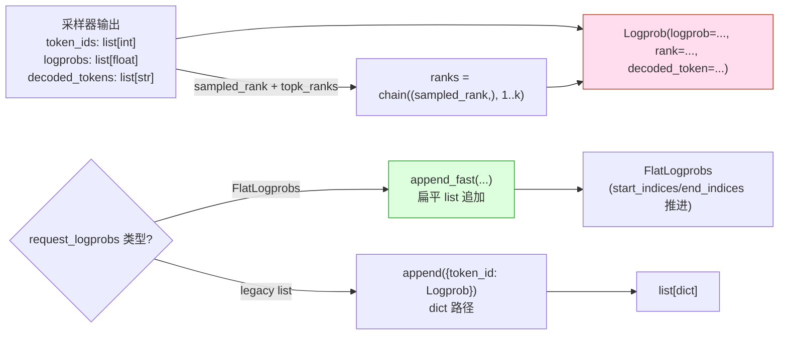

[← Wiki 首页](../README.md) > [可观测](README.md) > logprobs

# Logprobs（logprob 容器与构造工具）

> 源码：`vllm/logprobs.py`（206 行）

## 是什么

`logprobs.py` 提供 OpenAI 兼容 API 输出 logprobs 所需的数据结构与构造工具。它**本身不计算 logprob**——logprob 计算在 [采样器](../06-sampling-decoding/sampler.md) 完成，本文件负责把采样器的输出聚合成 OpenAI `/v1/chat/completions` 与 `/v1/completions` 期望的 `{logprob, rank, decoded_token}` 结构。

主要导出：

| 名 | 行号 | 角色 |
|---|---|---|
| `Logprob` (dataclass) | `logprobs.py:13` | 单 token 的 logprob 信息：`logprob: float`、`rank: int \| None`（vocab 排名，>=1）、`decoded_token: str \| None` |
| `LogprobsOnePosition` | `logprobs.py:27` | `dict[int, Logprob]` —— 单位置上 `{token_id: Logprob}`，含 sampled token 与 top-k |
| `FlatLogprobs(MutableSequence)` | `logprobs.py:31` | **扁平化**容器：把所有位置所有 rank 拍平到 4 个 list (`token_ids`/`logprobs`/`ranks`/`decoded_tokens`)，用 `start_indices`/`end_indices` 索引每位置范围；GC 友好，常数对象数 |
| `PromptLogprobs` | `logprobs.py:157` | `FlatLogprobs \| list[LogprobsOnePosition \| None]` —— 双形态兼容 |
| `SampleLogprobs` | `logprobs.py:159` | `FlatLogprobs \| list[LogprobsOnePosition]` |
| `create_prompt_logprobs(flat_logprobs)` | `logprobs.py:162` | 工厂：第一个 prompt token 是 None（无前序） |
| `create_sample_logprobs(flat_logprobs)` | `logprobs.py:170` | 工厂：空容器 |
| `append_logprobs_for_next_position(...)` | `logprobs.py:175` | 主构造 API：把采样器给的 `token_ids`/`logprobs`/`decoded_tokens` + sampled token 的 `rank` 与 `num_logprobs` 合并追加 |

`FlatLogprobs` 接口要点：

| 方法 | 行号 | 行为 |
|---|---|---|
| `append(logprobs_one_position)` | `:63` | dict 形态追加：先转 token_id/logprob/rank/decoded_token 4 个 list 增量 |
| `append_fast(token_ids, logprobs, ranks, decoded_tokens)` | `:74` | 跳过中间 dict 构造，直接 zip 4 个 list 追加——热路径优化 |
| `extend(logprobs_multi_positions)` | `:95` | 多位置 append |
| `__len__`/`__getitem__`/`__iter__` | `:100`/`:110`/`:146` | MutableSequence ABC 需求；按 `start_indices[i]:end_indices[i]` 范围切片 |
| `__setitem__`/`__delitem__`/`insert` | `:137`/`:140`/`:143` | 抛 TypeError 不可变 |

`append_logprobs_for_next_position` 关键逻辑（`logprobs.py:175`）：

- `num_logprobs == -1` 时取 `len(logprobs)`（全部 vocab）。
- `topk_ranks = range(1, num_logprobs + 1)` —— top-k 的 rank 从 1 起。
- `ranks = itertools.chain((rank,), topk_ranks)` —— sampled token 的 rank 在前，top-k rank 在后；用 chain 无需分配新 list。
- 若 `request_logprobs` 是 `FlatLogprobs`：调 `append_fast`（无中间 dict）；否则 `request_logprobs.append({token_id: Logprob(...)})` 走兼容路径。



## 为什么

- **OpenAI 协议建模**：OpenAI spec 要求每位置返回 sampled token logprob + top-k logprob + rank + decoded_token；`Logprob` dataclass 直接匹配。
- **`FlatLogprobs` 性能**：早期 vLLM 用 `list[dict[int, Logprob]]` 存全位置 logprobs——长序列与大 top-k 时 dict + dataclass 实例数爆炸（GC 压力 + 内存碎片）。`FlatLogprobs` 把所有数据拍平到 4 个 primitive list，对象数常数；`start_indices`/`end_indices` 两索引数组定位每位置范围。注释（`logprobs.py:36-49`）显式说明 GC 优化动机。
- **`MutableSequence` 适配**：实现 `__getitem__`/`__len__`/`append`/`extend`/`__iter__` 让 `FlatLogprobs` 表现像 `list[LogprobsOnePosition]` —— 调用方代码无感知切换（`for pos in request_logprobs: pos[sampled_token_id]`）。
- **`append_fast` 热路径**：直接走 4 list `extend`（precisely，是 loop append）避免 dict 临时构造——v1 采样器每 token 都生成 top-k logprob，是热路径。
- **`create_prompt_logprobs` 第一位 None**：OpenAI 协议要求 prompt 第一位 token `logprob=None`（无前序），`create_prompt_logprobs` 显式 `logprobs.append(None)`。
- **`flat_logprobs: bool` 双形态**：让 v1 走 FlatLogprobs、v0 兼容仍走 list[dict]，平滑迁移。
- **`num_logprobs == -1` 表全 vocab**：某些场景用户想看所有 logprob（小 vocab 模型）；API 用 -1 哨兵避免传 `vocab_size`。
- **`itertools.chain` 避免分配**：sampled + topk 的 rank 序列用 `chain` 惰性迭代，节省 list 构造。
- **dataclass 而非 msgspec**：注释（`logprobs.py:9-11`）说明 msgspec 不被 OpenAI server 序列化支持，故用 dataclass —— 是 OpenAI 输出形态约束。
- **rank 唯一性**：sampled token 可能落在 top-k 内（此时它在 top-k ranks 中也出现），docstring（`logprobs.py:187-189`）显式说"插入重复等价于一次"——dict 路径自动去重；flat 路径不去重但展示一致。

## 怎么做

**调用方**（采样器或 output processor，具体在 `vllm/v1/sample/sampler.py` 或 `vllm/v1/engine/output_processor.py`，待核实）：

```python
from vllm.logprobs import (
    create_prompt_logprobs, create_sample_logprobs,
    append_logprobs_for_next_position,
)

# 请求初始化
request.prompt_logprobs = create_prompt_logprobs(flat=True)
request.sample_logprobs = create_sample_logprobs(flat=True)

# 每步采样后
append_logprobs_for_next_position(
    request_logprobs=request.sample_logprobs,
    token_ids=sampled_token_ids + topk_token_ids,  # sampled 在前
    logprobs=sampled_logprob + topk_logprobs,
    decoded_tokens=sampled_decoded + topk_decoded,
    rank=sampled_rank,                  # sampled 在 vocab 的排名
    num_logprobs=request.sampling_params.num_logprobs,  # -1 表全 vocab
)
```

**用户 API 输出**：OpenAI handler 在生成完成后遍历 `request.sample_logprobs`，按 `Logprob.logprob/rank/decoded_token` 字段填充 response。

**自定义 logprob 计算**：用户若用 logits processor 自家算 logprob，可绕过 `append_logprobs_for_next_position`，直接 `FlatLogprobs.append_fast(...)` 或 `append({tid: Logprob(...)})`。

## 与其它模块/系统配合

- **[06-sampling-decoding/sampler.md](../06-sampling-decoding/sampler.md)**：采样器计算 logprob 并通过 `append_logprobs_for_next_position` 写入；`num_logprobs` 来自 `SamplingParams`。
- **[01-engine-core/output-processor.md](../01-engine-core/output-processor.md)**：output processor 在请求生命周期持有 `Request.prompt_logprobs`/`sample_logprobs`，最终 export 到 response。
- **[13-entrypoints/openai](../13-entrypoints/README.md)**：OpenAI API handler 把 `FlatLogprobs` 转 OpenAI 协议 JSON；`Logprob` dataclass 字段映射 `CompletionLogprob`。
- **`itertools`**：chain/zip 等热路径工具。
- **`msgspec`**：vLLM 通常用 msgspec 做高效序列化，但本文件用 dataclass 因 OpenAI server 序列化限制。
- **[17-utils-cross-cutting](../17-utils-cross-cutting/README.md)**：常与 sequence 数据结构（Request/RequestState）共存。

## 历史版本演进

- **v0.5（v0）**：`vllm/logprobs.py` 已存在；`Logprob` dataclass；`PromptLogprobs = list[dict | None]`、`SampleLogprobs = list[dict]`；`create_*`/`append_logprobs_for_next_position` API 已稳定。
- **v0.6**：`append_logprobs_for_next_position` 显式支持 `num_logprobs=-1` 全 vocab。
- **v0.7（v1 落地）**：引入 `FlatLogprobs` + `flat_logprobs: bool` 参数；`append_fast` 热路径优化；`MutableSequence` ABC 让接口兼容旧 list[dict]。
- **v0.8–main**：稳定 API；`append_fast` 内部用 `zip + append` 保留（不切 Numpy 是因 list-of-primitive 已足够 GC 友好）。具体版本归属（待核实）。

[← 返回可观测首页](README.md)

## 参见

- [../06-sampling-decoding/sampler.md](../06-sampling-decoding/sampler.md) — logprob 计算上游。
- [../01-engine-core/output-processor.md](../01-engine-core/output-processor.md) — `Request.*logprobs` 容器持有方。
- [../13-entrypoints/openai](../13-entrypoints/README.md) — OpenAI 协议输出下游。
