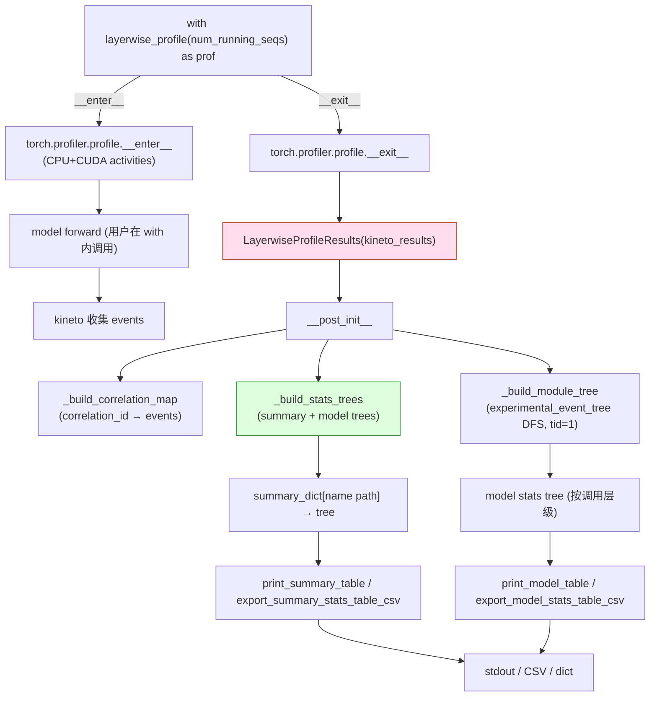

[← Wiki 首页](../../README.md) > [可观测](../README.md) > profiler/layerwise

# Layerwise Profile（按 Module 树聚合 CUDA 时间）

> 源码：`vllm/profiler/layerwise_profile.py`（400 行） + 接 `vllm/profiler/utils.py`

## 是什么

`layerwise_profile.py` 提供一个上下文管理器 `layerwise_profile`，它继承 `torch.profiler.profile`，在标准 PyTorch profiler 之上加一层 **按 `nn.Module` 树** 聚合 CUDA 时间的后处理——把 trace 事件按 module 嵌套关系重新组织，输出"逐层 Module 的 CPU 时间 / CUDA 时间 / 占比 / 调用次数"。

数据类与函数：

| 类/函数 | 行号 | 角色 |
|---|---|---|
| `_ModuleTreeNode` | `layerwise_profile.py:32` | event tree 节点，含 parent/children/trace；`is_leaf`/`is_torch_op`/`is_cuda` 属性 |
| `SummaryStatsEntry` | `layerwise_profile.py:55` | 汇总行：name/cuda_time_us/pct_cuda_time/invocations |
| `ModelStatsEntry` | `layerwise_profile.py:63` | 模型行：name/cpu_time_us/cuda_time_us/pct_cuda_time/trace |
| `StatsEntry` / `StatsEntryT` | `layerwise_profile.py:71-72` | 联合类型 + TypeVar |
| `_StatsTreeNode[StatsEntryT]` | `layerwise_profile.py:76` | 汇总/模型树的统计节点 |
| `LayerwiseProfileResults(profile)` | `layerwise_profile.py:83` | profile 退出时构造；持有 `_kineto_results` + correlation maps + module tree + stats trees |
| `layerwise_profile(profile)` | `layerwise_profile.py:373` | 上下文管理器入口，构造时 `activities=[CPU, CUDA]` + `record_shapes=True` + `with_stack=True` + `with_modules=True` + `experimental_config=_ExperimentalConfig(verbose=True)`；`__exit__` 构造 results |

`LayerwiseProfileResults` 主要方法：

| 方法 | 行号 | 行为 |
|---|---|---|
| `__post_init__` | `:94` | 调 `_build_correlation_map` / `_build_module_tree` / `_build_stats_trees` |
| `print_model_table(column_widths=None)` | `:99` | 用 `TablePrinter(ModelStatsEntry, ...)` 打印带缩进的 model stats 树（仅 cuda_time>0 或 cpu_time>0） |
| `print_summary_table(column_widths=None)` | `:117` | 用 `TablePrinter(SummaryStatsEntry, ...)` 打印汇总（仅 cuda_time>0） |
| `export_model_stats_table_csv(filename)` | `:135` | 用 pandas 导 CSV |
| `export_summary_stats_table_csv(filename)` | `:141` | 同上 |
| `convert_stats_to_dict()` | `:150` | 转 nested dict（含 metadata） |
| `_build_correlation_map` | `:171` | `correlation_id` → kineto events 列表 |
| `_build_module_tree` | `:176` | 遍历 `_kineto_results.experimental_event_tree()`，DFS 仅取 `event.start_tid == 1`（TP 单 task 路径），把 `event_has_module` 事件挂为 ModuleTreeNode |
| `_get_kineto_gpu_event(node)` | `:213` | 按 correlation_id + device=CUDA + name 匹配 kineto GPU event |
| `_cumulative_cuda_time(node)` | `:226` | 递归累加叶子 GPU 时间（微秒） |
| `_total_cuda_time()` | `:240` | 全 tree 总 CUDA 时间，作 100% 基准 |
| `_build_stats_trees` | `:243` | 同时构造 summary tree（按 trace path 合并同名 module）+ model tree（保持调用层级） |

`vllm/profiler/utils.py` 工具：

| 工具 | 行号 | 角色 |
|---|---|---|
| `trim_string_front`/`trim_string_back` | `utils.py:15/24` | 字符串前后裁剪配 `...` |
| `TablePrinter` | `utils.py:33` | 按 dataclass fields + column_widths 打印对齐表 |
| `indent_string` | `utils.py:79` | 按 indent 级别加前缀，支持 callable style |
| `event_has_module`/`event_is_torch_op` | `utils.py:96/103` | event 类型谓词 |
| `event_arg_repr`/`event_torch_op_repr`/`event_module_repr` | `utils.py:107/120/126` | 把 event 参数/算子/module 表示为字符串 |
| `event_torch_op_stack_trace` | `utils.py:138` | 从当前 event 向上找父级 torch op 形成调用栈串 |



## 为什么

- **普通 torch.profiler 不易看层级**：`torch.profiler.profile` 输出按 op name 平铺（如 `aten::add`、`aten::matmul`），但用户想看"每个 nn.Module 的总 CUDA 时间"需手动后处理。`LayerwiseProfileResults` 通过 `experimental_event_tree`（含 module 信息）重建层级，让 attention/ffn/embedding 等模块贡献一目了然。
- **summary vs model 双视角**：
  - `summary_stats_tree` 按**调用路径**合并——相同 module 在不同位置调用会按 path 累加 invocations，便于看 "总耗时排名"。
  - `model_stats_tree` 按**调用层级**展开——保留向前调用结构，便于看 "哪一层调用了哪一层"。
- **TP 单 task 过滤**：`event.start_tid == 1` 过滤掉非主 task 的事件——TP 多 worker 场景下避免重复计数（具体是否仍适用于 v1 的 SP/独立线程模型，待核实）。
- **correlation_id 关联**：CPU 事件与 GPU event 通过 `correlation_id` 关联；`_get_kineto_gpu_event` 找匹配的 CUDA device event 取其 `duration_ns()` 作 CUDA 时间。
- **pandas CSV 导出**：调优脚本可批量跑多个 batch size / 编译模式，把 CSV 喂给自动化分析。
- **`num_running_seqs` metadata**：profile 时把当前 batch 的 seq 数一起记入结果，让 CSV/dict 后处理能按 seq 数分桶分析。
- **pandas 软依赖**：`try: import pandas except ImportError: pd = PlaceholderModule(...)`，让无 pandas 环境仍可 import 但 CSV 导出会报错。

## 怎么做

**最小用法**（开发者排障脚本）：

```python
import torch
from vllm.profiler.layerwise_profile import layerwise_profile

with layerwise_profile(num_running_seqs=batch_size) as prof:
    output = model_runner.execute_model(...)

# stdout 表
prof.results.print_model_table()
prof.results.print_summary_table()

# CSV
prof.results.export_model_stats_table_csv("model_stats.csv")
prof.results.export_summary_stats_table_csv("summary_stats.csv")

# dict（自动化处理）
data = prof.results.convert_stats_to_dict()
# {"metadata": {"num_running_seqs": N},
#  "summary_stats": [...], "model_stats": [...]}
```

**自定义列宽**：

```python
prof.results.print_model_table(column_widths={
    "name": 80, "cpu_time_us": 15, "cuda_time_us": 15,
    "pct_cuda_time": 12, "trace": 80,
})
```

**注意事项**：
- `with_modules=True` 必需，否则 `event_has_module` 全 false；`experimental_config=_ExperimentalConfig(verbose=True)` 让 kineto 输出 event tree（实验 API）。
- `record_shapes=True` 让 op 名带形状，便于区分同样 op 名不同 batch 的调用。
- 仅在 `local_rank=0` 或单卡时运行，避免多 rank 重复 trace。
- 与 cudagraph 不兼容——cudagraph capture 后内部 op 不再触发 Python-level event，module tree 不完整。

## 与其它模块/系统配合

- **[profiler-readme.md](profiler-readme.md)**：`layerwise_profile` 与 `TorchProfilerWrapper`/`CudaProfilerWrapper` 是互补工具——后者是常驻 Worker 级 profiler，本文件是临时上下文管理器。`enable_layerwise_nvtx_tracing` (ObservabilityConfig) 与本文件不是同一物（待核实二者关系）。
- **[utils.py](profiler-readme.md#_utils)**：`TablePrinter`/`event_*` 工具被本文件用。
- **[03-model-execution/README.md](../../03-model-execution/README.md)**：用户通常在 model_runner 周围包 `with layerwise_profile()`，需熟悉 model 层结构。
- **[09-compilation-ir/README.md](../../09-compilation-ir/README.md)**：cudagraph 互斥提示。
- **`torch.profiler` 与 `torch._C._profiler`**：使用实验性 `_ExperimentalConfig`/`_ProfilerEvent`/`_EventType`，依赖 torch 版本（待核实最低版本要求）。
- **pandas**：软依赖，CSV 导出必需。

## 历史版本演进

- **v0.5/v0.6（v0）**：`layerwise_profile.py` 已存在；`_ModuleTreeNode`/`SummaryStatsEntry`/`ModelStatsEntry` 体系成熟；`print_model_table`/`print_summary_table`/CSV export。
- **v0.7（v1 落地）**：v1 保持兼容；`num_running_seqs` metadata 字段；`convert_stats_to_dict` 给自动化用。
- **v0.8–main**：与 torch 内部 event API 变更同步（如 `_ExperimentalConfig(verbose=True)`）；TP 多 worker 过滤 `start_tid==1` 是否仍准确（待核实）。具体版本归属（待核实）。

[← 返回可观测首页](../README.md)

## 参见

- [profiler-readme.md](profiler-readme.md) — `vllm/profiler/` 总览，本文件互补 Worker 级 profiler。
- [../../10-config/profiler-config.md](../../10-config/profiler-config.md) — `enable_layerwise_nvtx_tracing` 区分。
- [../../10-config/observability-config.md](../../10-config/observability-config.md) — `enable_layerwise_nvtx_tracing` 开关。
