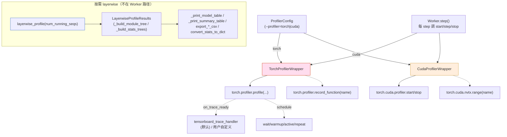

[← Wiki 首页](../../README.md) > [可观测](../README.md) > profiler

# Profiler（性能分析子目录总览）

> 源码：`vllm/profiler/`（`__init__.py` + `utils.py` + `wrapper.py` + `layerwise_profile.py`）

## 是什么

`vllm/profiler/` 封装 vLLM 与 PyTorch profiler / NVIDIA NVTX / 逐层 profile 的对接逻辑。它不是常驻可观测——而是 `--profiler` CLI 启用、`start_profile`/`stop_profile` API 触发的按需采样。配置入口是 [`ProfilerConfig`](../../10-config/profiler-config.md)（`vllm/config/profiler.py`）。

文件清单：

| 文件 | 主类 | 角色 |
|---|---|---|
| `wrapper.py` | `WorkerProfiler` (ABC) / `TorchProfilerWrapper` / `CudaProfilerWrapper` | profiler 生命周期骨架与两种后端实现 |
| `layerwise_profile.py` | `layerwise_profile` / `LayerwiseProfileResults` / `_ModuleTreeNode` / `_StatsTreeNode` | 按 `nn.Module` 树聚合 CUDA 时间的扩展 profile 上下文管理器 |
| `utils.py` | `TablePrinter` / `indent_string` / `event_*` helper | 字符串/事件树打印与裁剪工具，被 `layerwise_profile.py` 用 |
| `__init__.py` | 空 | 包标识 |

`WorkerProfiler` 抽象（`wrapper.py:19`）：

| 方法 | 行为 |
|---|---|
| `__init__(profiler_config)` | 读 `delay_iterations`/`max_iterations`，置 `_active`/`_running` |
| `start()` | 进入 active 状态；若 `delay=0` 立即 `_call_start()` |
| `step()` | 每 worker step 调用：处理 delay 启动、`profiler.step()`（schedule 模式）、max_iters 自动停 |
| `stop()` | 退出 active；若 running 则 `_call_stop()` |
| `shutdown()` | shutdown 时停 |
| `_start()`/`_stop()` | abstract，子类实现 |
| `_profiler_step()` | 子类可覆盖处理 schedule 的 warmup |
| `annotate_context_manager(name)` | 返回用于标注 trace 的 context manager，默认 nullcontext |

两种后端：

- **`TorchProfilerWrapper`** (`wrapper.py:159`)：包 `torch.profiler.profile`，支持 CPU/CUDA/XPU 活动、`record_shapes`/`profile_memory`/`with_stack`/`with_flops`/`on_trace_ready`；默认 trace handler 是 `torch.profiler.tensorboard_trace_handler`，可注入自定义；支持 `wait/warmup/active` 调度；停时按 `torch_profiler_dump_cuda_time_total`/`dump_cpu_time_total` 决定是否打表；`annotate_context_manager` 返回 `torch.profiler.record_function(name)`。`_write_profiler_table` 把表写到 `torch_profiler_dir/profiler_out_{rank}.txt`（URI 路径如 `gs://`/`s3://` 跳过文件写）。
- **`CudaProfilerWrapper`** (`wrapper.py:310`)：包 `torch.cuda.profiler.start/stop`，配合 `torch.cuda.nvtx.range` 标记；`annotate_context_manager` 返回 `torch.cuda.nvtx.range(name)`。用于外部工具（nsys/NTTune）。

`TorchProfilerActivity`/`TorchProfilerActivityMap` (`wrapper.py:151-156`)：`"CPU"|"CUDA"|"XPU"` 字符串到 `torch.profiler.ProfilerActivity` 的映射。



## 为什么

- **仅在调试时启用**：profiler 持续运行有 10×+ 开销。`WorkerProfiler` 抽象让 vLLM Worker 在 profiler 未启动时零开销（`step()` 直接 return），启动后走子类 `_start/_stop`。
- **延迟启动 + 最大迭代数**：`delay_iterations` 跳过 warmup（编译/缓存填充），`max_iterations` 自动停防忘关；都由 `step()` 在每 worker step 检查。
- **schedule 模式**：`wait/warmup/active` 三阶段让 profiler 仅在 active 期记录数据，避开 warmup 污染——这是 torch.profiler 原生 schedule，但 `_profiler_step()` 必须每步调 `profiler.step()` 推进状态机；`TorchProfilerWrapper._warmup_steps_remaining` 追踪 warmup 步数让 `max_iterations` 不计 warmup。
- **trace handler 灵活注入**：默认写 tensorboard trace 目录，但 `on_trace_ready` 参数让上层（如 vLLM 自定义 collector）注入自定义 handler。
- **CUDA vs Torch profiler 区分**：
  - `TorchProfilerWrapper` 适合"我要 chrome trace / tensorboard 看具体 op"，捕获全 Python+CUDA op trace。
  - `CudaProfilerWrapper` 适合"我要用 nsys针对性采集 GPU kernel"，仅启停 CUPTI，开销更低，配合外部 nsight-systems 启动。
- **NVTX 标注**：`annotate_context_manager(name)` 让模型层代码（如 attention/ffn）在 profiler trace 里以可读名字显示——`record_function`/`nvtx.range` 各自后端原生支持。
- **layerwise profile 单列**：`layerwise_profile` 是个**上下文管理器**（不是常驻），用 `record_shapes=True, with_stack=True, with_modules=True, experimental_config=_ExperimentalConfig(verbose=True)` 捕获 event tree，在 `__exit__` 构造 `LayerwiseProfileResults`，按 nn.Module 树聚合 CUDA 时间——见 [profiler-layer.md](profiler-layer.md)。
- **多 rank 协调**：`local_rank in (None, 0)` 时打 info 日志，避免多 rank 重复噪音；trace 写到 `profiler_out_{rank}.txt` 每个文件按 rank 隔离。

## 怎么做

**启用 torch profiler（CLI）**：

```bash
vllm serve <model> --profiler torch \
  --torch-profiler-dir /tmp/vllm_profiler \
  --torch-profiler-record-shapes \
  --torch-profiler-with-stack \
  --torch-profiler-with-flops \
  --torch-profiler-warmup-iterations 5 \
  --torch-profiler-active-iterations 10 \
  --torch-profiler-wait-iterations 0 \
  --torch-profiler-max-iterations 100 \
  --torch-profiler-delay-iterations 10
```

启动后调 `start_profile` API（HTTP `POST /start_profile` 或 EngineCore.profiler.start()），运行若干步后调 `stop_profile`，trace 在 `--torch-profiler-dir` 下，用 `tensorboard --logdir /tmp/vllm_profiler` 看。

**启用 cuda profiler（NVTX 模式）**：

```bash
vllm serve <model> --profiler cuda
# 用 nsys 启动 vLLM 进程:
nsys profile -t cuda,nvtx python -m vllm.entrypoints.openai.api_server ...
```

`start_profile`/`stop_profile` API 控制 `torch.cuda.profiler.start/stop`，nsys 在外层捕获 NVTX range。

**layerwise profile（开发者用，非常驻）**：

```python
from vllm.profiler.layerwise_profile import layerwise_profile

with layerwise_profile(num_running_seqs=num_seqs) as prof:
    # 跑一次 forward
    model_runner.execute_model(...)
# 退出 with 后 prof.results 就绪
prof.results.print_model_table()
prof.results.print_summary_table()
prof.results.export_model_stats_table_csv("model_stats.csv")
prof.results.export_summary_stats_table_csv("summary_stats.csv")
prof.results.convert_stats_to_dict()  # 给自动化分析
```

> `enable_layerwise_nvtx_tracing` 在 [`ObservabilityConfig`](../../10-config/observability-config.md) 是另一个独立开关（轻量 NVTX range，与 cudagraph 不兼容）；与本文件 `layerwise_profile`（重上下文管理器）不是同一物（待核实二者关系）。

**annotate context manager 用法**（模型层代码）：

```python
# worker.py 或 model_runner.py
with self.profiler.annotate_context_manager("attention_forward"):
    attn_output = self.attn(...)
```

只在 profiler active 时才产生标注，否则 `nullcontext()` 零开销。

## 与其它模块/系统配合

- **[02-execution/README.md](../../02-execution/README.md)**：Worker 持有 `WorkerProfiler` 实例，每 worker step 调 `profiler.step()`。
- **[EngineCore](../../01-engine-core/engine-core-process.md)**：`start_profile`/`stop_profile` API 调用通过 EngineCore 转发到 Worker；`ProfilerConfig.delay_iterations` 在 EngineCore 启动后开始数 step。
- **[ProfilerConfig](../../10-config/profiler-config.md)**：所有 `--torch-profiler-*`/`--profiler` CLI 在此配置。
- **[profiler-layer.md](profiler-layer.md)**：layerwise 详细文档。
- **[logger.md](../logger.md)**：profiler 的 `logger.info_once` 用 vllm logger，不重复打日志。
- **[09-compilation-ir/README.md](../../09-compilation-ir/README.md)**：cudagraph capture 期间 profiler 行为受限（NVTX 在 cudagraph capture 后失效），故 `enable_layerwise_nvtx_tracing` 与 cudagraph 互斥。

## 历史版本演进

- **v0.5/v0.6（v0）**：`vllm/profiler/` 已有 `wrapper.py` 与 `layerwise_profile.py`；TorchProfiler + CudaProfiler 双后端；schedule 不支持（仅 delay/max）。
- **v0.7（v1 落地）**：保持 wrapper 接口；`WorkerProfiler` 抽象统一；`_profiler_step()` 让 `TorchProfilerWrapper` 支持 `wait/warmup/active` 调度；`_warmup_steps_remaining` 让 max_iters 不计 warmup。
- **v0.8**：`_is_uri_path` 跳过 URI 路径文件写（gs://、s3://）；`annotate_context_manager` 在 `WorkerProfiler` 基类提供 nullcontext 默认。
- **v0.9**：`enable_layerwise_nvtx_tracing`（ObservabilityConfig 字段，独立开关，与 `layerwise_profile` 不同）。
- **v0.10–v0.12/main**：`schedule` 选项稳定；`XPU` 活动支持。具体版本归属（待核实）。

[← 返回可观测首页](../README.md)

## 参见

- [profiler-layer.md](profiler-layer.md) — layerwise profile 细节。
- [../../10-config/profiler-config.md](../../10-config/profiler-config.md) — 全部 CLI 开关。
- [../../02-execution/README.md](../../02-execution/README.md) — Worker 调用点。
