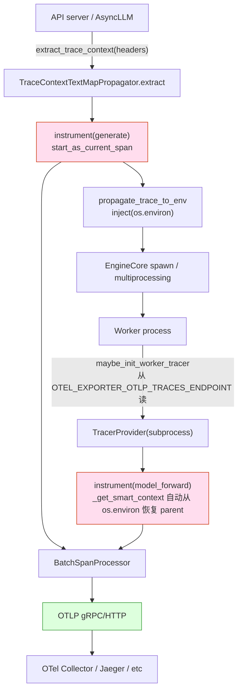

[← Wiki 首页](../../README.md) > [可观测](../README.md) > tracing

# Tracing（OpenTelemetry 集成）

> 源码：`vllm/tracing/`（`__init__.py` + `otel.py` + `utils.py`）

## 是什么

`vllm/tracing/` 把 vLLM 与 OpenTelemetry（OTel）对接，提供请求/任务级分布式追踪。它由 `--otlp-traces-endpoint` 启用，用 `@instrument` 装饰器把目标函数包成 OTel span，并通过 `traceparent`/`tracestate` HTTP 头在 API server → EngineCore → Worker 间传播上下文。

文件清单：

| 文件 | 主导出 | 角色 |
|---|---|---|
| `__init__.py` | `instrument`/`instrument_manual`/`init_tracer`/`maybe_init_worker_tracer`/`is_tracing_available` | 后端注册表 + 顶层 API；目前仅 `"otel"` 一种 |
| `otel.py` | `is_otel_available`/`init_otel_tracer`/`init_otel_worker_tracer`/`extract_trace_context`/`instrument_otel`/`manual_instrument_otel` | OTel SDK 初始化、span exporter、装饰器实现、subprocess 上下文传播 |
| `utils.py` | `SpanAttributes`/`LoadingSpanAttributes`/`TRACE_HEADERS`/`contains_trace_headers`/`extract_trace_headers`/`log_tracing_disabled_warning` | W3C trace header 常量、span 语义约定属性、警告 |

`__init__.py` 后端注册表机制：

```python
_REGISTERED_TRACING_BACKENDS: dict[str, tuple[
    BackendAvailableFunc,   # is_available
    InitTracerFunc,         # init_tracer (主进程)
    InitWorkerTracerFunc,   # init_worker_tracer (子进程)
    InstrumentFunc,         # instrument decorator
    InstrumentManualFunc,   # manual_instrument (显式时间戳)
]] = {
    "otel": (is_otel_available, init_otel_tracer, init_otel_worker_tracer,
             instrument_otel, manual_instrument_otel),
}
```

`instrument()` 装饰器（`__init__.py:90`）：

```python
@instrument(span_name="generate", attributes={"gen_ai.request.id": req_id})
async def generate(...): ...
```

OTel 不可用时返回原函数（no-op），使热路径在未启用 tracing 时零开销。

`SpanAttributes`（`utils.py:15`）——基于 OTel Semantic Conventions：

| 常量 | 值 | 含义 |
|---|---|---|
| `GEN_AI_USAGE_COMPLETION_TOKENS` | `"gen_ai.usage.completion_tokens"` | 完成侧 token 数 |
| `GEN_AI_USAGE_PROMPT_TOKENS` | `"gen_ai.usage.prompt_tokens"` | 提示侧 token 数 |
| `GEN_AI_REQUEST_MAX_TOKENS`/`TOP_P`/`TEMPERATURE` | `"gen_ai.request.*"` | 请求参数 |
| `GEN_AI_RESPONSE_MODEL` | `"gen_ai.response.model"` | 模型名 |
| `GEN_AI_REQUEST_ID`/`N` | `"gen_ai.request.id"/"n"` | 自定义扩展 |
| `GEN_AI_USAGE_NUM_SEQUENCES` | `"gen_ai.usage.num_sequences"` | 序列数 |
| `GEN_AI_LATENCY_TIME_IN_QUEUE` | `"gen_ai.latency.time_in_queue"` | 队列等待时长 |
| `GEN_AI_LATENCY_TIME_TO_FIRST_TOKEN` | `"gen_ai.latency.time_to_first_token"` | TTFT |
| `GEN_AI_LATENCY_E2E` | `"gen_ai.latency.e2e"` | 端到端时长 |
| `GEN_AI_LATENCY_TIME_IN_SCHEDULER` | `"gen_ai.latency.time_in_scheduler"` | 调度器内时长 |
| `GEN_AI_LATENCY_TIME_IN_MODEL_FORWARD/EXECUTE/PREFILL/DECODE/INFERENCE` | `"gen_ai.latency.time_in_model_*"` | 模型各阶段时长 |

`LoadingSpanAttributes`（`utils.py:48`）：`code.namespace`/`code.function`/`code.filepath`/`code.lineno`——代码级 span 属性，被 `instrument_otel` 自动填入。

OTel 初始化 (`otel.py:60-91`)：

1. 写 `OTEL_EXPORTER_OTLP_TRACES_ENDPOINT` 环境变量（让子进程继承）。
2. `Resource.create({...})` 含 `vllm.instrumenting_module_name`/`vllm.process_id`/调用方额外 attrs。
3. `TracerProvider(resource=...)` + `BatchSpanProcessor(get_span_exporter(endpoint))`。
4. `set_tracer_provider(trace_provider)` + `atexit.register(trace_provider.shutdown)`。
5. 返回 `trace_provider.get_tracer(instrumenting_module_name)`。

`get_span_exporter` (`otel.py:94`)：按 `OTEL_EXPORTER_OTLP_TRACES_PROTOCOL`（默认 grpc）选 `OTLPGrpcExporter(endpoint, insecure=True)` 或 `OTLPHttpExporter(endpoint)`。

`init_otel_worker_tracer` (`otel.py:105`)：Worker 进程从 `OTEL_EXPORTER_OTLP_TRACES_ENDPOINT` 环境变量读端点，注入 `vllm.process_kind`/`vllm.process_name` attrs，调 `init_otel_tracer`。

`instrument_otel` (`otel.py:134`)：包装 sync/async 函数。每次调用：
- `trace.get_tracer(module_name)` 取 tracer。
- `_get_smart_context()` 决定 parent context（见下）。
- `tracer.start_as_current_span(name, context=ctx, attributes=code_attrs, record_exception=...)`。
- 进入 `propagate_trace_to_env()` 上下文——把当前 OTel context 注入 `os.environ`（让本函数内 fork 的子进程继承 traceparent）。

`_get_smart_context` (`otel.py:216`)：
1. 若当前进程已有 valid span，return None（用当前 context）。
2. 否则从 `os.environ["traceparent"|"TRACEPARENT"|"tracestate"|"TRACESTATE"]` 提取 carrier。
3. 用 `TraceContextTextMapPropagator().extract(carrier)` 构造 parent context。

`propagate_trace_to_env` (`otel.py:240`)：进入时 `inject(os.environ)` 写 `traceparent`/`tracestate`，离开时恢复原始 environ——让 `multiprocessing.Process`/`spawn` 子进程继承。

`manual_instrument_otel` (`otel.py:183`)：显式 `start_time`/`end_time`（ns）创建短跨度——适合 vLLM 在 EngineCore 已记录时间戳后回填 span，无需把代码包成装饰器。



## 为什么

- **OTel 行业标准**：用 OTel SDK 让 vLLM span 融入用户已有可观测性栈（Tempo/Jaeger/Datadog/Honeycomb）；不发明新协议。
- **后端注册表为未来扩展**：当前仅 `"otel"` 但注册表设计允许 Profiler/mux 后端——`is_tracing_available()` 检查任一后端可用即 True 用于热路径 guard。
- **`instrument` 优雅降级**：OTel 未装时 `instrument_otel` 不可用，`instrument()` 直接返回原函数——已埋点代码无需 `if VLLM_TRACE`。
- **跨进程传播靠环境变量**：vLLM EngineCore 是 spawn 子进程，子进程不继承父进程的 in-memory OTel context；靠 `propagate_trace_to_env` 在 fork 点把 `traceparent` 写 `os.environ`，子进程用 `_get_smart_context` 读回——W3C trace context 标准做法。
- **smart context 兼顾两种场景**：请求路径上 API server 已提取 HTTP header traceparent → 当前 span 是 valid → 用当前；Worker 重启或离线 batch 没 parent → 从环境变量/全 environ 提取。
- **`SpanAttributes` 语义约定**：用 OTel 标准 `gen_ai.*` 命名让 vLLM span 与其他 LLM 框架（LangChain 等）的 span 在同一 trace 视图里语义对齐；`gen_ai.latency.*` 是 vLLM 自定义扩展待标准化。
- **`manual_instrument_otel` 适配已测时点**：vLLM 在 EngineCore/Worker 已用 `time.monotonic()` / `time.time()` 测了 TTFT/prefill/decode 时间。重新包装饰器会有时钟漂移；用 `manual` API 把这些已有时间戳直接灌入 span，零开销。
- **`record_exception` 默认 True**：异常自动 record 入 span，简化错误排障。
- **`log_tracing_disabled_warning` 用 `@run_once`**：请求带 trace header 但 tracing disabled 时只警告一次，避免日志洪水。

## 怎么做

**启用 OTel traces**：

```bash
pip install opentelemetry-sdk opentelemetry-exporter-otlp
vllm serve <model> \
  --otlp-traces-endpoint http://otel-collector:4317 \
  --collect-detailed-traces model
```

`--collect-detailed-traces` 接 `["model","worker","all"]`，在 [`ObservabilityConfig`](../../10-config/observability-config.md) 触发 `collect_model_forward_time`/`collect_model_execute_time` cached_property，让 EngineCore 在 `model_forward`/`model_execute` 额外用 `manual_instrument_otel` 创建子 span。具体埋点位置（待核实）。

**Worker 端**：`VLLM_ENABLE_V1_MULTIPROCESSING=1` 时 EngineCore 是 spawn 进程；`maybe_init_worker_tracer("vllm.v1.worker", "EngineCoreWorker", process_name)` 从环境继承 endpoint；Worker 在 `init_worker_distributed_environment` 或类似入口调（待核实）。

**装饰用户函数**（开发者埋点）：

```python
from vllm.tracing import instrument, SpanAttributes

@instrument(span_name=" attn_forward",
            attributes={"layer": "attention"})
def attn_forward(...): ...
```

**手动 span**（已有时间戳）：

```python
from vllm.tracing import instrument_manual, SpanAttributes, SpanKind

instrument_manual(
    span_name="model_prefill",
    start_time=start_ns,
    end_time=end_ns,
    attributes={SpanAttributes.GEN_AI_LATENCY_TIME_IN_MODEL_PREFILL: duration_s},
    kind=SpanKind.INTERNAL,
)
```

**从 HTTP headers 提取 trace context**（API server middleware 内）：

```python
from vllm.tracing import extract_trace_context, contains_trace_headers

if contains_trace_headers(request.headers):
    ctx = extract_trace_context(request.headers)
    # 把 ctx 传给 instrumented 函数；或写入环境变量让子进程继承
```

## 与其它模块/系统配合

- **[logger.md](../logger.md)**：`is_tracing_available()` guard 昂贵 trace 逻辑；`log_tracing_disabled_warning` 走 vllm logger。
- **[EngineCore](../../01-engine-core/engine-core-process.md)**：EngineCore 启动时调 `init_tracer("vllm.v1.engine", otlp_endpoint)`；spawn 子进程时由父进程 `propagate_trace_to_env` 注入 environ。
- **[Worker](../../02-execution/README.md)**：Worker 启动时调 `maybe_init_worker_tracer("vllm.v1.worker", process_kind, process_name)`。
- **[13-entrypoints/openai](../../13-entrypoints/README.md)**：OpenAI API server middleware 提取 HTTP `traceparent`/`tracestate` header 调 `extract_trace_context`；`instrument` 装饰 `generate`/`completion` 路径。
- **[ObservabilityConfig](../../10-config/observability-config.md)**：`otlp_traces_endpoint`/`collect_detailed_traces`/`otlp_traces_endpoint` 验证器调 `is_tracing_available`。
- **`opentelemetry-*` 第三方库**：SDK/trace/exporterotlp；不可用时 `_IS_OTEL_AVAILABLE=False`，所有 API no-op。

## 历史版本演进

- **v0.5（v0）**：`vllm/tracing.py` 单文件，仅 `instrument` + `init_tracer`，无 backend registry；OTel gRPC exporter 硬编码；不支持子进程 tracer init。
- **v0.6**：添加 `otlp_traces_endpoint` 校验；`extract_trace_context` HTTP header 提取。
- **v0.7（v1 落地）**：抽 `vllm/tracing/` 目录；`__init__.py` backend registry；`init_otel_worker_tracer` 支持子进程；`propagate_trace_to_env` + `_get_smart_context` 跨进程 context 传播；`manual_instrument_otel` 适配已测时点。
- **v0.8**：`SpanAttributes` 引入 `gen_ai.latency.time_in_model_*` 系列扩展属性。
- **v0.9**：HTTP/protobuf exporter 支持（`OTEL_EXPORTER_OTLP_TRACES_PROTOCOL=http/protobuf`）；`LoadingSpanAttributes` 代码级属性。
- **v0.10–v0.12/main**：`log_tracing_disabled_warning @run_once`；`TRACE_HEADERS` 常量化；多 backend 注册表 API 稳定（仍仅 otel）。具体版本归属（待核实）。

[← 返回可观测首页](../README.md)

## 参见

- [logger.md](../logger.md) — `is_tracing_available` 与 vllm logger。
- [../../10-config/observability-config.md](../../10-config/observability-config.md) — `--otlp-traces-endpoint` / `--collect-detailed-traces` 开关与校验。
- [../../01-engine-core/engine-core-process.md](../../01-engine-core/engine-core-process.md) — tracer init 调用点。
- [../../02-execution/README.md](../../02-execution/README.md) — worker tracer init。
