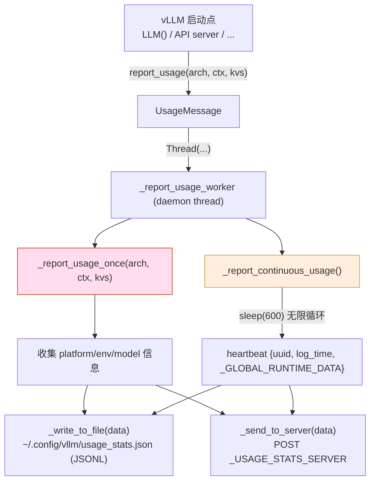

[← Wiki 首页](../README.md) > [可观测](README.md) > usage

# Usage（匿名使用统计上报）

> 源码：`vllm/usage/usage_lib.py`（282 行）

## 是什么

`usage_lib.py` 提供 vLLM 启动时收集**匿名平台/模型信息**并周期性上报到 vLLM 官方统计服务的能力，帮助项目团队了解部署规模与硬件分布。**完全可关**，符合 [do-not-track](https://consoledonottrack.com/) 规范。

主要组件：

| 名 | 行号 | 角色 |
|---|---|---|
| `UsageContext(str, Enum)` | `usage_lib.py:112` | 启动上下文枚举：`UNKNOWN_CONTEXT`/`LLM_CLASS`/`API_SERVER`/`OPENAI_API_SERVER`/`OPENAI_BATCH_RUNNER`/`ENGINE_CONTEXT` |
| `UsageMessage` | `usage_lib.py:121` | 平台信息收集与上报类 |
| `usage_message` | `usage_lib.py:282` | 模块级单例 `usage_message = UsageMessage()` |
| `is_usage_stats_enabled()` | `usage_lib.py:51` | 检查 env vars 与 `~/.config/vllm/do_not_track` 文件 |
| `set_runtime_usage_data(key, value)` | `usage_lib.py:46` | 运行时往 `_GLOBAL_RUNTIME_DATA` 注入 k-v，每周期 heartbeat 一起上报 |
| `_detect_cloud_provider()` | `usage_lib.py:76` | 通过 `/sys/class/dmi/id/*` 与 env var 检测 AWS/Azure/GCP/OCI/RunPod |
| `_USAGE_ENV_VARS_TO_COLLECT` | `usage_lib.py:37` | 收集的 env vars 清单：`VLLM_USE_MODELSCOPE`/`VLLM_USE_FLASHINFER_SAMPLER`/`VLLM_PP_LAYER_PARTITION`/`VLLM_USE_TRITON_AWQ`/`VLLM_ENABLE_V1_MULTIPROCESSING` |
| `_USAGE_STATS_JSON_PATH` | `usage_lib.py:30` | 本地副本：`$HOME/.config/vllm/usage_stats.json`（每条一行 JSONL） |
| `_USAGE_STATS_DO_NOT_TRACK_PATH` | `usage_lib.py:31` | 文件级 opt-out：`~/.config/vllm/do_not_track` |

`UsageMessage` 字段：

- **Environment**：`provider`/`num_cpu`/`cpu_type`/`cpu_family_model_stepping`/`total_memory`/`architecture`/`platform`/`xpu_runtime`/`cuda_runtime`/`gpu_count`/`gpu_type`/`gpu_memory_per_device`/`env_var_json`
- **vLLM**：`model_architecture`/`vllm_version`/`context`
- **Metadata**：`uuid`（启动时 `uuid4()` 绑定）/`log_time`（ns 级 UTC 时间戳）/`source` (`VLLM_USAGE_SOURCE`)

**`report_usage(model_architecture, usage_context, extra_kvs)`** (`usage_lib.py:154`)：



`_report_continuous_usage` (`usage_lib.py:249`) 每 10 分钟发一次 heartbeat（仅 `uuid` + `log_time` + `_GLOBAL_RUNTIME_DATA` runtime 注入项）；让 vLLM 团队看部署活跃度。

`_send_to_server` 用 `global_http_connection.get_sync_client().post(...)`，捕获 `requests.exceptions.RequestException` 仅在 debug log 提示——保证网络问题不影响 vLLM 运行。

`_report_tpu_inference_usage` (`usage_lib.py:176`)：TPU 平台用 `tpu_inference` 库（`tpu_info`/`utils`）拿 chip 数与 HBM limit；失败时 `logger.exception` 但不阻塞。

## 为什么

- **项目健康度反馈**：vLLM 团队需了解部署硬件分布（NV vs AMD vs TPU vs XPU）、模型架构分布、版本渗透率以指导开发优先级。
- **匿名 UUID 仪式**：每次启动 `uuid4()`，不持久化绑机器——同一机器多次启动不同 UUID。**不收集 prompt/token данные/模型路径**，只 platform type+model architecture+version+context。
- **三重 opt-out**：
  1. `VLLM_DO_NOT_TRACK=1`
  2. `DO_NOT_TRACK=1`（标准）
  3. `VLLM_NO_USAGE_STATS=1`
  4. 文件 `~/.config/vllm/do_not_track` 存在
  任一开即关。
- **本地副本**：`usage_stats.json` 每条 JSONL——即使用户禁网络也保留本地记录；可被用户审计看到具体发了什么。
- **daemon 线程 + 10min 周期**：发送不阻塞主进程；进程退出时 daemon 线程自动结束。
- **`_GLOBAL_RUNTIME_DATA` runtime 注入**：vLLM 子系统在运行期发现某些状态（如 spec decode 启用/LoRA 加载）后调 `set_runtime_usage_data("spec_decode", True)`，下一个 heartbeat 自动带上——无需重启即可观察特性渗透。
- **TPU/XPU/CUDA 多平台**：分支按 `current_platform.is_cuda()`/`is_xpu()`/`is_tpu()` 走对应路径；TPU 用专用 `tpu_inference` 库避免依赖圆形 `torch_xpu...` API。
- **`_USAGE_ENV_VARS_TO_COLLECT` 白名单**：只采这些与可观测/平台相关的 env vars（如 MODELSCOPE 渗透率），**不采 prompt/token/敏感配置**。
- **云端探测降级**：`/sys/class/dmi/id/*` 在容器内可能不存在→UNKNOWN；env var `RUNPOD_DC_ID` 兜底。

## 怎么做

**默认行为**：vLLM 启动时（在 `LLM.__init__` / API server startup / EngineCore 启动 等关键入口）调 `usage_message.report_usage(model_architecture, UsageContext.LLM_CLASS, extra_kvs={...})`。具体调用点（待核实）：

```python
# vllm/entrypoints/llm.py 或 vllm/engine/llm_engine.py 内
from vllm.usage.usage_lib import usage_message, UsageContext

usage_message.report_usage(
    model_architecture=model_config.architecture,
    usage_context=UsageContext.LLM_CLASS,
    extra_kvs={"vllm_version": VLLM_VERSION, ...},
)
```

**opt out**：

```bash
# 任一
export VLLM_DO_NOT_TRACK=1
export DO_NOT_TRACK=1
export VLLM_NO_USAGE_STATS=1
touch ~/.config/vllm/do_not_track
```

**自定义 source**（如自家 fork 标识）：

```bash
export VLLM_USAGE_SOURCE=myteam-internal
```

`source` 字段上报，让团队审计来源。

**运行时注入特性数据**：

```python
from vllm.usage.usage_lib import set_runtime_usage_data

if spec_decode_enabled:
    set_runtime_usage_data("spec_decode", True)
```

下个 heartbeat 自动带上 `spec_decode: True`。

**审计本地副本**：

```bash
cat ~/.config/vllm/usage_stats.json | head -1 | jq .
# {"uuid": "...", "provider": "AWS", "gpu_type": "H100", "vllm_version": "0.x.y", ...}
```

## 与其它模块/系统配合

- **[logger.md](logger.md)**：`UsageMessage._send_to_server` 失败时 `logging.debug`；上报失败不影响 vLLM 运行。
- **`vllm/connections.py::global_http_connection`**：HTTP 客户端复用（与 HuggingFace 下载同 HTTP pool，节省连接数）。
- **`vllm/utils/platform_utils.py::cuda_get_device_properties`**：拿 GPU 名称/总显存。
- **`vllm/platforms/`**（[08-platforms](../08-platforms/README.md)）：`current_platform.is_cuda()`/`is_xpu()`/`is_tpu()` 分支。
- **`vllm/version.py::__version__`**：版本号入上报。
- **`vllm/envs.py`**（[17-utils-cross-cutting](../17-utils-cross-cutting/README.md)）：`VLLM_DO_NOT_TRACK`/`DO_NOT_TRACK`/`VLLM_NO_USAGE_STATS`/`VLLM_USAGE_STATS_SERVER`/`VLLM_USAGE_SOURCE`/`VLLM_CONFIG_ROOT`/`_USAGE_ENV_VARS_TO_COLLECT` 中的 env vars。
- **TPU 库 `tpu_inference`**：第三方软依赖，缺失时 `_report_tpu_inference_usage` 失败但仍继续。
- **`psutil` / `cpuinfo`**：CPU 与内存信息源。
- **API server / LLM / EngineCore 启动点**：调用方（具体调用点 待核实）。

## 历史版本演进

- **v0.5（v0）**：`vllm/usage/usage_lib.py` 已存在；`UsageMessage`/`UsageContext`；`report_usage` 单次上报；opt-out 三 env vars + 文件。
- **v0.6**：`_report_continuous_usage` 每 10 分钟 heartbeat；`set_runtime_usage_data` runtime 注入。
- **v0.7（v1 落地）**：`_USAGE_ENV_VARS_TO_COLLECT` 加 `VLLM_ENABLE_V1_MULTIPROCESSING` 收集 v1 多进程渗透；TPU/XPU 支持。
- **v0.8**：`_detect_cloud_provider` env var `RUNPOD_DC_ID` 加。
- **v0.9–main**：稳定 API；`provider`/`uuid`/`log_time` 字段未变。具体版本归属（待核实）。

[← 返回可观测首页](README.md)

## 参见

- [logger.md](logger.md) — 上报失败的 logger 行为。
- [../08-platforms/README.md](../08-platforms/README.md) — `current_platform.is_*()` 分支。
- [../17-utils-cross-cutting/README.md](../17-utils-cross-cutting/README.md) — `vllm/envs.py` 中的 usage env vars。
