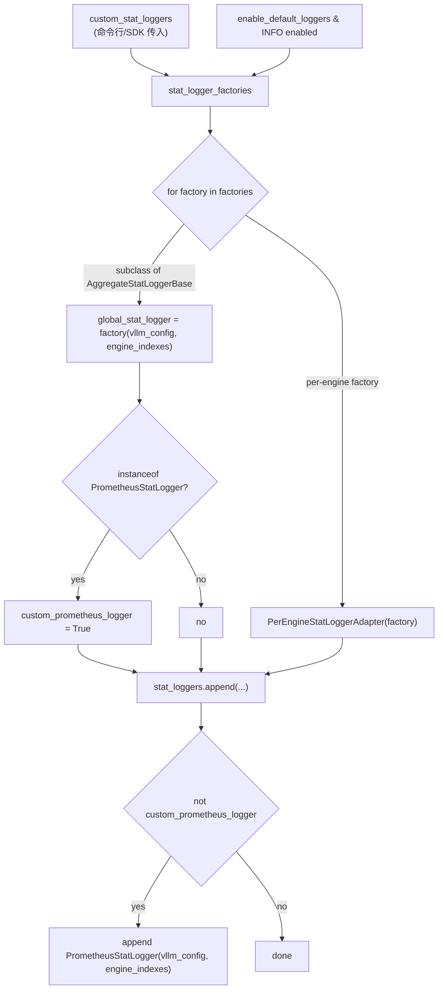

[← Wiki 首页](../../README.md) > [可观测](../../README.md) > v1/metrics/loggers

# Loggers（LoggingStatLogger + PrometheusStatLogger + Manager）

> 源码：`vllm/v1/metrics/loggers.py`（1365 行）

## 是什么

`loggers.py` 实现 v1 metrics 的"扇出层"：接收 `SchedulerStats` + `IterationStats` + `MultiModalCacheStats`，分别送到 stdout 日志和 Prometheus。核心类层级：

```
StatLoggerBase (ABC)
├── LoggingStatLogger                      # stdout 周期日志
├── AggregateStatLoggerBase (ABC)          # 跨 DP engine 聚合
│   ├── AggregatedLoggingStatLogger        # 多 engine 合并打日志
│   ├── PerEngineStatLoggerAdapter         # 多 engine 各打各的（适配 per-engine factory）
│   └── PrometheusStatLogger               # 单 logger + 多 label
└── (插件 logger)
```

关键组件：

| 类/函数 | 行号 | 角色 |
|---|---|---|
| `StatLoggerBase` | `loggers.py:44` | ABC：`record()`/`log_engine_initialized()`/`log()`/`record_sleep_state()` |
| `load_stat_logger_plugin_factories()` | `loggers.py:74` | 从 `STAT_LOGGER_PLUGINS_GROUP` 加载用户自定义 logger |
| `LoggingStatLogger` | `loggers.py:99` | 周期性 `log()` 把 throughput / hit rate / preemption / spec decode / KV connector / cudagraph 等打到 vllm logger |
| `AggregatedLoggingStatLogger` | `loggers.py:295` | DP 多 engine 合并：`aggregate_scheduler_stats()` 把 `last_scheduler_stats_dict` 求和后打 "N Engines Aggregated" |
| `PerEngineStatLoggerAdapter` | `loggers.py:366` | 多 engine 各自独立的 per-engine logger 包装为统一接口 |
| `PrometheusStatLogger` | `loggers.py:406` | 注册所有 `vllm:*` 指标（Gauge/Counter/Histogram），按 `(model_name, engine_idx)` 分 label；同时持有 `SpecDecodingProm`/`KVConnectorProm`/`PerfMetricsProm` 子组件 |
| `StatLoggerManager` | `loggers.py:1274` | AsyncLLM 唯一接口：构造时拼装 `LoggingStatLogger`/`AggregatedLoggingStatLogger`/`PrometheusStatLogger`/用户插件，`record()`/`log()` 同步扇出 |
| `build_1_2_5_buckets(max)` | `loggers.py:1265` | 1/2/5 mantissa histogram 桶构造器 |

`PrometheusStatLogger` 注册的指标族（部分）：

- 调度状态 Gauge：`vllm:num_requests_running`、`vllm:num_requests_waiting`、`vllm:num_requests_waiting_by_reason{reason=capacity|deferred}`、`vllm:kv_cache_usage_perc`、`vllm:engine_sleep_state{sleep_state=awake|weights_offloaded|discard_all}`
- 缓存 Counter：`vllm:prefix_cache_queries/hits`、`vllm:external_prefix_cache_queries/hits`、`vllm:mm_cache_queries/hits`
- Token Counter：`vllm:prompt_tokens`、`vllm:prompt_tokens_by_source{source=...}`、`vllm:prompt_tokens_cached`、`vllm:generation_tokens`、`vllm:iteration_tokens_total`(histogram)
- 完成 Counter+Histogram：`vllm:request_success{finished_reason=...}`、`vllm:e2e_request_latency_seconds`、`vllm:request_queue_time_seconds`、`vllm:request_prefill_time_seconds`、`vllm:request_inference_time_seconds`、`vllm:request_decode_time_seconds`、`vllm:request_prompt_tokens`、`vllm:request_generation_tokens`、`vllm:request_params_n`、`vllm:request_params_max_tokens`、`vllm:request_time_per_output_token_seconds`、`vllm:request_prefill_kv_computed_tokens`
- 时延 Histogram：`vllm:time_to_first_token_seconds`、`vllm:inter_token_latency_seconds`
- KV 驻留 Histogram（`kv_cache_metrics` 开启）：`vllm:kv_block_lifetime_seconds`、`vllm:kv_block_idle_before_evict_seconds`、`vllm:kv_block_reuse_gap_seconds`
- LoRA info Gauge：`vllm:lora_requests_info{max_lora,waiting_lora_adapters,running_lora_adapters}`
- NaN：`vllm:corrupted_requests`（`VLLM_COMPUTE_NANS_IN_LOGITS` 开启时）

`StatLoggerManager.__init__()` 决策树（`loggers.py:1287`）：



## 为什么

- **单一接口屏蔽 DP**：`AsyncLLM` 不关心有 1 个还是 N 个 engine，只调 `manager.record/stats.log()`；`StatLoggerManager` 内部决定是 per-engine 复制（Local Logger）还是单 logger 多 label（Prometheus）。
- **同源 stats 双出口**：stdout 与 Prom 都吃 `SchedulerStats`/`IterationStats` 同一对象，保证两边数字对齐——若用户在 `/metrics` 看到 `vllm:num_requests_running=10` 同期日志就也该有 "Running: 10 reqs"。
- **隐藏 metrics 退役机制**：`show_hidden_metrics` 让上一版本 deprecated 的指标仍可见，给迁移期留缓冲（详见 ObservabilityConfig）。
- **聚合 vs 逐 engine Logging**：`aggregate_engine_logging` 开关让用户在被多 engine 日志淹没时合并为一条 "N Engines Aggregated"；但聚合不对 Prometheus 生效（Prom 用 label 区分）。
- **api_server_count > 1 时不打 stats 日志**：`StatLoggerManager.__init__` 检测到多 api_server 时 disable default logger，因为 stats 在多 api_server 下不完整（每个 api_server 自有 EngineCore 集合）。
- **插件 farming**：用户实现 `StatLoggerBase` 子类并在 entry_point 注册 `STAT_LOGGER_PLUGINS_GROUP`，可完全替换默认 logger（例如 Datadog / Splunk 推送）。若插件本身是 `PrometheusStatLogger` 子类则跳过默认 Prom logger。
- **sleep state 三态**：`record_sleep_state(level)` 把 vLLM 的 sleep/awake 状态暴露为 `vllm:engine_sleep_state`，支持 power saving 场景观测。

## 怎么做

**用户启用 metrics**：默认即开。`--disable-log-stats` 关闭 LoggingStatLogger；Prometheus 永远开（除非插件替换）。

**自定义 stat logger 插件**：

```python
# 在用户包的 entry_points
[project.entry-points.vllm.stat_loggers_plugins]
my_logger = "my_pkg.metrics:MyStatLogger"

# MyStatLogger 须继承 StatLoggerBase 或 AggregateStatLoggerBase
class MyStatLogger(StatLoggerBase):
    def __init__(self, vllm_config, engine_index=0): ...
    def record(self, scheduler_stats, iteration_stats, mm_cache_stats=None, engine_idx=0): ...
    def log_engine_initialized(self): ...
```

vLLM 启动时 `load_stat_logger_plugin_factories()` 自动发现并注入。

**DP 聚合日志**：`--aggregate-engine-logging` 让多 engine 共打一条日志而非 N 条。

**Multiprocess Prometheus**：当 api_server 多 worker（uvicorn `--workers >1`）时，[prometheus.py](prometheus.md) 的 `setup_multiprocess_prometheus()` 设置 `PROMETHEUS_MULTIPROC_DIR`，`PrometheusStatLogger` 用 `multiprocess_mode="mostrecent"` 等 Gauge 模式合并多进程值。

`PrometheusStatLogger.record()` 关键逻辑（`loggers.py:1063`）：

- scheduler_stats → Gauge set 与 cache Counter inc
- spec_decoding / kv_connector / perf_stats 子组件 `.observe()`
- KV 驻留 histogram 遍历 `kv_cache_eviction_events`
- LoRA info Gauge 用 `set_to_current_time()` 把当前 LoRA adapter 名单编码为 label
- iteration_stats → token Counter inc、TTFT/ITL/e2e/q/p/i/d Histogram observe、finished_request per-reason Counter inc

## 与其它模块/系统配合

- **[stats.py](stats.md)**：上游数据。
- **[prometheus.md](prometheus.md)**：`unregister_vllm_metrics()` 在 `PrometheusStatLogger.__init__` 中清旧 collector，防多测注册报错。
- **[utils.py](metrics-utils.md)**：`create_metric_per_engine()` 把单一 Prom metric 按 `(model_name, engine_idx)` label 展开为 dict。
- **[perf.py](perf.md)**：`PerfMetricsProm` 由 `PrometheusStatLogger` 持有，注册 MFU 相关 Counter。
- **`06-sampling-decoding/speculative-decoding/metrics.md`**：`SpecDecodingProm` 由 `PrometheusStatLogger` 持有。
- **KV connector metrics**（`vllm/distributed/kv_transfer/kv_connector/v1/metrics.py`）：`KVConnectorProm` 由 `PrometheusStatLogger` 持有。
- **EngineCore**：每步调 `StatLoggerManager.record()`；周期性 `log()` 由 output processor 的 timer 驱动。
- **[RayPrometheusStatLogger](ray-wrappers.md)**：Ray Serve 部署时替换 Prometheus 后端为 `ray.util.metrics`。
- **[reader.py](reader.md)**：`get_metrics_snapshot()` 反向读 Prom collectors 供 LLM API 暴露。
- **`13-entrypoints/serve/instrumentator.md`**（待补充）— API server 的 prometheus_fastapi_instrumentator 与 vllm metrics 路径不同但常配合部署。
- **ObservabilityConfig**：`show_hidden_metrics`、`kv_cache_metrics`、`cudagraph_metrics`、`enable_mfu_metrics` 等开关驱动 logger 行为。

## 历史版本演进

- **v0.5/v0.6（v0）**：v0 `StatLogger` 体系（`LoggingStatLogger`/`PrometheusStatLogger` 存在），但接 `SchedulerStats`/`RequestStats` 旧结构；v0 没有 `StatLoggerManager` 抽象，AsyncLLM 直连两个 logger。
- **v0.7（v1 落地）**：重写为 v1 stats；引入 `StatLoggerManager` 屏蔽 DP；`AggregateStatLoggerBase` 抽象；`PerEngineStatLoggerAdapter`；`WAITING_REASON_CAPACITY/DEFERRED` 拆分 `num_requests_waiting_by_reason`。
- **v0.8**：`kv_cache_metrics` 三 histogram；`cudagraph_metrics` 委托给 `CUDAGraphLogging`；`enable_mfu_metrics` 委托给 `PerfMetricsLogging/Prom`；`prompt_tokens_by_source` 三路 Counter；`prompt_tokens_cached` Counter。
- **v0.9**：`engine_sleep_state` 三态（awake/weights_offloaded/discard_all）；`stats_logger_plugins` 机制；`iteration_tokens_total` histogram。
- **v0.10–v0.12/main**：AggregatedLoggingStatLogger 与 `aggregate_engine_logging` CLI；`api_server_count>1` 时禁 default logger 警告。具体版本归属（待核实）。

[← 返回可观测首页](../../README.md)

## 参见

- [stats.md](stats.md) — 上游数据来源。
- [prometheus.md](prometheus.md) — registry 处理与 unregister。
- [perf.md](perf.md) — MFU / PerfMetricsProm。
- [ray-wrappers.md](ray-wrappers.md) — Ray Serve 替代 Prom 后端。
- [reader.md](reader.md) — 反向读取。
- `../../10-config/observability-config.md` — 各 metrics 开关。
