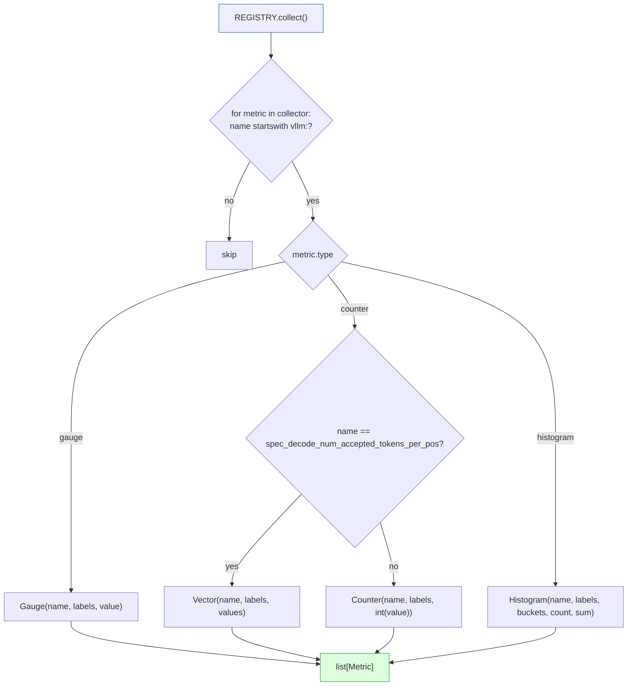

[← Wiki 首页](../../README.md) > [可观测](../../README.md) > v1/metrics/reader

# Reader（in-memory metrics 快照 API）

> 源码：`vllm/v1/metrics/reader.py`（257 行）

## 是什么

`reader.py` 在不通过 HTTP `/metrics` 抓取的前提下，直接遍历当前进程 `prometheus_client.REGISTRY.collect()` 把所有 `vllm:*` 指标转为 dataclass，供 `LLM.get_metrics()` 这类同步 API 暴露给用户程序。

数据类层级：

| 类 | 行号 | 角色 |
|---|---|---|
| `Metric` (base) | `reader.py:12` | name + labels dict |
| `Counter(Metric)` | `reader.py:25` | value: int |
| `Vector(Metric)` | `reader.py:32` | values: list[int] —— **非 Prom 原生类型**，专门为 `vllm:spec_decode_num_accepted_tokens_per_pos` 这个"per-position 计数器向量"建模 |
| `Gauge(Metric)` | `reader.py:43` | value: float |
| `Histogram(Metric)` | `reader.py:50` | count + sum + buckets dict (`{le_str: count}`) |
| `get_metrics_snapshot()` | `reader.py:70` | 入口函数：遍历 REGISTRY，过滤 `name.startswith("vllm:")`，按 type 分派构造 |
| `_get_samples(metric, suffix)` | `reader.py:146` | 取 `samples` 中 name 匹配的子集（处理 `_total`/`_bucket`/`_count`/`_sum` 后缀） |
| `_digest_histogram(...)` | `reader.py:157` | 把 bucket/count/sum samples 按 label 集合聚合（处理 DP 多 engine label） |
| `_digest_num_accepted_by_pos_samples(...)` | `reader.py:217` | 把 `{position, engine_idx}` labeled Counter 转为按 engine 聚合的 `Vector.values` |

`get_metrics_snapshot()` 分派逻辑：



## 为什么

- **无需 HTTP 抓取**：`LLM.get_metrics()` 走进程内调用，避免用户为了读自家指标再起 prometheus scrapers；适合批处理/Notebook 场景。
- **类型化结果**：返回的是 dataclass 而非 prometheus 原生 `Metric` 对象，用户侧无需依赖 `prometheus_client` 即可消费。
- **DP label 摘要**：`_digest_histogram` 把多个 `engine_idx` labeled bucket 合并为按 label 集合分组的 dict；用户可分别取每个 engine 的 histogram 也可合并。
- **Vector 特例**：spec decoding 的"per-position accepted tokens" 是一组 position-labeled Counter，把它转成 `Vector` 让用户像读数组一样读 position 0/1/2/... 的接受数——比保持 Counter 形态更直观。
- **过滤非 vllm 指标**：注册表里可能有 prometheus_client 自带或第三方库（httpx/uvicorn）的指标，`startswith("vllm:")` 过滤避免泄漏。
- **限制**：直接读 `REGISTRY`，故**多进程模式下 reader 只看到主进程的指标**（不通过 `MultiProcessCollector`）——多进程部署需走 `/metrics` HTTP 抓取（待核实是否有改进计划）。

## 怎么做

**用户侧调用**：

```python
from vllm import LLM
llm = LLM(model=...)

from vllm.v1.metrics.reader import get_metrics_snapshot
for m in get_metrics_snapshot():
    if isinstance(m, Histogram) and m.name == "vllm:time_to_first_token_seconds":
        print(m.buckets, m.count, m.sum)
    elif isinstance(m, Counter) and m.name == "vllm:generation_tokens":
        print(m.labels, m.value)
    elif isinstance(m, Vector) and m.name == "vllm:spec_decode_num_accepted_tokens_per_pos":
        print(m.values)  # [pos0_count, pos1_count, ...]
```

（`LLM.get_metrics()` 在 vLLM 公共 API 中暴露此函数的包装，具体签名待核实。）

**调试场景**：在 pytest 里直接调 `get_metrics_snapshot()` 读出指标断言（前提是 `unregister_vllm_metrics` 已在 logger 构造时调过，避免上一轮测试残留）。

## 与其它模块/系统配合

- **[loggers.py](loggers.md)**：`PrometheusStatLogger` 注册的指标是 reader 读到的来源。
- **[prometheus.md](prometheus.md)**：reader 直读 `REGISTRY` 全局变量；多进程模式下行为有偏差。
- **[stats.md](stats.md)**：reader 读的是聚合后 Prom 值，不是原始 stats dataclass——若需热路径原始数据应直接接 `StatLoggerBase`。
- **`06-sampling-decoding/speculative-decoding/metrics.md`**：reader 的 `Vector` 类型专为 spec decode 的 `vllm:spec_decode_num_accepted_tokens_per_pos` 引入。
- **`13-entrypoints/serve/instrumentator.md`**（待补充）—— HTTP `/metrics` 端点是 reader 的互补出口。

## 历史版本演进

- **v0.5/v0.6（v0）**：v0 已有 `vllm/engine/llm_engine.py::LLMEngine.get_metrics()` 调用 reader（早期 reader 位于 `vllm/engine/metrics.py` 或类似位置，待核实）。
- **v0.7（v1 落地）**：reader 迁到 `vllm/v1/metrics/reader.py`；新增 `Vector` 类型支持 spec decode per-position 计数。
- **v0.8**：`_digest_histogram` 显式支持 DP 多 engine label。
- **v0.9–main**：稳定 API；多进程模式下 reader 行为（待核实是否有补丁让 reader 走 `MultiProcessCollector`）。

[← 返回可观测首页](../../README.md)

## 参见

- [loggers.md](loggers.md) — 注册指标的上游。
- [prometheus.md](prometheus.md) — registry 管理。
- `../../06-sampling-decoding/speculative-decoding/metrics.md` — `Vector` 类型的来源。
