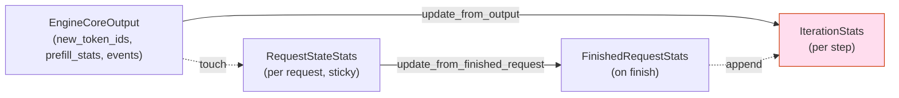

[← Wiki 首页](../../README.md) > [可观测](../../README.md) > v1/metrics/stats

# Stats（原始统计 dataclass）

> 源码：`vllm/v1/metrics/stats.py`（539 行）

## 是什么

`stats.py` 定义 v1 引擎在每次调度/迭代中收集的原始统计量 dataclass。它**只描述数据**，不写日志、不写 Prometheus。输出由 [loggers.py](loggers.md) 消费。

主要类型：

| 类 | 行号 | 角色 |
|---|---|---|
| `BaseCacheStats` | `stats.py:19` | 缓存命中基准：`reset/requests/queries/hits` |
| `CachingMetrics` | `stats.py:35` | 滑动窗口（最近 N=1000 请求）的命中率聚合器，被 `LoggingStatLogger` 持有 |
| `PrefixCacheStats` | `stats.py:115` | 前缀缓存命中，扩展 `BaseCacheStats`，并区分 preempted 请求 |
| `MultiModalCacheStats` | `stats.py:146` | 多模态缓存命中 |
| `KVCacheEvictionEvent` | `stats.py:162` | 单次 KV block 驱逐采样（生命周期/idle/reuse gap） |
| `SchedulerStats` | `stats.py:171` | 每步调度器全局状态：running/waiting/skipped 请求数、kv_cache_usage、prefix cache、spec decode、KV connector、LoRA、cudagraph、perf 等 |
| `RequestStateStats` | `stats.py:202` | 单请求跨多次 delta 的状态：arrival/queued/scheduled/first_token/last_token 时间戳、生成 token 数、is_corrupted |
| `FinishedRequestStats` | `stats.py:224` | 单请求完成时的最终统计：e2e/prefill/decode/inference/queue 时长、token 数、finish_reason |
| `PrefillStats` | `stats.py:243` | 单次 prefill 的 token 拆分：computed / local_cached / external_cached |
| `PromptTokenStats` | `stats.py:277` | 累积版 prompt token 拆分，含 `ALL_SOURCES = ("local_compute","local_cache_hit","external_kv_transfer")` |
| `IterationStats` | `stats.py:325` | 单次迭代（一组 EngineCoreOutput）的聚合统计——TTFT 列表、ITL 列表、prompt token 拆分、finished_requests、corrupted 计数 |
| `LoRAStats`/`LoRARequestStates` | `stats.py:483`/`stats.py:507` | per-LoRA 的 waiting/running 请求集合，喂给 `SchedulerStats.waiting_lora_adapters/running_lora_adapters` |

`IterationStats` 的核心方法：

- `update_from_output(...)` (`stats.py:353`)：从 `EngineCoreOutput` 累积生成 token、TTFT、ITL；处理 events（QUEUED/SCHEDULED/PREEMPTED）；记录 corruption。
- `update_from_events(...)` (`stats.py:404`)：从 `EngineCoreEvent` 更新请求时间戳与 LoRA 状态。
- `update_from_finished_request(...)` (`stats.py:428`)：计算 e2e/queued/prefill/decode/inference 时长与 mean_time_per_output_token，追加到 `finished_requests`。



## 为什么

- **数据/出口解耦**：stats 只塑形，logger 决定如何出。换 exporter（stdout / Prom / Ray / OTel）无需动 stats。
- **粘性 per-request 状态**：`RequestStateStats` 跨多次 `update_from_output` 累积时间戳——TTFT/ITL 必须知道上一 token 时间，故不能 step-local。
- **iter-local + finished 分层**：`IterationStats` 是 step-local（TTFT/ITL 列表），`FinishedRequestStats` 在请求结束时才生成；`StatLoggerManager.record()` 同时收两个对象，让 Prom Counter / Histogram 各取所需。
- **prefix cache 滑动窗口**：`CachingMetrics` 不存全 session 累积，而是最近 1000 请求的命中率，避免长程漂移。
- **prompt token 来源拆分**：v1 让 `PromptTokenStats.ALL_SOURCES` 把 prompt token 拆成 `local_compute / local_cache_hit / external_kv_transfer` 三路，对应三个 Prometheus Counter（`vllm:prompt_tokens_by_source`），让用户看清前缀缓存/外部 KV 迁移各自贡献。
- **NaN corruption 探测**：`VLLM_COMPUTE_NANS_IN_LOGITS` 开启后 `EngineCoreOutput.num_nans_in_logits` 触发 `RequestStateStats.is_corrupted`，最终在 logger 里吐 `vllm:corrupted_requests` Counter——排查精度异常。
- **LoRA 统计**：`LoRARequestStates` 仅在 `log_stats=True` 时跟踪，避免无 LoRA 场景开销。

## 怎么做

**调度器侧**（`vllm/v1/core/sched/scheduler.py`，详见 01-engine-core/scheduler/）每步构造 `SchedulerStats`：

```python
# 伪码
scheduler_stats = SchedulerStats(
    num_running_reqs=len(running),
    num_waiting_reqs=len(waiting),
    num_skipped_waiting_reqs=len(skipped),
    kv_cache_usage=kv_cache_manager.usage,
    prefix_cache_stats=prefix_cache_stats,
    spec_decoding_stats=spec_decode_stats,  # 选填
    kv_connector_stats=connector_stats,    # 选填
    perf_stats=perf_stats,                 # --enable-mfu-metrics 时
    ...
)
```

**EngineCore 侧**（`vllm/v1/engine/core.py`，详见 `01-engine-core/engine-core-process.md`）每收到一组 `EngineCoreOutput` 构造 `IterationStats`：

```python
iter_stats = IterationStats()
for output in outputs:
    req_stats = request_state[output.request_id]  # sticky
    iter_stats.update_from_output(output, now, is_prefilling, req_stats, lora_states, lora_name)
    if output.is_finished:
        iter_stats.update_from_finished_request(...)
```

随后 `StatLoggerManager.record(scheduler_stats, iter_stats, mm_cache_stats, engine_idx=...)` 扇出。

**用户侧**：`LLM.get_metrics()` 通过 [reader.py](reader.md) 反向读取 Prom registry 的当前快照，返回 `Metric` dataclass，无需 HTTP `/metrics`。

## 与其它模块/系统配合

- **[loggers.py](loggers.md)**：直接消费 `SchedulerStats`/`IterationStats`/`MultiModalCacheStats`。
- **[perf.py](perf.md)**：`PerfStats` 字段嵌在 `SchedulerStats.perf_stats`，由 `ModelMetrics.get_step_perf_stats_per_gpu()` 计算。
- **`06-sampling-decoding/speculative-decoding/metrics.md`**：`SpecDecodingStats` 嵌在 `SchedulerStats.spec_decoding_stats`，由该文件实现。
- **KV connector metrics**（`vllm/distributed/kv_transfer/kv_connector/v1/metrics.py`）：`SchedulerStats.kv_connector_stats: dict[str, Any]` 透传给 `KVConnectorLogging`/`KVConnectorProm`。
- **EngineCore**：构造 `IterationStats` 与 `EngineCoreEvent`（QUEUED/SCHEDULED/PREEMPTED）。事件时间戳是 monotonic，但 `arrival_time` 是 EngineCore 前端 wall-clock——`_time_since` 用 `iteration_timestamp` 减去，故 TTFT 跨进程语义需注意。
- **ObservabilityConfig**：`kv_cache_metrics` 让 `SchedulerStats.kv_cache_eviction_events` 不为空，被 Prom logger observe 到三个 histogram。
- **CUDAGraphStat**：`SchedulerStats.cudagraph_stats: CUDAGraphStat | None`，仅在 `observability_config.cudagraph_metrics` 开启时填充。

## 历史版本演进

- **v0.5/v0.6（v0）**：v0 stats 体系（`RequestStateStats`/`IterationStats` 已存在），但包含 `num_preemption` 等已变字段；decoder 用 v0 scheduler。
- **v0.7（v1 落地）**：v1 stats 重写；`SchedulerStats` 引入 `spec_decoding_stats`、`kv_connector_stats`、`waiting_lora_adapters`、`num_skipped_waiting_reqs`（deferred）；`PrefillStats` 把 cached 细分为 local/external。
- **v0.8**：`KVCacheEvictionEvent` 与 `kv_cache_eviction_events`（采样 KV 驻留指标）；`PromptTokenStats` 引入 `ALL_SOURCES` 三路拆分；`cudagraph_stats` 字段。
- **v0.9**：`enable_logging_iteration_details`（具体字段关联待核实）；`perf_stats` 字段；`step_counter`/`current_wave`（DP load-balancing 用）。
- **v0.10–v0.12/main**：`preempted_requests/queries/hits` 在 `PrefixCacheStats` 中单独追踪，避免与新请求混计；`RequestStateStats.is_corrupted`（NaN 探测）。具体版本归属（待核实）。

[← 返回可观测首页](../../README.md)

## 参见

- [loggers.md](loggers.md) — 直接消费方。
- [perf.md](perf.md) — `PerfStats` 来源。
- [reader.md](reader.md) — 反向读取 Prom registry 的快照 API。
- `../../10-config/observability-config.md` — `kv_cache_metrics` / `cudagraph_metrics` 等开关。
